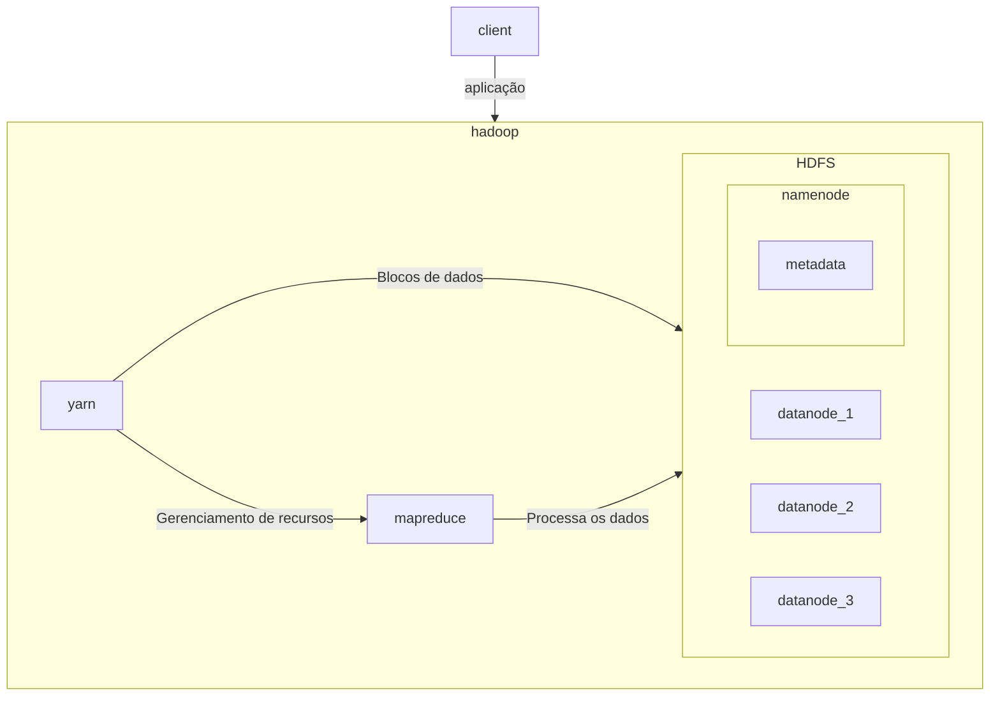

---
tags:
  - engenharia_de_dados
---
# Apache Hadoop

> [!info] Definição
[Apache Hadoop](https://hadoop.apache.org/) é uma coleção de software de código aberto para análise de big data que permite que grandes conjuntos de dados sejam processados ​​com clusters de computadores trabalhando em paralelo. 

Apache Hadoop é composto por 3 principais componentes:

- [[HDFS - Hadoop Distributed File System]]

- [[MapReduce]]

- [[YARN (Yet another resource Negotiator)]]

O **HDFS** permite que um único conjunto de dados seja armazenado em vários dispositivos de armazenamento diferentes, como se fosse um único arquivo. Ele funciona lado a lado com o algoritmo **MapReduce**, que determina como dividir uma grande tarefa computacional (como uma contagem ou agregação estatística) em tarefas muito menores que podem ser executadas em paralelo em um cluster de computação.

Foi um dos primeiros frameworks que permitiam a coleção e análise de grandes quantidades de dados não estruturados. Atualmente o Hadoop foi praticamente substituído pelo Apache Spark (mesmo que o Spark utilize o Hadoop por baixo dos panos) por ser complexo, ter uma baixa performance, segurança limitada e falta de suporte para streaming de dados.

Alguns pontos que levaram o Hadoop a não ser mais uma das opções para o armazenamento de dados é a segurança dos dados, que no HDFS não existe nenhum tipo de possibilidade de governança.

> [!quote]- (Artigo) - [Introdução ao HDFS parte 1](https://medium.com/@cm.oeiras01/uma-breve-introdu%C3%A7%C3%A3o-do-hadoop-hdfs-hadoop-distributed-file-system-1-2-6883710ea64f) e [Introdução ao HDFS parte 2](https://medium.com/@cm.oeiras01/uma-breve-introdu%C3%A7%C3%A3o-do-hadoop-hdfs-hadoop-distributed-file-system-2-2-7694055a7917)
> Artigos explicando os principais componentes do Apache Hadoop

# Exemplo - Execução de uma aplicação com Hadoop

Ao final do procedimento temos no HDFS todos os dados processados de acordo com o algoritmo enviado pelo cliente.
