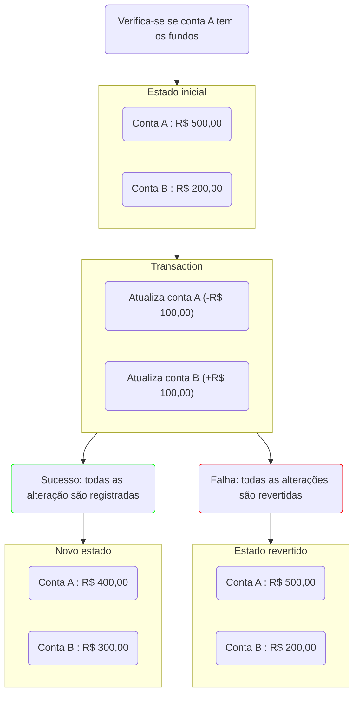

---
tags:
  - arquitetura_software
---
Dependendo da estrutura do sistema a consistência dos dados pode ser tratada de forma distintas. 

As formas mais comuns de lidar com a consistência dos dados são:

- ACID: altamente consistente
- BASE: eventualmente consistente

# ACID

ACID é uma conjunto de características que suportam as transações atômicas muito utilizadas em bases de dados. Elas garantem que a base de dados irá manter uma imagem consistente do mundo dos dados.

- *Atomicity*
	- Garante que uma conjunto de alterações seja registrado como uma unidade.
- *Consistency*
	- Qualquer leitura a uma base de dados irá retornar a última versão do item recuperado.
- *Isolation*
	- Define que se duas atualizações estão correndo concorrentemente para a mesma coisa, o estado final da base de dados será executado em ordem sequencial
- *Durability*
	- Indica que os dados registrados nunca serão perdidos

Características:
- ➕ Simplifica bastante o desenvolvimento de aplicações
- ➖ A fim de garantir consistência verificações são definidas impactando na performance do sistema

Exemplo: Conta de banco
Um usuário que enviar R$ 100,00 da conta A para a conta B.

Em um sistema ACID a operação para isso ser possível é feita da seguinte maneira:

# BASE

É um acrônimo para outro formato de consistência de dados, focado em uma consistência mais fraca. Pode ser muito bem utilizado em sistemas que a consistência não é algo crítico.

- Basically available
	- Consistência não é garantida, porém a base de dados se encarrega de buscar essa consistência que é alcançada a maioria do tempo
- Soft-state
	- O estado da transação é obscuro, e é incerto quando uma transação será registrada ou revertida
- Eventual consistency
	- Em algum ponto a leitura dos dados irá trazer resultados consistentes.

Por não garantir a consistência dos dados esse formato permite uma maior performance de escritas e leituras.

