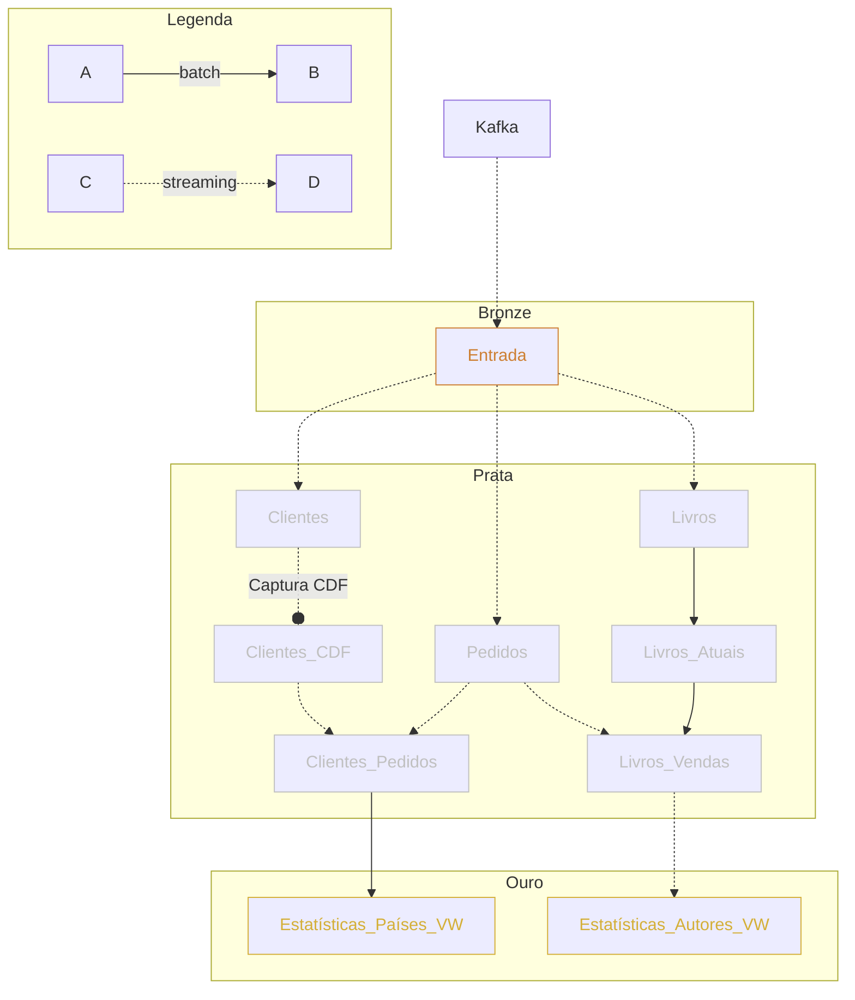

> [!info] Descrição
> Exemplo extraído do [curso preparatório para a certificação Databricks Engineer Professional](https://www.udemy.com/course/databricks-certified-data-engineer-professional/) 

# Descrição

Esse exemplo visa demonstrar a implementação de uma arquitetura completa de processamento de dados para o caso de uma loja de livros.

Ao final desse exemplo teremos obtidos as seguintes visualizações de dados:

- Estatísticas de vendas por países
- Estatísticas de vendas por autores

### Arquitetura



# Implementação

A loja de livros cataloga todos os eventos em um servidor com [[Apache Kafka]], esse tipo de ingestão é chamada de Multiplex, já que uma única fonte consolida vários tipos diferentes de informações. O formato dos eventos no Kafka são o seguinte:

| key  | topic     | value                    | partition | timestamp |
| ---- | --------- | ------------------------ | --------- | --------- |
| QjA0 | books     | jbgHvB2QDJaVI3TQyCGCEw== |           |           |
| QjA1 | orders    | jbgHvB2QDJaVI3TQyCGCEw== |           |           |
| QjA2 | order     | jbgHvB2QDJaVI3TQyCGCEw== |           |           |
| QjA3 | customers | jbgHvB2QDJaVI3TQyCGCEw== |           |           |
| QjA4 | customers | jbgHvB2QDJaVI3TQyCGCEw== |           |           |
| QjA5 | books     | jbgHvB2QDJaVI3TQyCGCEw== |           |           |

Campos

- key: chave do kafka
- topic: tópico do kafka
- value: informação codificada em base64
- partition: partição do kafka
- timestamp: horário de registro no kafka

## Bronze

A camada bronze é a responsável por receber os dados sem alterações e organiza-los a fim de facilitar o processamento subsequente.
### Ingestão para a Bronze

Para a ingestão iremos utilizar uma única tabela que recebe todos os eventos disponíveis no Kafka da Loja.

```python
(spark
	 .readStream
		 .format("cloudFiles")
		 .option("cloudFiles.format", "json")
		 .schema("key BINARY, value BINARY, topic STRING, partition LONG, offset LONG, timestamp LONG")
		 .load("f{dataset_bookstore}/kafka-raw")
		 .withColumn("timestamp", (F.col("timestamp")/1000).cast("timestamp"))
		 .withColumn("year_month", F.date_format("timestamp", "yyyy-MM"))
	 .writeStream
		 .option("checkpointLocation", "...")
		 .option("mergeSchema", True)
		 .partitionBy("topic", "year_month")
		 .trigger(availableNow=True) # define o tempo de processamento dos dados
		 .table("bronze"))
```

A ingestão dos dados foi feita para uma tabela chamada `bronze` que está particionada em relação ao mês e ano que é obtido a partir do campo `timestamp` quando um evento é persistido no Kafka.

## Prata

Com a camada Bronze já configurada podemos avançar para criar o processamento da camada Prata ([[Arquitetura medalhão#Prata|Características da camada Prata]]). 

Nessa camadas estamos preocupados em
- Definir a granularidade dos dados para iniciar a extração de informações relevantes dos dados
- Garantir a qualidade das informações, por meio de testes, restrições e filtros
### Pedidos

A tabela `Pedidos` é definida a partir do seguinte processamento:

```sql
CREATE OR REPLACE TABLE pedidos_tmp AS
SELECT v.*
FROM (
	SELECT from_json(
		cast(value as STRING), 
		"order_id STRING, order_timestamp Timestamp, customer_id STRING, quantidade BIGINT, total BIGINT, books ARRAY<STRUCT<book_id STRING, quantity BIGINT, subtotal BIGINT>>"
	) v
	FROM bronze
	WHERE topic = "orders"
)
```

Com a tabela temporária criada, utilizando o formato [[Databricks#CTAS (Create Tables as Select)]], podemos criar efetivamente a tabela `Pedidos` pelo código python:

```python
spark.readStream
	.table("pedidos_tmp")
	.dropDuplicates(["order_id", "order_timestamp"])
	.withWatermark("order_timestamp", "30 seconds")
	.writeStream
		 .option("checkpointLocation", "...")
		 .option("mergeSchema", True)
		 .partitionBy("topic", "year_month")
		 .trigger(availableNow=True)
		 .table("pedidos")
```

Durante o processo de transformação dos dados é importante que eliminemos os registros duplicados, isso mantem a base menor e evita desperdício de processamento. 

O método `withWatermark(field, timeout)` define que o driver do spark irá manter uma tabela de referência para dados duplicados durante uma certa duração, **caso isso não seja especificado o driver nunca irá limpar esses registros o que pode levar a problemas de falta de memória.** 

Na camada Prata também já podemos definir algumas métricas de qualidade de dados. No caso do Pedidos é importante que processemos apenas os que são válidos, ou seja, com a quantidade de produtos escolhidos maiores do que zero.

```sql
ALTER TABLE pedidos ADD CONSTRAINT valid_ CHECK (quantidade > 0);
```

> [!tip] Erro ao alterar a tabela para uma nova restrição
> Quando executamos essa alteração na tabela `pedidos` podemos receber um erro já que alguns registros já pertencentes a base não se adequam a nova regra definida.
> 
> Nesse caso podemos apenas remover esses registros ou caso a tabela seja de streaming e apenas de apêndice precisamos fazer um procedimento de [[Arquitetura medalhão#Quarentena de entradas inválidas]]

### Livros

Para a tabela Livros vamos criar uma estrutura baseada nos conceitos de [[Mudança lenta de dimensões]] do tipo 2. Nesse caso cada alteração das informações do Livro será catalogada e apenas a versão mais recente é considerada a ativa. **Isso irá nos permitir ter informações de alterações dos preços dos livros ao longo do tempo.**

Esquema do livros após a decodificação da base64:

- book_id
- title
- author
- price
- updated

```sql
MERGE INTO livros
USING (
	-- Todas as atualizações
	SELECT updates.book_id as merge_key, updates.*
	FROM updates
	
	UNION ALL

	-- Atualizações da versão atual dos livros
	SELECT NULL as merge_key, updates.*
	FROM updates
	JOIN livros ON updates.book_id = livros.book_id
	WHERE livros.current = true AND updates.price <> livros.price
) 
staged_updates ON livros.book_id = merge_key

-- Caso preço seja diferente atualiza a versão atual
WHEN MATCHED AND livros.current = true AND livros.price <> staged_updates.price THEN
	UPDATE SET current = false, end_date = staged_updates.updated

-- Caso livro não exista cria o livro na base
WHEN NOT MATCHED THEN
	INSERT (book_id, title, author, price, current, effective_date, end_date)
	VALUES (
		staged_updates.book_id, 
		staged_updates.title, 
		staged_updates.author, 
		staged_updates.price, 
		true, 
		staged_updates.updated, 
		NULL
	)
```

A query acima podem ser utilizada no processamento de cada micro_batch:

```python
def type2_upsert(microBatchDF, batch):
	microBatchDF.createOrReplaceTempView("updates") # Tabela temporária updates
	sql_query = """query""" # query definida no código anterior


schema = "book_id STRING, title STRING, author STRING, price DOUBLE, updated TIMESTAMP"
query = (spark.readStream
		.table("bronze")
		.filter("topic = 'books'")
		.select(F.from_json(F.col("value").cast("string"), schema).alias("v"))
		.select("v.*")
	.writeStream
		.foreachBatch(type2_upsert)
		.option("checkpointLocation", "dbfs: /mnt/demo_pro/checkpoints/livros")
		.trigger(availableNow=True)
		.table("livros")
	.start())
```

Para cada micro batch vamos executar a junção das informações dos livros e analisar dois casos:

- Caso o preço do livro esteja diferente do preço atual ele é atualizado
- Caso contrário um novo registro do livro é criado (isso vale para livros que não existiam ou que existiam na base mas a versão atual foi descontinuada).

#### Livros atuais

Como podemos ter livros descontinuados em nossa loja, queremos garantir que os novos pedidos sejam comparados apenas com os livros atualmente disponíveis.

```python
query = (spark.read
			.table("livros")
			.filter("current = true")
			.select("book_id", "title", "price")
		.write
			.option("checkpointLocation", "dbfs: /mnt/demo_pro/checkpoints/livros_atuais")
			.table("livros_atuais")
		.start())
```

### Clientes

Para a tabela `clientes` é necessário utilizar uma abordagem no formato [[Change Data Capture]] já que os registros no Kafka estão da seguinte forma depois de decodificados da base64:

| customer_id | row_status | row_time            | outros campos .... |
| ----------- | ---------- | ------------------- | ------------------ |
| 01          | insert     | 2024-06-01 14:00:00 | ...                |
| 02          | insert     | 2024-06-01 15:00:00 | ...                |
| 01          | update     | 2024-06-01 15:00:00 | ...                |
| 03          | insert     | 2024-06-01 16:00:00 | ...                |
| 02          | update     | 2024-06-01 16:00:00 | ...                |
Como podemos perceber os registros são instâncias de alterações na base de dados, assim para cada cliente representado pela `customer_id` podemos ter várias entradas definindo todas as alterações feitas nesse cadastro.

Para isso é necessário definir dentro de uma *janela de tempo* qual o evento será considerado para o processamento, já que várias alterações podem ser feitas a um cadastros durante esse período.

```python
from pyspark.sql import functions as F

from pyspark.sql.window import Window
def batch_upsert(microBatchDF, batchId):
	window = Window.partitionBy("customer_id").orderBy(F.col("row_time").desc())
	(microBatchDF
		.filter(F.col("row_status").isin(["insert", "update"]))
		.withColumn("rank", F.rank().over(window))
		.filter("rank == 1")
		.drop("rank")
		.createOrReplaceTempView("ranked_updates"))
		
	query =
		"""
		MERGE INTO clientes c
		USING ranked_updates r ON c.customer_id = r.customer_id
		WHEN MATCHED AND c. row_time < r. row_time
			THEN UPDATE SET *
		WHEN NOT MATCHED
			THEN INSERT *
		"""
	microBatchDF.sparkSession.sql (query)

df_country_lookup = spark.read.json(f"{dataset_bookstore}/country_lookup")

schema = "customer_id STRING, email STRING, first_name STRING, last_name STRING, gender STRING, street STRING, city STRING, country_code STRING, row_status STRING, row_time timestamp"

query = (spark.readStream
			.table("bronze")
			.filter("topic = 'customers'")
			.select(F.from_json(F.col ("value").cast("string"), schema). alias("v"))
			.select("v.*")
			.join(F.broadcast(df_country_lookup), F.col("country_code") == F.col("code"), "inner")
		.writeStream
			.foreachBatch(batch_upsert)
			.option("checkpointLocation", "dbfs: /mnt/demo_pro/checkpoints/clientes")
			.trigger(availableNow=True)
		.start())
```

Nesse caso estamos utilizando a função [[Funções nativas#Window Functions|rank()]], nativa do próprio pyspark, para fazer o ranking do evento considerando a ordenação do campo `row_time`. Assim iremos pegar apenas o evento mais recente dentro da janela de tempo.

> [!warning] Funções de janela não são suportadas por Dataframes de streaming
> Nesse caso podemos criar uma função para o processamento de cada micro batch. Dentro de cada micro batch podemos utilizar as funções de janela.

> [!tip] Tabelas de referência
> Tabelas de referência podem ser utilizadas para enriquecer os dados. Caso a tabela seja pequena é possível fazer o espalhamento de seus dados por meio da função `broadcast`, melhorando assim a performance do sistema como um todo.

Por fim podemos definir um teste automatizado para garantir que apenas clientes distintos estejam armazenados na tabela de clientes.

```python
count = spark.table("clientes").count()
expected_count = spark.table("clientes").select("customer_id").distinct().count()

assert count == expected_count
print("Apenas clientes únicos existem na tabela clientes")
```

#### Habilitando o CDF

Em Delta table podemos habilitar o [[Change Data Feed (CDF)]] para fazer o versionamento das alterações feitas na base de dados automaticamente. No nosso caso isso irá permitir utilizar a funcionalidade de Viagem no Tempo para consultar versões anteriores dos registros dos clientes.

Para habilitar a funcionalidade precisamos apenas alterar as propriedades da tabela

```sql
ALTER TABLE clientes
SET TBLPROPERTIES (delta.enableChangeDataFeed = true);

DESCRIBE TABLE EXTENDED clientes;
```

| col_name         | data_type                              | comment |
| ---------------- | -------------------------------------- | ------- |
| ...              | ...                                    | ...     |
| Table Properties | [delta.enableChangeDataFeed=true,....] |         |
Essa alteração nos permite executar a seguinte consulta

```sql
SELECT *
FROM table_changes("clientes", 2)
```

| customer_id | row_status | row_time            | _change_type    | _commit_version | _commit_timestamp   | outros campos .... |
| ----------- | ---------- | ------------------- | --------------- | --------------- | ------------------- | ------------------ |
| 01          | insert     | 2024-06-01 14:00:00 | update_preimage | 3               | 2024-06-02 14:00:00 | ...                |
| 02          | insert     | 2024-06-01 15:00:00 | update_posimage | 3               | 2024-06-02 14:00:00 | ...                |
| 01          | update     | 2024-06-01 15:00:00 | insert          | 3               | 2024-06-02 14:00:00 | ...                |
| 03          | insert     | 2024-06-01 16:00:00 | insert          | 3               | 2024-06-02 14:00:00 | ...                |
| 02          | update     | 2024-06-01 16:00:00 | update_preimage | 3               | 2024-06-02 14:00:00 | ...                |
Perceba que são adicionados 3 campos a tabela de clientes

- `_change_type`
- `_commit_version`
- `_commit_timestamp`

Esses são os campos responsáveis pelo versionamento e a funcionalidade de viagem no tempo.

### Clientes_Pedidos

O processamento da tabela `clientes_pedidos` é feito por meio de uma junção Stream-Stream.

```python
from pyspark.sql import functions as F from pyspark.sql.window import Window


def batch_upsert (microBatchDF, batchId):
	window = Window.partitionBy("order_id", "customer_id").orderBy(F.col("_commit_timestamp").desc())
	
	# cria uma tabela temporário com as atualizações dentro da janela de tempo
	(microBatchDF.filter(F.col("_change_type").isin(["insert", "update_postimage"]))
		.withColumn("rank", F.rank().over(window)) # última atualização captura
		.filter("rank = 1")
		.drop("rank", "_change_type", "_commit_version")
		.withColumnRenamed("_commit_timestamp", "processed_timestamp")
		.createOrReplaceTempView("ranked_updates"))
	
	query= """
		MERGE INTO clientes_pedidos c
		USING ranked_updates r
		ON c.order_id = r.order_id AND c.customer_id = r.customer_id
		WHEN MATCHED AND c.processed_timestamp < r.processed_timestamp
			THEN UPDATE SET *
		WHEN NOT MATCHED
			THEN INSERT *
	"""

	# atualiza a tabela clientes_pedidos com os novos registros
	microBatchDF.sparkSession.sql(query)


orders_df = spark.readStream.table("pedidos")

cdf_customers_df = (spark.readStream
						.option("readChangeData", True)
						.option("startingVersion", 2)
						.table("clientes"))

query =  (orders_df.join(cdf_customers_df, ["customer_id"], "inner")
	.writeStream
		.foreachBatch(batch_upsert)
		.option("checkpointLocation", "dbfs: /mnt/demo_pro/checkpoints/pedidos_clientes")
		.trigger(available Now=True)
	.start())
```

### Livros_Vendas

Nesse caso temos um caso de junção Stream-Static.

```python

from pyspark.sql import functions as F
orders_df = (spark.readStream.table("pedidos") 
			 .withColumn("book", F.explode("books")))

books_df = spark.read.table("livros_atuais")

query = (orders_df.join(books_df, orders_df.book.book_id == books_df.book_id, "inner") 
		.writeStream
		.outputMode ("append")
		.option("checkpointLocation", "dbfs: /mnt/demo_pro/checkpoints/livros_vendas") 
		.trigger(availableNow=True)
		.table("livros_vendas"))
```

## Ouro

Para a camada Ouro já queremos definir as visualizações mais consolidadas da nossa base de dados de forma a fazer consultas rápidas.

### Estatística_Países_VW

Iremos criar uma [[Delta lake#Visualizações materializadas (Materialized View)|visualização materializada]] para as estatísticas de vendas de livros por país.

```sql
CREATE VIEW IF NOT EXISTS estatistica_paises_vw AS (
	SELECT country
	, date_trunc("DD", order_timestamp) order_date
	, count(order_id) orders_count
	, sum(quantity) books_count 
	FROM customers_orders
	GROUP BY country, order_date
```

### Estatística_Autores_VW

Para a estatística de vendas de livros por autores queremos algo mais dinâmico. Nesse caso vamos fazer o processamento em Streaming assim podemos ter essas estatísticas em próximo a tempo real (5 minutos).

```python
from pyspark.sql import functions as F
query = (spark
		.readStream
			.table("livros_vendas")
			.withWatermark("order_timestamp", "10 minutes")
			.groupBy(F.window("order_timestamp", "5 minutes").alias("time"), "author")
			.agg(
				F.count("order_id").alias ("orders_count"),
				F.avg("quantity").alias ("avg_quantity")
			)
		.writeStream
			.option("checkpointLocation", f"dbfs: /mnt/demo_pro/checkpoints/estatistica_autores")
			.trigger(availableNow=True)
			.table("estatistica_autores")
)
```