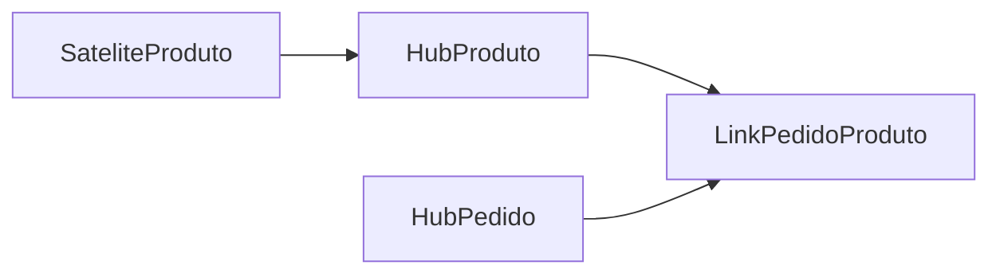

# Data vault

Criada em 1990 pelo Dan Linstedl, um modelo data vault (cofre de dados) separa os aspectos estruturais dos sistemas fontes dos seus atributos. Em vez de representar o negócio por meio de fatos e dimensões ou de tabelas altamente normalizadas, um cofre de dados carrega dados dos sistemas fonte diretamente e transforma em tabelas construídas com propósitos específicos no formato de permitir apenas inserção.

É uma forma de agilizar, flexibilizar e escalar o processo de movimento dos dados de forma a manter conformidade com o negócio enquanto o próprio negócio se expande.

Consiste em 3 partes principais:
- Hubs
	- Armazena as chaves do negócio
	- Apenas são inseridos dados
- Links
	- Relacionamento entre as chaves de negócio entre Hubs
	- 
- Satélites
	- Atributos e contextos relacionados ao negócio

### Exemplo em um ecommerce

Hub do produto:

| ProductHashKey | LoadDate   | RecordSource | ProductID |
| -------------- | ---------- | ------------ | --------- |
| abc1        | 2020-01-02 | ERP          | 1         |
| abc2           | 2021-03-09 | ERP          | 2         |
| abc3           | 2021-03-09 | ERP          | 3         |

Hub do pedido:

| OrderHashKey | LoadDate   | RecordSource | OrderID |
| ------------ | ---------- | ------------ | ------- |
| abc4         | 2022-03-01 | Website      | 100     |
| abc5         | 2022-03-01 | Website      | 101     |
| abc6         | 2022-03-01 | Website      | 102     |

Link entre Pedido e Produto:

| OrderProductHashKey | LoadDate   | RecordSource | ProductHashKey | OrderHashKey |
| ------------------- | ---------- | ------------ | -------------- | ------------ |
| ff64ec193           | 2022-03-01 | Website      | abc1           | abc4         |
| cf27369b            | 2022-03-01 | Website      | abc2           | abc4         |
| 4041fd8v            | 2022-03-01 | Website      | abc3           | abc5         |
| fsd3241fd           | 2022-03-01 | Website      | abc3           | abc6         |

Satélite de Produto

| ProductHashKey | LoadDate   | RecordSource | ProductName     | Price |
| -------------- | ---------- | ------------ | --------------- | ----- |
| abc1        | 2020-01-02 | ERP          | Thingamajig     | 10    |
| abc2           | 2021-03-09 | ERP          | Whatchamacallit | 12    |
| abc3           | 2021-03-09 | ERP          | Whozeewhatzit   | 15    |
