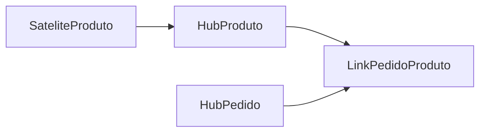

---
tags:
  - modelagem_de_dados
---
# Normalização

> [!info] Definição
> Normalização é uma prática de modelagem de dados que garante controle estrito sobre os relacionamentos das tabelas e suas colunas.

Essa prática de modelagem de dados foi criada nos inícios dos anos de 1970 pelo Edgar Codd (muito inspirada na ideia do Não se repita DRY, que determinar uma sequencia de passos que determinam a forma normal que os dados se encontram.

Codd define vários passos onde a aplicação de cada um desses passos deixam a modelagem de dados em uma forma normal, quanto maior a forma normal mais seus dados estão normalizados (até o 3FN já conseguimos tirar bastante proveito dessa modelagem a partir daí são ganhos mais incrementais). Os 3 primeiros passos dessa sequencia são:

- Denormalizado
	- Sem nenhum tipo de normalização. Dados aninhados e redundantes são permitidos
- Primeira forma normal (1FN)
	- Cada coluna é única e tem um única valor.
	- A tabela tem um chave primária única
		- Chave primária única: é um campo ou conjunto de campos que unicamente determinam a linha na tabela.
- Segunda forma normal (2FN)
	- Requer 1FN
	- Dependências parciais são removidas
		- Dependência parcial: um subconjunto da chave primária pode ser utilizado para determinar uma coluna não-chave de uma tabela.
- Terceira forma normal (3FN)
	- Requer 2FN
	- Cada tabela contem apenas campos relevantes para sua chave primária
	- Remover todo tipo de dependência transitiva
		- Dependência transitiva: ocorre quando um campo não-chave depende de outro campo não-chave

### Exemplo de aplicação de normalização

Vamos levar em consideração a modelagem de um sistema de pedidos de produtos em uma loja. Inicialmente temos a seguinte modelagem para os dados dessa loja:

| OrderID | OrderItems                                                                                                                                                             | CustomerID | CustomerName | OrderDate  |
| ------- | ---------------------------------------------------------------------------------------------------------------------------------------------------------------------- | ---------- | ------------ | ---------- |
| 100     | [{ "sku": 1, "price": 50, "quantity": 1, "name:": "Thingamajig" }, { "sku": 2, "price": 25, "quantity": 2, "name:": "Whatchamacallit" }] | 5          | Joe Reis     | 2022-03-01 |

#### Aplicando 1FN

Para a 1FN é necessário que cada coluna seja única e tenha um único valor, nesse caso precisamos desaninhar a coluna `OrderItems` para transformar cada um dos campos em um campo único.

| OrderID [KEY] | ItemSku [KEY] | CustomerID | CustomerName | OrderDate  | ItemPrice | ItemQuantity | ItemName        |
| ------------- | ------------- | ---------- | ------------ | ---------- | --------- | ------------ | --------------- |
| 100           | 1             | 5          | Joe Reis     | 2022-03-01 | 50        | 1            | Thingamajig     |
| 100           | 2             | 5          | Joe Reis     | 2022-03-01 | 25        | 2            | Whatchamacallit |
Porém quando fazemos isso acabamos replicando o OrderID, ou seja, não temos uma chave única. Para isso podemos fazer uma chave única que seja composta do `OrderID` e do `ItemSku`. Com isso feito temos todos os campos definidos com apenas um valor e uma chave única para cada linha da tabela, ou seja, estamos na 1FN.

#### Aplicando 2FN

Para estarmos na 2FN precisamos agora eliminar as dependências parciais. Nesse caso será dividida a tabela em duas.

Orders:

| OrderID [KEY] | ItemSku [KEY] | CustomerID | CustomerName | ItemQuantity | OrderDate  |
| ------------- | ------------- | ---------- | ------------ | ------------ | ---------- |
| 100           | 1             | 5          | Joe Reis     | 1            | 2022-03-01 |
| 100           | 2             | 5          | Joe Reis     | 2            | 2022-03-01 |
Items:

| ItemSku [KEY] | ItemPrice | ItemName        |
| ------------- | --------- | --------------- |
| 1             | 50        | Thingamajig     |
| 2             | 25        | Whatchamacallit |
Com isso eliminamos todos as dependências parciais já que nenhum conjunto dentro da chave composta identifica outros campos na tabela.

#### Aplicando 3FN

Para a 3FN precisamos que a tabela tenha campos relevantes apenas para sua chave primária. Nesse caso precisamos remover as informações de CustomerName para outra tabela já que as chaves de Orders não identificam esse campo.

Orders:

| OrderID [KEY] | ItemSku [KEY] | CustomerID | ItemQuantity | OrderDate  |
| ------------- | ------------- | ---------- | ------------ | ---------- |
| 100           | 1             | 5          | 1            | 2022-03-01 |
| 100           | 2             | 5          | 2            | 2022-03-01 |
| 101           | 2             | 6          | 4            | 2022-03-02 |

Customers:

| CustomerID | CustomerName |
| ---------- | ------------ |
| 5          | Joe Reis     |
| 6          | Bruno Biluca |

Items:

| ItemSku [KEY] | ItemPrice | ItemName        |
| ------------- | --------- | --------------- |
| 1             | 50        | Thingamajig     |
| 2             | 25        | Whatchamacallit |

Com isso chegamos a 3FN.

# Kimball

Criado por Ralph Kimball a modelagem Kimball vem como uma abordagem totalmente oposta ao que [[#Inmon]] propõe, onde nessa abordagem o foco é bem menos na normalização dos dados, permitindo até ter denormalização.

O modelo de Kimball tenta uma abordagem mais baixa-cima, onde cada departamento ou negócio deve ser modelado e servido do próprio Data Warehouse, removendo assim a centralidado do modelo Inmon conseguindo então mais agilidade no processo em detrimento de uma menor taxa de integração e dados duplicados ou redundantes.

A abordagem do Kimball tem como elementos principais dois tipos de tabelas: Fatos e Dimensões.

- Tabela Fato
	- Contém dados factuais, quantitativos e relacionados a eventos.
	- São apenas aditivas (append-only)
	- Cada linha da tabela deve representar o grão dos dados.
	- Referenciam apenas tabelas dimensão
- Tabela Dimensão
	- Referencia uma tabela fato com dados qualitativos como atributos, contexto relacional
	- Quando juntadas as tabelas fato podem responder perguntas como "o que, onde e quando"
	- São denormalizadas possibilitando dados duplicados

Alguns tipos de estratégias de atualização das tabelas dimensão são:

- Sobrescrever tudo
- Manter histórico completo de mudanças
	- Quando uma mudança é feita a linha atual é marcada como alterada e uma cópia dela com as novas informações é adicionada em uma nova linha, esta passa a ser a linha atual
- Manter histórico de mudanças por adição de novos campos
	- Quando uma mudança é feita um novo campo é criado para armazenar o estado atual

### Exemplo em um ecommerce

Esse exemplo utiliza [[Mudança lenta de dimensões]] para definir as mudanças de estados.

Tabela Fato:

| OrderID | CustomerKey | DateKey  | ValorBruto |
| ------- | ----------- | -------- | ---------- |
| 100     | 5           | 00330322 | 10         |
| 101     | 6           | 00330322 | 100        |
| 102     | 5           | 00330401 | 1000       |

Dimensão de Datas

| DateKey  | Date-ISO   | Year | Trimestre | Month | Dia-da-semana |
| -------- | ---------- | ---- | --------- | ----- | ------------- |
| 20220301 | 2022-03-01 | 2022 | 1         | 3     | Terça         |
| 20220302 | 2022-03-02 | 2022 | 1         | 3     | Quarta        |

Dimensão do cliente:

| CustomerKey | FirstName | LastName   | ZipCode   | EFF_StartDate | EFF_EndDate |
| ----------- | --------- | ---------- | --------- | ------------- | ----------- |
| 5           | Judas     | Escariotes | 33333-666 | 0033-03-12    | 9999-01-01  |
| 6           | Jesus     | -          | 33333-666 | 0001-01-01    | 0033-03-31  |
| 6           | Jesus     | -          | 00000-000 | 0033-03-31    | 9999-01-01  |
Perceba como nesse modelo é permitido dados duplicados, quando Jesus ressucita na Páscoa ele muda de endereço para o céu, uma nova linha é adicionada a dimensão do cliente definindo o novo estado dos atributos do cliente, e então o valor `EFF_EndDate` (Effective End Date) é atualizado para o momento da alteração. 

Com esse formato podemos facilmente responder perguntas como:

- "Qual o valor bruto de vendas por cada cliente por data?"
	- Facilmente podemos fazer agrupamentos por DateKey e CustomerKey utilizando apenas a tabela fato
- "Qual o total de vendas no primeiro trimestre de 2022?"
	- Fazendo um Join entre a Tabela Fato e a dimensão de data podemos obter essa informação e filtrar pelo ano e trimestre armazenados na dimensão de data
- "Quantos clientes a mais compram na terça que na quarta?"
	- Também podemos responder essa resposta com uma simples junção e agrupar pelo Dia da semana.

# Inmon

> [!quote] Definição de Inmon para Data Warehouse
> Um data warehouse é uma coleção de dados orientada a assuntos, integrada, não-volátil, e variante ao tempo que suporta decisões da gestão. A data warehouse contem dados corporativos granulares. Dados em um Data Warehouse são capazes de serem usados para diferentes propósitos, incluindo aguardar necessidades futuras que não são conhecidas atualmente.

As principais características são:

- Orientada a assuntos (subject-oriented): o data warehouse foca em assuntos e área específicas, como marketing ou vendas.
- Integrada: diversas fontes de dados são centralizadas e normalizadas na data warehouse
- Variante ao tempo: faixas de tempo podem ser consultadas.

O Data warehouse no formato proposto por Bill Inmon deve ser armazenado de forma altamente normalizada, então são construídos por meio do processo de ETL a Data Marts que focam em responder áreas ou assuntos específicos.

![[Inmon para um ecommerce.png|Exemplo da modelagem de um Data warehouse no formato Inmon para um ecommerce|500]]

Uma opção popular para modelagem de dados em um data mart é o [[#Esquema Estrela (Star Schema)]], onde cada um dos data marts podem ter seu próprio esquemas estrela alimentados pelos dados granulares no data warehouse. Isso permite que cada departamento possa ter sua própria estrutura de forma a otimizar suas próprias necessidades.
# Esquema Estrela (Star Schema)

Esquema estrela representa o modelo do negócio, onde uma tabela fato é cercada apenas das dimensões necessárias. Esse esquema captura lógica do negócio e deve ser flexível o bastante para responder questões críticas.

# Data vault

Criada em 1990 pelo Dan Linstedl, um modelo data vault (cofre de dados) separa os aspectos estruturais dos sistemas fontes dos seus atributos. Em vez de representar o negócio por meio de fatos e dimensões ou de tabelas altamente normalizadas, um cofre de dados carrega dados dos sistemas fonte diretamente e transforma em tabelas construídas com propósitos específicos no formato de permitir apenas inserção.

É uma forma de agilizar, flexibilizar e escalar o processo de movimento dos dados de forma a manter conformidade com o negócio enquanto o próprio negócio se expande.

Consiste em 3 partes principais:
- Hubs
	- Armazena as chaves do negócio
	- Apenas são inseridos dados
- Links
	- Relacionamento entre as chaves de negócio entre Hubs
	- 
- Satélites
	- Atributos e contextos relacionados ao negócio

### Exemplo em um ecommerce

Hub do produto:

| ProductHashKey | LoadDate   | RecordSource | ProductID |
| -------------- | ---------- | ------------ | --------- |
| abc1        | 2020-01-02 | ERP          | 1         |
| abc2           | 2021-03-09 | ERP          | 2         |
| abc3           | 2021-03-09 | ERP          | 3         |

Hub do pedido:

| OrderHashKey | LoadDate   | RecordSource | OrderID |
| ------------ | ---------- | ------------ | ------- |
| abc4         | 2022-03-01 | Website      | 100     |
| abc5         | 2022-03-01 | Website      | 101     |
| abc6         | 2022-03-01 | Website      | 102     |

Link entre Pedido e Produto:

| OrderProductHashKey | LoadDate   | RecordSource | ProductHashKey | OrderHashKey |
| ------------------- | ---------- | ------------ | -------------- | ------------ |
| ff64ec193           | 2022-03-01 | Website      | abc1           | abc4         |
| cf27369b            | 2022-03-01 | Website      | abc2           | abc4         |
| 4041fd8v            | 2022-03-01 | Website      | abc3           | abc5         |
| fsd3241fd           | 2022-03-01 | Website      | abc3           | abc6         |

Satélite de Produto

| ProductHashKey | LoadDate   | RecordSource | ProductName     | Price |
| -------------- | ---------- | ------------ | --------------- | ----- |
| abc1        | 2020-01-02 | ERP          | Thingamajig     | 10    |
| abc2           | 2021-03-09 | ERP          | Whatchamacallit | 12    |
| abc3           | 2021-03-09 | ERP          | Whozeewhatzit   | 15    |
