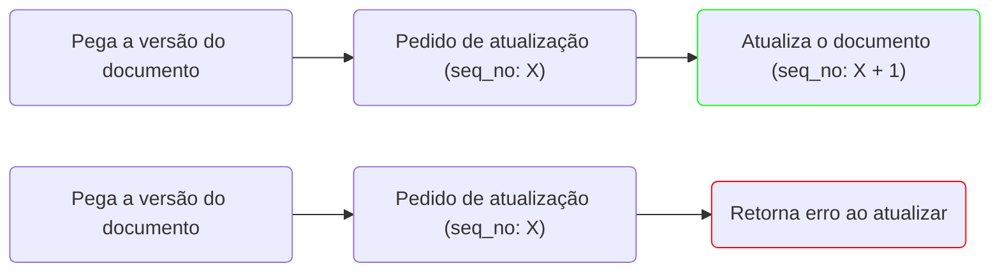

---
tags:
  - engenharia_de_dados
  - banco_de_dados
---
# Dicas de performance

## Ingestão

### Individual vs Bulk (REST)

```python
from elasticsearch import Elasticsearch
es = Elasticsearch([{"host": "localhost", "port": 9200}])

# Envio individual de objetos
for i in range(10000):
	res = es.index(index, body=random_object())

# Envio em buld dos objetos
body = []
for i in range(10000):
	body.append({'index': {}})
	body.append(random_object())

res = es.bulk(body, index=index, doc_type='_doc')
```

Podemos notar uma diferença muito grande no tempo de ingestão entre os tipos de ingestão simples e no modelo bulk. Esse valores foram feitos utilizando o ambiente local.

> [!info] Comparação
> - Insert simples: 589s
> - Bulk: 36s


## Agregações

### Filtros gerais vs filtros nas agregações

> [!tip] Melhoria de performance
> Uma coisa para ter atenção na hora de utilizar agregações é garantir que a varredura de itens será a menor possível dentro do Elasticsearch. Qualquer filtro dentro da query pode melhorar muito a performance de uma agregação.

Exemplo de query utilizando um filtro geral, será executado antes dos filtros de agregações:

```json
// Agregação geral
{
  "size": 0, 
  "query": {"bool": {"must": [{"terms": { "categories": ["A"]}}]}},
  "aggs": {"count": { "value_count": { "field": ""}}
}
```

Exemplo de query utilizando filtros nas agregações

```json
// Agregação separada (por agregregação)
{
  "size": 0, 
  "aggs": {
    "filter": {
        "bool": {"must": [{"terms": { "categories": ["A"]}}]}      
    },
    "aggs": {"count": { "value_count": { "field": ""}}
  }
}
```

Esses dois exemplos tem uma diferença de tempo na execução da consulta.

> [!info] Comparação query com filtro geral vs filtro por agregação
> 
### Paralelismo de agregações

> [!tip] Estratégia de paralelização de agregações
> Uma boa estratégia pode ser quebrar as agregações em várias queries e enviar essas queries todas de uma vez utilizando da api do `msearch`.

```json
// Agregação por msearch
{"index": "test-index"}
{
  "size": 0, 
  "query": {"bool": {"must": [{"terms": { "categories": ["A"]}}]}},
  "aggs": {"count": { "value_count": { "field": ""}}
}
{"index": "test-index"}
{
  "size": 0, 
  "query": {"bool": {"must": [{"terms": { "categories": ["B"]}}]}},
  "aggs": {"count": { "value_count": { "field": ""}}
}
```

Dessa forma fazemos cada query ser referente a apenas um tipo de categoria, isso nos permite utilizar o poder de paralelismo do cluster e retornar a consulta de forma mais rápida.

# Solução de problemas

## Concorrência em atualizações

O Elasticsearch oferece uma forma de solução de conflitos de concorrência chamado ==Controle de concorrência otimista==. Esse tipo de controle define um campo em cada documento chamado `seq_no` (Número de sequência), quando um cliente tenta alterar um documento, o Elasticsearch verifica se o número de sequência corresponde ao enviado e então faz a alteração, caso contrário é retornado um erro, indicando que a versão persistida é mais recente que o valor enviado.

O exemplo abaixo mostra o que acontece quando dois clientes tentam atualizar a mesma versão do documento.

