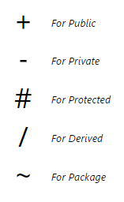
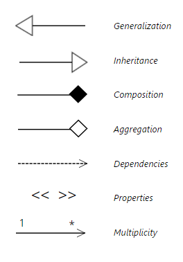
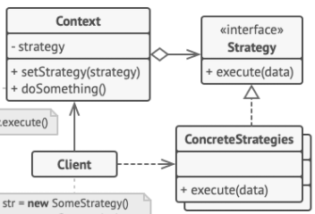

# Diagrama de classes UML

> [!info] Definição
> UML é uma estrutura padrão para desenvolvimento de software, bastante utilizada na diagramação de estruturas do código, bancos de dados e fluxo de código.

Quando falamos de Design Patters utilizamos muito UML para representar visualmente a especificação das estruturas no código. Dessa forma temos uma visão simples e direta de como podemos implementar o Design Pattern.

Ao mesmo tempo que o UML ajuda a entender as responsabilidades de cada agente no código, cada linguagem tem uma forma de implementação diferente para o Design Pattern e não deve ser levado literalmente.

São muito utilizados em [[Documento de arquitetura]]
## Símbolos do UML

## Exemplo

