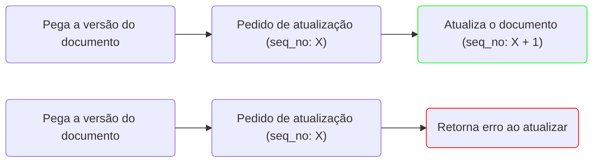

---
tags:
  - engenharia_de_dados
  - banco_de_dados
---
# Solução de problemas

## Concorrência em atualizações

O [[Elasticsearch]] oferece uma forma de solução de conflitos de concorrência chamado ==Controle de concorrência otimista==. Esse tipo de controle define um campo em cada documento chamado `seq_no` (Número de sequência), quando um cliente tenta alterar um documento, o Elasticsearch verifica se o número de sequência corresponde ao enviado e então faz a alteração, caso contrário é retornado um erro, indicando que a versão persistida é mais recente que o valor enviado.

O exemplo abaixo mostra o que acontece quando dois clientes tentam atualizar a mesma versão do documento.

