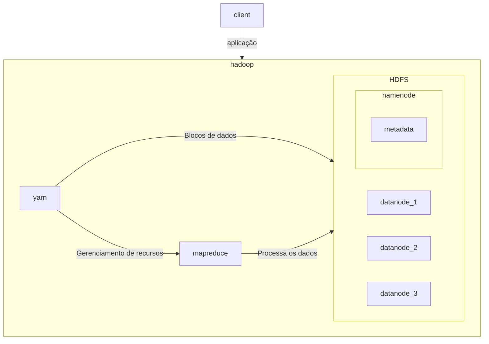

---
tags:
  - engenharia_de_dados
---
# [Apache Hadoop](https://hadoop.apache.org/)

> [!info] Definição
> Apache Hadoop™ é uma coleção de software de código aberto para análise de big data que permite que grandes conjuntos de dados sejam processados ​​com clusters de computadores trabalhando em paralelo. 

Inclui o **Hadoop MapReduce**, o **Hadoop Distributed File System (HDFS)** e o **YARN (Yet Another Resource Negotiator)**. 

O HDFS permite que um único conjunto de dados seja armazenado em vários dispositivos de armazenamento diferentes, como se fosse um único arquivo. Ele funciona lado a lado com o algoritmo **MapReduce, que determina como dividir uma grande tarefa computacional** (como uma contagem ou agregação estatística) em tarefas muito menores que podem ser executadas em paralelo em um cluster de computação.

Foi um dos primeiros frameworks que permitiam a coleção e análise de grandes quantidades de dados não estruturados. Atualmente o Hadoop foi praticamente substituído pelo Apache Spark (mesmo que o Spark utilize o Hadoop por baixo dos panos) por ser complexo, ter uma baixa performance, segurança limitada e falta de suporte para streaming de dados.

Alguns pontos que levaram o Hadoop a não ser mais uma das opções para o armazenamento de dados é a segurança dos dados, que no HDFS não existe nenhum tipo de possibilidade de governança.

# HDFS - Hadoop Distributed File System

Essa é a camada de armazenamento do Hadoop que foi desenvolvido para lidar com grandes volumes de dados na grandeza dos GBs a TBs. Ele oferece um bom rendimento (Throughput, quantidade de trabalho realizado em um tempo unitário) por conseguir de forma independente e paralela executar tarefas em toda a rede de nós.

O Hadoop funciona com a arquitetura Primary-Secondary (Primario-Secundario) em que existe um nó primário e **n** nós escravos onde n pode ser mais de 1000 por exemplo. O Nó primário deve ser configurado em uma boa máquina pois é a peça central do cluster Hadoop.

No nó principal da Arquitetura Hadoop, um daemon chamado `namenode` é executado para o HDFS. Em todos os escravos, um daemon chamado `datanode` é executado para o HDFS. Portanto, os escravos também são chamados de datanodes.

O Namenode armazena meta dados e gerencia os datanodes. Por outro lado, os Datanodes armazenam os dados e executam as tarefas. Também existe o Secondary NameNode que tem a função de fazer o balanceamento para realizar checkpoints nos arquivos e datalogs, além de ser responsável por maximizar processos de otimização do cluster.

> [!info] Daemon
> Em sistemas operacionais multitarefas, um Daemon é um programa que executa como um processo em plano de fundo, em vez de estar sob o controle direto de um usuário interativo.

 No HDFS um arquivo é dividido em blocos (padrão 128 MB) e armazenado de forma distribuída em várias máquinas. É possível configurar replicações para garantir que caso falhas ocorram o processamento siga utilizando uma das réplicas. Por exemplo, caso uma das máquinas falhar em um cluster com fator de replicação três, ainda teremos duas cópias daquele bloco.

# MapReduce

O Hadoop MapReduce é um modelo de programação projetado para processar grandes volumes de dados em paralelo, dividindo o trabalho em um conjunto de tarefas independentes. Ele consegue isso movendo a computação para perto dos dados, onde cada máquina tem um processo rodando uma parte do código de programação.

# YARN (Yet another resource Negotiator)

YARN- Yet Another Resource Negotiator- é a camada de gerenciamento de recursos do Hadoop para o cluster, assim, operações de gerenciar/alocar/liberar os recursos (CPU, memória e disco) ficam em sua responsabilidade.

# Exemplo - Execução de uma aplicação com Hadoop

Ao final do procedimento temos no HDFS todos os dados processados de acordo com o algoritmo enviado pelo cliente.

# Referência

- [Introdução ao HDFS parte 1](https://medium.com/@cm.oeiras01/uma-breve-introdu%C3%A7%C3%A3o-do-hadoop-hdfs-hadoop-distributed-file-system-1-2-6883710ea64f)
- [Introdução ao HDFS parte 2](https://medium.com/@cm.oeiras01/uma-breve-introdu%C3%A7%C3%A3o-do-hadoop-hdfs-hadoop-distributed-file-system-2-2-7694055a7917)