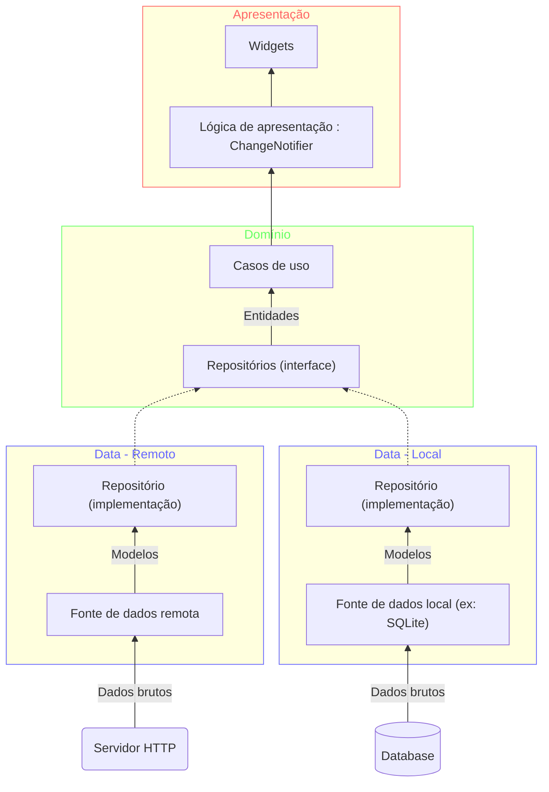

# Arquitetura limpa para Flutter

Como estamos trabalhando com um aplicativo voltado a interação do usuário, uma boa forma de organizarmos a arquitetura do código é seguindo o **fluxo de chamada**. O fluxo de chamada é o caminho que o sistema toma para atualizar o estado da aplicação que o usuário está utilizando.

Com o fluxo de chamada do usuário como guia do desenvolvimento em flutter a aplicação é  utilizando as seguintes camadas:

- Apresentação
- Domínio
- Dados

Cada uma dessa camadas são independentes das camadas inferiores. Essa arquitetura utiliza os conceitos da [[Architecture|Arquitetura DDD]].

### Apresentação

- **Widgets:** componentes que o usuário irá interagir durante todo o uso da aplicação.
	- Podemos ter widgets específicos de cada funcionalidade ou gerais para toda a aplicação.
- **Lógica de apresentação ([[Padrão BLoC]])**

### Domínio

- **Casos de uso:** são entidade que devem encapsular uma única funcionalidade alto nível que o usuário pode acionar.
- **Repositórios:** contratos de funcionalidades do acesso de dados

> [!tip] Casos de uso
> A utilização de casos de uso aqui são chave para esse tipo de arquitetura, já que podemos focar o desenvolvimento diretamente nas interações do usuário com a aplicação e evitar assim implementação de funcionalidades que não agregam nenhum valor para o usuário. 

### Data (Infraestrutura)

- **Implementação dos repositórios:** a camada de infraestrutura é responsável por implementar os acessos concretos as fontes de dados a fim de executar as funcionalidades da interface
- **Acesso a fontes de dados:** cada módulo de infraestrutura irá implementar um tipo diferente de acesso concreto as fontes de dados. Por exemplo: acesso ao banco de dados local SQLite quando o acesso a um banco de dados remoto por chamada HTTP não está disponível.