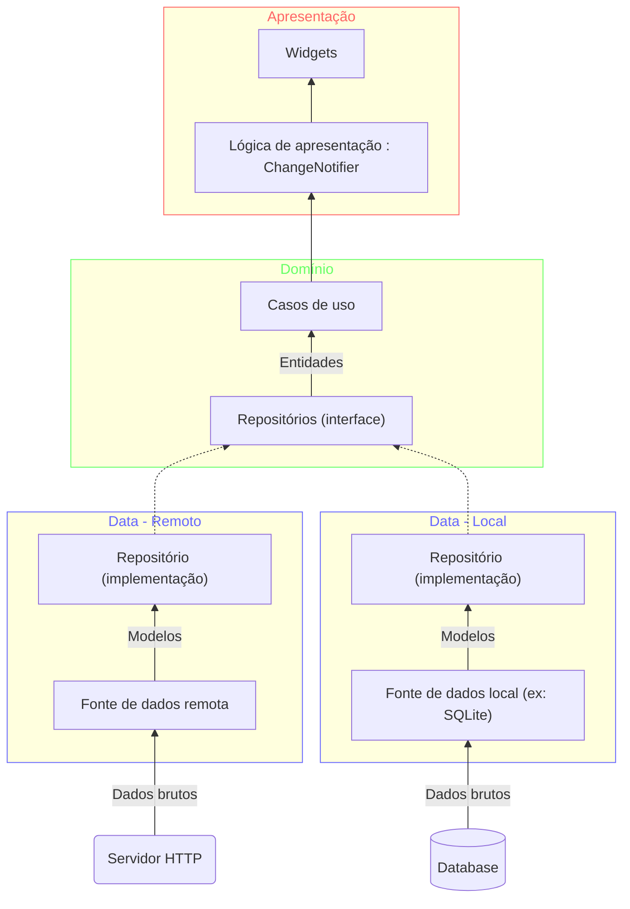

---
tags:
  - programação/frameworks
---
> [!info] O que é?
> Flutter é um framework multiplataforma para a criação de aplicações.
> Utiliza a linguagem [Dart](https://dart.dev/overview) para desenvolvimento
> 
> - [Documentação](https://docs.flutter.dev/)
> - [Tutorial de Flutter](https://www.youtube.com/watch?v=1ukSR1GRtMU&list=PL4cUxeGkcC9jLYyp2Aoh6hcWuxFDX6PBJ)
>- [Filledstacks - Site voltado a tutoriais simples e diretos de flutter](https://www.filledstacks.com/)

Flutter é muito inspirado pelo React, tanto em seus componentes quanto no formato de desenvolvimento.

Vantagens

- Poder utilizar uma única base de código para várias plataformas como Windows, Linux, Web, Android, iOS e muitas outras
- Apresenta uma ótima performance
- Material Design disponível desde o começo

Funcionalidades

- [Material components](https://docs.flutter.dev/ui/widgets/material)
- [Temas](https://docs.flutter.dev/cookbook/design/themes)

Integração com Windows

- [https://dzone.com/articles/build-great-windows-desktop-apps-with-flutter](https://dzone.com/articles/build-great-windows-desktop-apps-with-flutter)
	- Esse artigo apresenta algumas limitações que o desenvolvimento de aplicações para Windows possui

Padrões

- [[Padrão BLoC]]

# Principais componentes

Layouts

- [Scaffold](https://api.flutter.dev/flutter/material/Scaffold-class.html): layout padrão que já permite várias configurações como barra do app, footer, body e vários outros.

Componentes prontos

- AppBar: barra superior do app utilizado em todas as páginas

## Navigator

### Navigator e contexto

Para utilizar o Navigator é necessário que o contexto passado seja provido por builder de um `MaterialApp` ou de um `WidgetsApp`

Caso o **erro: Navigator operation requested with a context that does not include a Navigator** está ocorrendo o contexto utilizado pode ser referência ao pai dos widgets necessários. 

Exemplo de uma versão que ocorre o erro:

```dart
// causa o erro por utilizar o contexto pai do MaterialApp
class MyApp extends StatelessWidget {
  @override
  Widget build(BuildContext context) {
    return MaterialApp(
      home: RaisedButton(
          child: Text("Foo"),
          onPressed: () => Navigator.pushNamed(context, "/"), // context do MyApp
        ),
    );
  }
}
```

Correção do erro por meio da separação em uma classe de widget específica:

```dart
class MyApp extends StatelessWidget {
  @override
  Widget build(BuildContext context) {
    return MaterialApp(
      home: MyHome()
    );
  }
}

class MyHome extends StatelessWidget {
  @override
  Widget build(BuildContext context) {
    return Center(
      child: RaisedButton(
        child: Text("Foo"),
        onPressed: () => Navigator.pushNamed(context, "/"), // context do MaterialApp
      ),
    );
  }
}
```

# StatelessWidget vs StatefulWidget

> [!info] Links úteis
> - [StatelessWidget vs StatefulWidget](https://www.flutterclutter.dev/flutter/basics/statelesswidget-vs-statefulwidget/2020/1195/)

# Desenvolvimento

- [[Injeção de dependência]]
- [[SQLite para Flutter]]
- [[Testes]]

ORM
- https://pub.dev/packages/orm
	- funciona apenas com iOS/Android e banco de dados SQLite


# Visual e estilo

#### Texto vs fundo (conflito de cor)

Um problema bem comum em componentes que são constituídos por texto e uma cor de fundo é definir a cor de ambos. Dependendo da combinação o texto pode ficar ilegível.

Uma solução simples para esse problema é definir a cor do fundo e ajustar a cor do texto de acordo com a luminância dessa cor. Para isso podemos fazer uma simples função:

```dart
Color textColor() {
	return widget.color.computeLuminance() > 0.5
		? Colors.black
		: Colors.white;
}
```

# Notificações do Linter

#### Don't use BuildContexts across async gaps

> [!info] [Documentação](https://dart.dev/tools/linter-rules/use_build_context_synchronously)

Utilizar o BuildContext após espaços assíncronos pode levar a dois problemas:

- Dificuldade em diagnosticar quebras no aplicativo já que o contexto utilizado pode estar se referindo a um widget que não está montado na árvore
- Vazamento de memória, já que estamos armazenando contextos em variável que deveriam ser descartadas

```dart
class MyCustomClass {
  const MyCustomClass();

  Future<void> myAsyncMethod(BuildContext context) async {
    Navigator.of(context).push(/* waiting dialog */);
    await Future.delayed(const Duration(seconds: 2));
    if (!context.mounted) return; // utilizar essa verificação garante que não ocorrerão problemas com o contexto
    Navigator.of(context).pop();
  }
}
```

# Formulários

### Máscara monetária em reais

```dart
import 'package:flutter/services.dart';
import 'package:intl/intl.dart';

class RealInputFormatter extends TextInputFormatter {
  @override
  TextEditingValue formatEditUpdate(
    TextEditingValue oldValue,
    TextEditingValue newValue,
  ) {
    if (newValue.selection.baseOffset == 0) {
      return newValue;
    }

    String currText = newValue.text;
    if (newValue.text == "-") {
      currText = "-0";
    }

    final formatter = NumberFormat.simpleCurrency(locale: "pt_Br");
    String newText = formatter.format(parse(currText)).replaceAll('\u00A0', " ");
    return newValue.copyWith(text: newText, selection: TextSelection.collapsed(offset: newText.length));
  }

  double parse(String value) =>
      double.parse(
        value.replaceAll('.', '').replaceAll(",", "").replaceAll("R\$", "").replaceAll(" ", "").trim(),
      ) /
      100;
}

// uso em um componente de campo
TextField(
  inputFormatters: [RealInputFormatter()],
);
```

# Publicação

A publicação de um app em flutter deve ser feito pelo comando:

```powershell
flutter build <plataforma>
```

Nesse processo o flutter busca todos os arquivos definido no `pubspec.yaml`.

> [!info]- Especificidades do windows
> - `*.dll(s)` específicas devem ser copiadas para a pasta de `./build\windows\x64\runner\Release`.

> [!tip] Logging
> Logging é uma funcionalidade crucial principalmente após a publicação já que perdemos a possibilidade de verificar o console para as mensagens da aplicação e é necessário exibir essas informações em um formato de texto.
> 
> Para isso podemos utilizar a implementação definida em [[Logging]]


# Uso de teclado (windows)

Para utilizar teclados e outros periféricos utilizamos a biblioteca `service`.

```dart
import 'package:flutter/services.dart';
  
// ... demais código
@override
void initState() {
	ServicesBinding.instance.keyboard.addHandler(_onKey);
}

@override
void dispose() {
	ServicesBinding.instance.keyboard.removeHandler(_onKey);
}

bool _onKey(KeyEvent event) {
	String key = event.logicalKey.keyLabel;	
	if (event is KeyDownEvent && key == "Arrow Down") {
		// ...
	} else if (event is KeyDownEvent && key == "Arrow Up") {
		// ...
	} else if (event is KeyDownEvent && key == "Enter") {
		// ...
	}
	return false;
}
// ... demais código
```

# Arquitetura limpa para Flutter

Como estamos trabalhando com um aplicativo voltado a interação do usuário, uma boa forma de organizarmos a arquitetura do código é seguindo o **fluxo de chamada**. O fluxo de chamada é o caminho que o sistema toma para atualizar o estado da aplicação que o usuário está utilizando.



Cada uma dessa camadas são independentes das camadas inferiores. Essa arquitetura utiliza os conceitos da [[Architecture|Arquitetura DDD]].

### Apresentação

- **Widgets:** componentes que o usuário irá interagir durante todo o uso da aplicação.
	- Podemos ter widgets específicos de cada funcionalidade ou gerais para toda a aplicação.
- **Lógica de apresentação ([[Padrão BLoC]])**

### Domínio

- **Casos de uso:** são entidade que devem encapsular uma única funcionalidade alto nível que o usuário pode acionar.
- **Repositórios:** contratos de funcionalidades do acesso de dados

### Data (Infraestrutura)

- **Implementação dos repositórios:** a camada de infraestrutura é responsável por implementar os acessos concretos as fontes de dados a fim de executar as funcionalidades da interface
- **Acesso a fontes de dados:** cada módulo de infraestrutura irá implementar um tipo diferente de acesso concreto as fontes de dados. Por exemplo: acesso ao banco de dados local SQLite quando o acesso a um banco de dados remoto por chamada HTTP não está disponível.