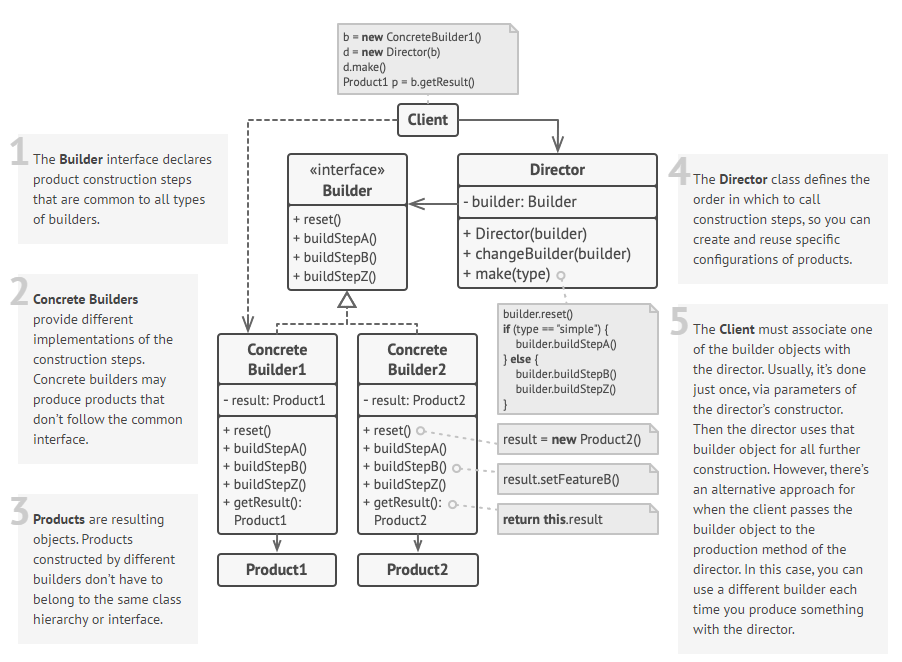

### Builder

Builder Pattern é destinado a resolver a construção de objetos complexos permitindo produzir diferentes resultados utilizando o mesmo código de construção.

Builder é fortemente implementado utilizando **Fluent API** facilitando a legibilidade do código.

Builder Pattern pode ser utilizado nos mais diversos tipos de problemas como:
- Criação de objetos para testes
- Criação de objetos complexos que são montados através de várias interações
- Validação na criaçaõ dos objetos
