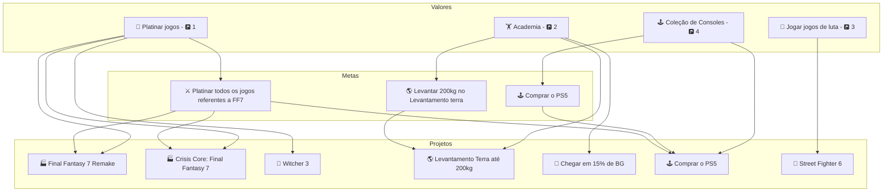
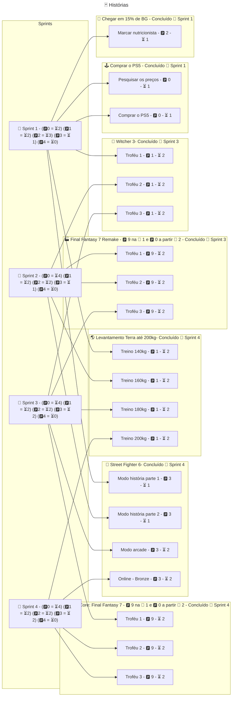

#planejamento_de_projetos 

A 🎽 Sprint é uma iteração de execuções de 🃏 Histórias que foram priorizadas com o objetivo de avançar na conclusão de 🎯 Metas e 🏆 Projetos ativos que por sua vez encurtam a distância para alcançar um 🌟 Valor.

Uma 🎽 Sprint é criada a fim de definir um objetivo concreto de forma a unir algumas histórias e então guiar a equipe a entregar mais valor. Esse objetivo é um compromisso entre a equipe de forma a durante uma período de tempo conseguirmos avançar de forma substancial no projeto.

As 🃏 Histórias candidatas a uma 🎽 Sprint devem estar devidamente refinadas, ou seja, o momento de refinar 🃏 Histórias é anterior do planejamento da 🎽 Sprint. 🃏 Histórias que ainda não estão suficientemente refinadas podem atrasar a entrega da 🎽 Sprint e consequentemente de valor.

### Propriedades de uma 🎽 Sprint

| Propriedade           | Descrição                                                                                                                        |
| --------------------- | -------------------------------------------------------------------------------------------------------------------------------- |
| Objetivo da 🎽 Sprint | Toda 🎽 Sprint deve ter um objetivo, ou seja, uma objetivo lógico que une todas as 🃏 Histórias a fim de entregar um valor maior |
| Data de início        | Data inicial da 🎽 Sprint                                                                                                        |
| Data de término       | Data final da realização da 🎽 Sprint                                                                                            |
| Total de tarefas      | Quantidade de tarefas atribuídas na 🎽 Sprint                                                                                    |
| Tarefas concluídas    | Quantidade de tarefas já concluídas                                                                                              |
| Tarefas atrasadas     | Quantidade de tarefas atrasadas                                                                                                  |
| Progresso             | Relação das tarefas concluídas com as tarefas atrasadas                                                                          |
| Sprint ativa          | Determina se a 🎽 Sprint está ativa, geralmente uma 🎽 Sprint é considerada ativa quando durante as datas de início e término    |
| 🏆 Épicos impactados  | Define os 🏆 Épicos impactados pela conclusão da 🎽 Sprint                                                                       |
| 🎯 Metas impactadas   | Define as 🎯 Metas que serão impactadas com a conclusão da 🎽 Sprint                                                             | 

### Priorização e planejamento de uma sprint

Anterior ao processo de planejamento é necessário que as 🃏 Histórias candidatas estejam suficientemente refinadas. Qualquer História que não se encaixe no padrão de refinamento não deve ser levantada como uma candidata.

> [!tip] 🃏 Histórias candidatas
> As 🃏 Histórias candidatas devem estar relacionadas ao objetivo a ser entregue pela 🎽 Sprint.
> 
> Não há motivo para apenas agrupar 🃏 Histórias em uma 🎽 Sprint sem essa união lógica. Nesse caso é melhor continuar com o desenvolvimento independente de Histórias (Kanban).

Com as 🃏 Histórias devidamente refinadas o planejamento se inicia levando em consideração os seguintes fatores:

- Prioridade do 🌟 Valor, constitui a base da prioridade, já que o principal objetivo de organizar Sprints é definir metas a curto prazo para alcançar um 🌟 Valor.
- Prioridade da 🎯 Meta, a prioridade da meta pode substituir a prioridade do 🌟 Valor
- Dependência, caso o projeto seja uma dependência de outro, ele deve ter uma prioridade maior.
- Dependente, caso o projeto seja dependente de outro, ele deve ter a menor prioridade até o projeto que é dependente seja concluído

#### Roteiro de planejamento

Esse roteiro pode ser utilizado como guia para o planejamento de uma 🎽 Sprint

- [ ] Cadastrar as tarefas com data de conclusão referentes ao objetivo
	- Tarefas mais prioritárias

- [ ] Adicionar tarefas a sprint de acordo com sua prioridade
	- Começar adicionar por projetos que são de primeira prioridade

- [ ] Criar o estado inicial da retrospectiva
	- [[⏪ Reunião de Retrospectiva#Propriedades inicias de uma Retrospectiva]]

O estado inicial da retrospectiva é utilizado para comparar os resultados depois de concluída a 🎽 Sprint. Dessa forma o time tem informação sobre vários aspectos do projeto, como progresso de Épicos, Metas e priorização.

### Durante a execução de uma 🎽 Sprint

Uma boa forma de pensar em uma 🎽 Sprint é como se ela fosse uma 🎯 Meta a curtíssimo prazo. Quando uma 🎽 Sprint está ativa todas as suas 🃏 Histórias tem uma prioridade superior a qualquer 🃏 História não definida na 🎽 Sprint atual.

A 🎽 Sprint não pode tomar todo o tempo de trabalho da equipe, já que outros rituais pertinentes ao desenvolvimento do projeto precisam ser executados, como por exemplo, refinamento de 🃏 Histórias.

Durante a execução da 🎽 Sprint o time se compromete ao ritual de reuniões diárias de andamento. Durante essas reuniões cada integrante do time explica brevemente a evolução em suas 🃏 Histórias associadas e caso necessário já levanta pedidos de ajuda com outros integrantes da equipe. Esses pedidos de ajuda podem ser solucionados ao final da reunião ou caso demandem um pouco mais de auxílio são levados para suas próprias reuniões.

### Finalização de uma 🎽 Sprint

Quanto a 🎽 Sprint chega ao final, ou seja, todas as tarefas propostas foram concluídas. É necessário fazer um processo de retrospectiva em relação ao trabalho executado.

A reunião de retrospectiva é o momento em que são convocados todos os integrantes que trabalharam durante a 🎽 Sprint para discutir o processo empregado durante seu desenvolvimento. Nesse momento sugestões são levantadas para melhoria de futuras 🎽 Sprints além da discussão sobre o valor entregue e próximos passos.

[[⏪ Reunião de Retrospectiva]]

# Exemplo de planejamento de uma 🎽 Sprint

Para o planejamento precisamos principalmente levar em consideração as prioridades dos vários 🌟 Valores, 🎯 Metas e 🏆 Projetos.

Digamos que tenho o seguinte cenário

- 🌟 Valores
    - 💎  Platinar jogos - 🅿️ 1
    - 🏋️ Academia - 🅿️ 2
    - 🤼 Jogar jogos de luta - 🅿️ 3
    - 🕹️ Coleção de Consoles - 🅿️ 4
- 🎯 Metas
    - ⚔️ Platinar todos os jogos referentes a FF7
        - ⏳ 3 meses
    - 🌎 Levantar 200kg no Levantamento terra
        - ⏳ 6 meses
- 🏆 Projetos
    - 🏭 Final Fantasy 7 Remake
    - 🏭 Crisis Core: Final Fantasy
    - 🐺 Witcher 3
    - 🌎 Levantamento Terra até 200kg
    - 🥑 Chegar em 15% de BG
    - 🥊 Street Fighter 6
    - 🕹️ Comprar o PS5

As sprints tem um tempo limitado para desempenhar as 🃏 Histórias. Essa quantidade de tempo deve ser determinada pela prioridade de cada 🃏 Histórias de maneira proporcional.

Como a sprint é organizada a partir desse exemplo:

