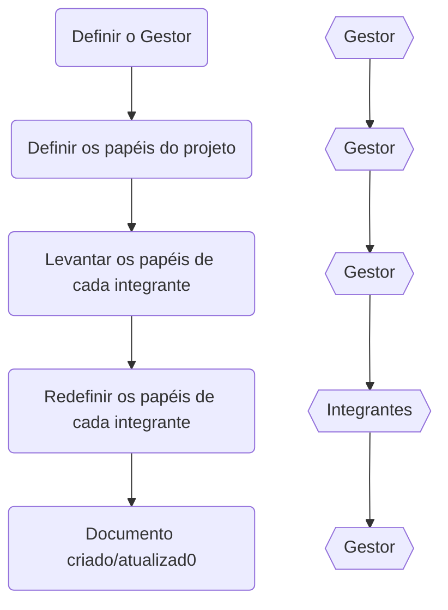
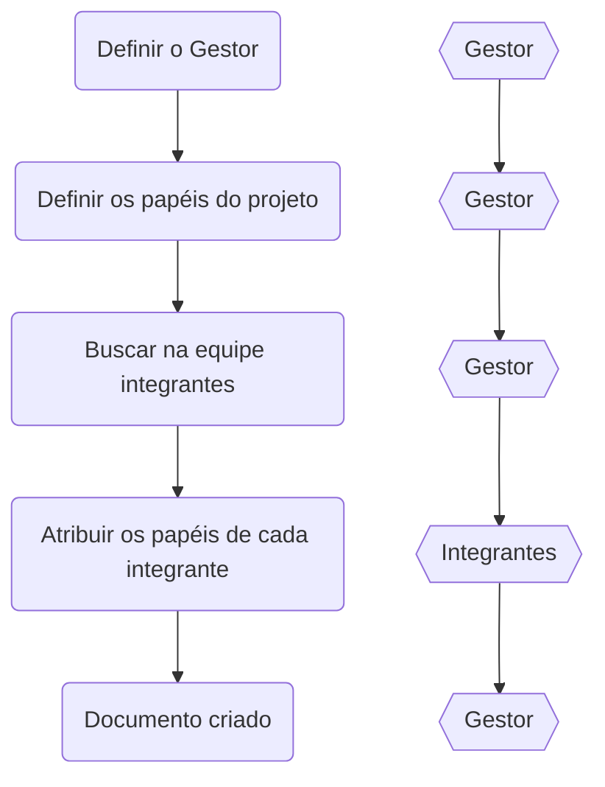

#planejamento_de_projetos/papéis

Um dos fatores que complicam o desenvolvimento de software é a falta de clareza nas atribuições de cada colaborador ao projeto. 

> 💡 Ter clareza no papel de cada integrante no projeto facilita a comunicação e acelera o processo de desenvolvimento.

A clareza na definição dos papéis dentro de um projeto resolve vários dos problemas comuns que acontecem no desenvolvimento de software, como:

- Configuração do time mal definida
- Todos os colaboradores fazem de tudo no projeto
- Falta de clareza quando necessário reportar um problema específico
- Falta de responsabilidade na execução do projeto (o famoso isso é fulano que faz)

Uma forma de reverter esse tipo de problema é definir os papéis dentro do time.

- Criar um documento com as definições dos papéis dentro da equipe.
  - Esse documento deve definir todos os papéis dentro do time, desde o programador e design na ponta até a maior hierarquia (cuidado com hierarquias, elas são gargalos no desenvolvimento e devem ser evitadas) dentro do time.
  - Deve apresentar exemplos de atribuições para cada papel dentro da equipe
- Criar cultura da importância dessas definições.
- Esse documento deve ser mantido e atualizado a cada alteração na equipe e no projeto.

> ⚠️ O **Gestor** é o papel responsável pela criação e manutenção da documentação de definições de papéis de todo o time.

A utilização de uma documentação clara das definições dos papéis de uma equipe geram várias vantagens durante o desenvolvimento, entre elas:

- Visibilidade dos integrantes do time
	- Cada integrante sabe exatamente qual a sua responsabilidade dentro do desenvolvimento
- Visibilidade dos canais de comunicação
	- Quando um bloqueio se mostra diante do time, dada a definição da natureza do bloqueio é simples de identificar os responsáveis pela remoção do bloqueio
- Onboarding de novos membros facilitado
	- Novos integrantes do time conhecem cada atribuição de uma vez

# Papéis

- [[PO - Product Owner (Gestor de projeto)]]
- [[Agilista (Líder de equipe)]]
- [[Desenvolvedor]]
- [[QA - Quality Assurance]]
- [[Stakeholders]]
- [[Game Designer]]
- [[Artista Designer]]

# Documento de definição de papéis dentro do time

> **Nome do documento:** Papéis do time

```md
<!-- Nome do arquivo: Papéis do time -->

# Integrantes do time

| Integrante | Papéis                              | Contato               |
| ---------- | ----------------------------------- | --------------------- |
| Fulano 1   | Frontend developer                  | email                 |
| Fulano 2   | Backend developer                   | email                 |
| Ciclano 1  | Backend developer, System Architect | email                 |
| Ciclano 2  | SM                                  | email                 |
| Beltrano 1 | QA                                  | email                 |
| Beltrano 2 | Manager                             | email, Whatapp número |

# Grupos de conversa do time

| Nome             | Plataform | Descrição                                            |
| ---------------- | --------- | ---------------------------------------------------- |
| Grupo Tal        | Whatsapp  | Grupo de conversa sobre tecnologia dentro do projeto |
| Grupo Tal Gestão | Whatsapp  | Grupo de gestão dentro do projeto                    |

# Links relacionados

Referencia para o documento de `objetivo do projeto`;

```

### Fluxo de levantamento de papéis para projetos legados



### Fluxo de levantamento de papéis para projetos novos


