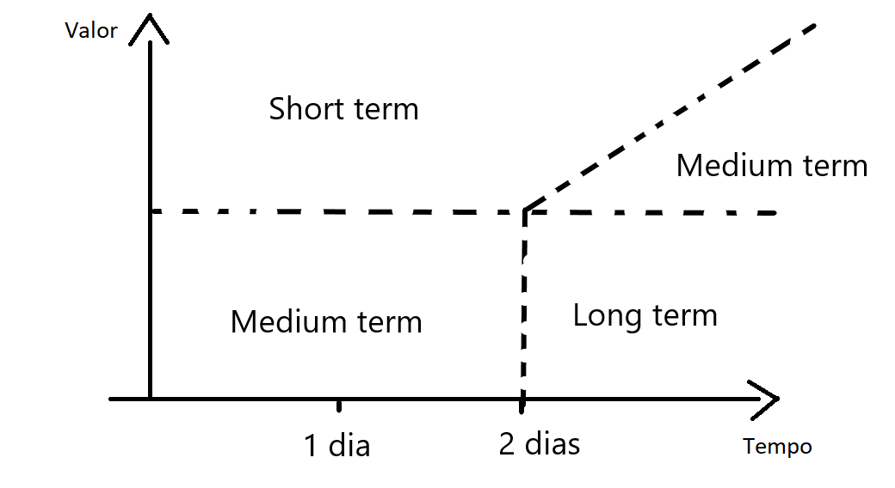

#planejamento_de_projetos 

O backlog de tarefas é o conjunto de histórias que serão refinadas em relação a vários aspectos do desenvolvimento para serem elegidas como candidatas para a produção ou descartadas.

O Backlog deve ser um recurso utilizado para facilitar ao time de desenvolvimento a criação de Histórias refinadas. O refinamento de Histórias acontece por parte do time de desenvolvimento, por meio de revisões, reuniões com usuários, clientes, time técnico, time de negócio e qualquer outro tipo de pessoa envolvida ou impactada pela História.

> [!tip] Tenha um Backlog refinado com moderação
Uma equipe deve ter um Backlog organizado, porém esse Backlog não deve estar demasiadamente refinado. O refinamento deve ser feito em reflexo ao desenvolvimento. Caso muitas Histórias sejam refinadas seu entendimento pode ficar perdido, assim esse tempo foi gasto em vão.

# Propriedades

| Propriedade | Descrição                                                                                                         |
| ----------- | ----------------------------------------------------------------------------------------------------------------- |
| Estimativa  | Tempo necessário para o desenvolvimento da 🃏 História                                                            |
| Valor       | Valor agregado ao projeto com a entrega da 🃏 História                                                            |
| Escala      | Estado da 🃏 História em relação ao seu refinamento                                                               |
| 🌟 Valor    | 🌟 Valor associado a 🃏 História. Toda 🃏 História deve estar associado a um Valor para determinar sua prioridade |

Todas as outras propriedades são iguais as de [[🃏 Histórias]] já que uma História de Backlog é apenas uma História que ainda não foi refinada.

> [!tip]- Estimativa
> A estimativa é a quantidade de trabalho necessário para a conclusão da História. Essa quantidade é estimada pelo time, porém não deve ser levado como uma previsão precisa de tempo gasto.
> 
> Ela pode ser estimada em 3 quantidades: Pequeno, Médio e Grande.
> - Pequeno significa no máximo 1-2 dias de trabalho. 
> - Médio entre 2-4 dias de trabalho
> - Grande mais do que 4 dias de trabalho
>   
>  Dessa forma caso as estimativas estejam muito grandes, são feitos sucessivos refinamentos para isolar o risco da História e assim diminuir as estimativas.

> [!tip]- Valor
> O Valor é uma ideia do impacto que a História terá em um grupo de usuários definido. Esse impacto define a quantidade desse valor.
> 
> A quantidade de Valor entregue pode ser dividida entre Pequena e Grande.
> - Pequena define que uma História não tem um impacto pouco notado na experiência desse grupo de usuários. Seja uma melhoria pequena de performance ou uma funcionalidade auxiliar.
> - Grande define que a História cria uma alteração no projeto que será amplamente notada pelo grupo de usuários. Seja uma melhoria de usabilidade ou uma grande melhoria de performance.
>   
> O grupo de usuário definido pode ser o próprio time. Exemplo, dado um processo novo de automação a equipe de desenvolvimento pode ser altamente impactada por esse processo. Nesse caso essa História deve ter um Valor alto de entrega.  

# História devidamente refinada

Para a História ser priorizada no Backlog é necessário que esta esteja devidamente refinada. Dessa forma o time tem um melhor entendimento sobre seu escopo e valor entregue.

> [!] Sobre refinamento de Histórias
> - [[Refinamento de Histórias]]
> - [[💎 Reunião de refinamento de Histórias]]

# Priorização de uma História

A criação de um backlog ajuda o time de desenvolvimento a ter acesso a todas as ideias levantadas que podem acrescentar valor ao projeto. Porém a medida que esse número de Histórias aumentam é necessário criar um alguma organização para priorizar Histórias.

## Custo/Benefício

O backlog pode ser dividido de acordo com a razão custo/benefício de cada funcionalidade no sistema.

Pode ser dividido na seguinte forma:

- Novo
  - Novas ideias que surgiram em reuniões de brainstorm ou durante o desenvolvimento
- Refinando
  - As ideias que já foram discutidas uma primeira vez durante alguma reunião de refinamento e precisam de mais algum tipo de refinamento
- Curto prazo
  - 🃏Histórias elegíveis para entrar nas próximas sprints de desenvolvimento
- Médio prazo
  - 🃏Histórias elegíveis para entrar em sprints futuras 
- Longo prazo
  - 🃏Histórias sem previsão para serem implementadas 
- Caducou
  - 🃏Histórias que não tem mais sentido a implementação no projeto, utilizado mais como um histórico de ideias que foram levantas. 

## Priorização de backlog

A priorização do backlog deve organizar as tarefas de forma a maximizar o valor entregue pelas funcionalidades no projeto e relação ao custo de produção, ou seja, tempo de desenvolvimento, custo com assets e ferramentas.

A media de tempo e de valor devem ser avaliadas junto ao time de desenvolvimento.