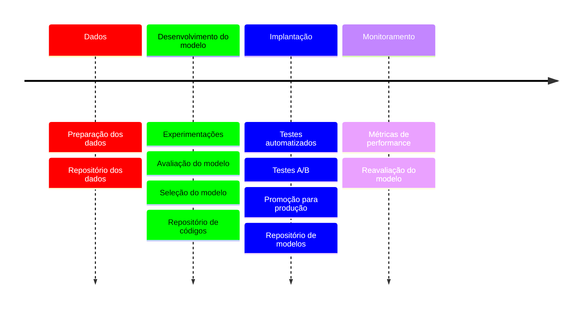

> [!info] Definição
> MLOps se refere à prática de operacionalizar e simplificar o ciclo de vida de machine learning de ponta a ponta, desde o desenvolvimento e implantação do modelo até o monitoramento e a manutenção

Os princípios chave do MLOps são:

- Controle de versão
- Automação
- CI/CD
- Governança de modelo

#### Fluxo do tempo de um ciclo com desenvolvimento MLOps

