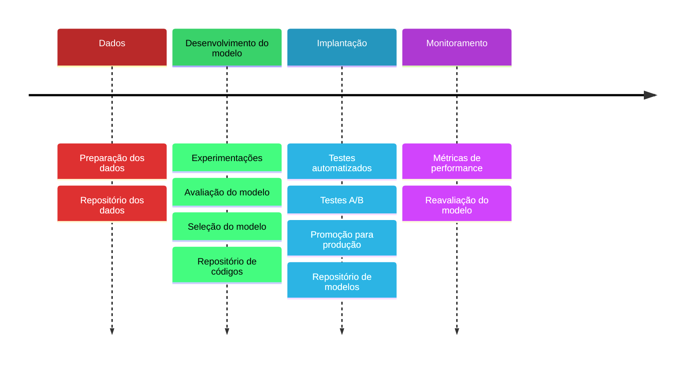

> [!info] Definição
> MLOps se refere à união de pessoas, processos e produtos aplicados ao ciclo de vida de machine learning de ponta a ponta, desde o desenvolvimento e implantação do modelo até o monitoramento e a manutenção.

Os princípios chave do MLOps são:

- Controle de versão
- Automação
- CI/CD
- Governança de modelo

#### Fluxo do tempo de um ciclo com desenvolvimento MLOps

# Arquitetura proposta

A arquitetura proposta busca acelerar o processo inicial de implantações de práticas MLOps em uma operação sem nenhum fluxo definido. 

Principais casos de uso:
- [[Machine Learning]]
- Pesquisa visual computacional
- [[Large Language Models]]

> [!quote]- Documentação - [MLOps pela Microsoft](https://learn.microsoft.com/pt-br/azure/architecture/ai-ml/guide/machine-learning-operations-v2)
> É apresentada uma arquitetura de referência para o desenvolvimento de MLOps na plataforma Azure. Acredito que ela apresenta muito bem os componentes necessários para esse formato de trabalho e pode ser implementada com algumas alterações em outras clouds.

Componentes

- Acervo de dados
- Administração e configuração
- Desenvolvimento de modelo
- Implantação de modelo

