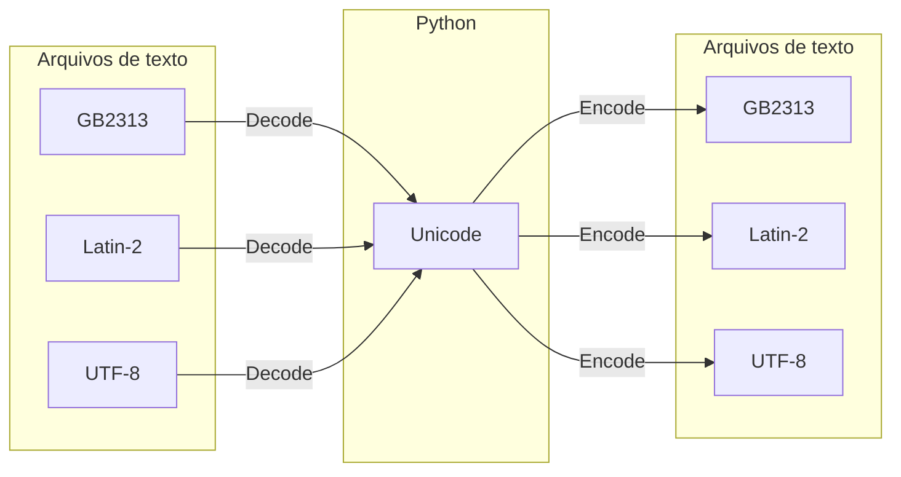

# Encoding e Decoding

Strings em python são manipuladas no formato de Unicode. O Unicode define mais de 1 milhão de tipos diferentes de caracteres no formato `\\uXXXX` onde `XXXX` é o código do caractere

Existem vários tipos de formatos como ASCII que tem origem em falantes de inglês e outros como Latin-2 com caracteres para falantes de línguas provenientes do Latim. Esses formatos podem armazenar cada caractere como um ou múltiplos bytes como é o caso do UTF-8.

Quando escrevemos essas strings em arquivos é necessário fazer o processo de encoding dessas strings em algum formato.

