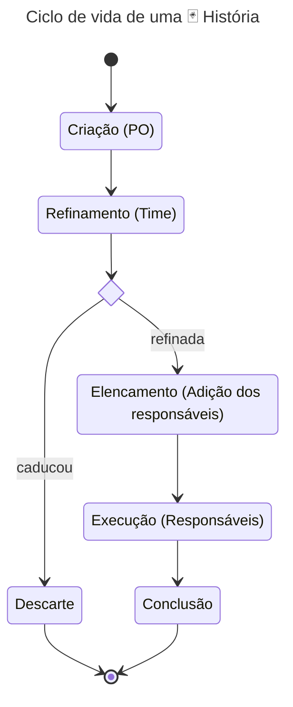

---
tags:
  - planejamento_de_projetos/histórias
---
# Descrição

Uma 🃏 História é a unidade de ação que será executada.

> [!info] Resumo
> Uma história do usuário é uma explicação informal e geral sobre um recurso de software. Ela é escrita a partir da perspectiva do **usuário final**. 
> 
> Seu objetivo é articular a forma como um recurso de software pode gerar valor para um usuário ou segmento de usuários.

Histórias como definido são focadas na entrega de valor para os usuários finais. Porém podemos separar histórias em relação a característica que esses valores são definidos. São essas histórias de **entrega de valor** e de [[Histórias de aprendizado]].
# Ciclo de vida

Uma 🃏 História é criada geralmente é criada pelo [[PO - Product Owner (Gestor de projeto)]] dada uma necessidade aparente dos usuários do sistema ou dos stakeholders. Nesse primeiro momento o PO tem a responsabilidade de descrever pelo menos sobre 3 aspectos da História:

- Problema (qual aspecto essa alteração impacta no sistema)
- Usuário (qual usuário ou segmento de usuários contemplados)
- Solução (qual o valor que os usuário irão receber na solução do problema)

> [!tip] Dicas para criação de Histórias
> Uma boa História é assertiva o suficiente para capturar a **essência do requisito** e vaga o suficiente para **permitir várias soluções** para o mesmo requisito.
> 
> Histórias devem claramente informar a alteração no comportamento relacionada ao projeto de forma a definir quais são os usuários impactados e que tipo de valor esses usuários irão receber.

Após a criação essa 🃏 História começa a ser definida refinada durante o processo de refinamento ([[Refinamento de Histórias]]). Durante esse processo a 🃏 História é transformada de várias formas, levando até ao entendimento que não faz mais sentido e ela é então descartada.

Quando ela está devidamente refinada, a História já apresenta todas as informações necessárias para sua execução. Assim ela pode pode ser adiciona a um 🎽 Sprint ou executada diretamente.

Com a História em progresso, ela passa a ser de responsabilidade dos seus desenvolvedores (quaisquer papéis responsáveis). Quando o recurso está devidamente entregue (critérios de aceite concluídos) a História é dada como concluída.




# Propriedades de uma 🃏 História

> [!tip]- Título
> O título de uma história é um lembre rápido sobre o que a História se trata.
> Bom títulos são simples e descrevem o aspecto central da História sem explicitar a solução empregada.
> 
> Exemplos bons
> - Contato inicial
>   - Brevemente descreve o primeiro contato do jogador com o jogo, não explicita se será por uma tela, um menu ou diretamente pelo jogo, essas soluções serão discutidas durante o desenvolvimento. Porém o valor está claro, é o contato inicial do jogador que deve ser muito bem tratado.
>- Dano em área
>    - Brevemente descreve uma História que apresenta uma mecânica de Dano em Área. Não é explicitado que tipo de recurso será utilizado com esse tipo de mecânica.
> 
> Exemplos ruins
> 
> - Criar a Tela inicial
>	- Nesse caso já especifica a criação de uma tela inicial, porém não descreve nenhum tipo de valor entregue por essa tela, ou seja, apenas criar uma tela inicial não demonstra nenhum valor que o usuário irá ganhar.
>	- Outra questão é no uso de uma ação para descrever a História. Criar a Tela inicial é ambíguo, isso envolve implementar a tela? criar o design? Uma História deve conter toda a discussão necessária para entrega de valor, então utilizar essa nomenclatura não deixa claro para o time que tipo de trabalho deve ser feito.
> - Ataque de fogo em área para personagem XYZ
> 	- Nesse caso a História apresenta vários conceitos, esses conceitos podem ser quebrados em Histórias próprias e então serem combinadas por meio de configurações. Assim Ataque de Fogo, Ataque em Área e Personagem XYZ são Histórias independentes.

> [!tip]- Descrição (Modelo AS... IN ORDER TO ... I WANT)
> Esse é o modelo mais comum de encontrar quando equipes descrevem Histórias. Ele pode ser um bom modelo, porém é importante lembrar que Histórias devem relatar uma alteração no comportamento do projeto de forma a entregar valor ao usuário. Assim o formato de escrita deve apresentar de forma bem resumida essas características.
> Bons exemplos
> - Como jogador casual a fim de acessar as imagens completadas eu quero uma visualização própria
> - Como jogador profissional a fim de melhorar minhas habilidades eu quero um modo de treinamento
> - Como jogador offline a fim de poder ir ao banheiro ou cozinha durante o gameplay quero poder pausar o jogo sem nenhum tipo de punição.
>
> Maus exemplos
> 
> - Como jogador a fim de começar a jogar quero ter um menu com um botão de começar a jogar
>	- Essa História tem problemas nos 3 aspectos necessários para sua explicação.
>	- O usuário impactado não está bem definido, ou seja, é um grupo muito genérico
>	- A premissa também está confusa, começar a jogar não define um modo de jogo específico ou qualquer coisa, assim não define o real valor entregue ao grupo de usuário
>	- Por fim essa História está definindo qual o resultado esperado, a criação de um menu com um botão, isso impede qualquer tipo de discussão e impede outras formas de solução da História.

> [!tip]- Critérios de aceite (CA)
> Critérios de aceite, também conhecidos como acceptance criteria, são condições que devem ser satisfeitas a fim de que uma História seja aceita. Cada CA deve ser expresso como uma conjunto de declarações que visam descrever o que será entregue como valor pela História, sem focar no resultado de implementação final esperado.
> 
> Os critérios de aceite devem ser concisos, testáveis, claros e focado no resultado.
> 
> - Modelo baseado em cenário
>
>Um modelo recorrentemente utilizado na criação de casos de testes e critérios de aceite é imaginar um cenário e de acordo a uma ação ou acontecimento se espera um resultado. Pode se utilizar o formato **Given that; when; then**.
>
>🃏 História: Como jogador profissional a fim de melhorar minhas habilidades eu quero um modo de treinamento
>
>Bons exemplos
>- Espero que seja simples acessar o modo de treinamento
>- Espero escolher um personagem para treinar
>
>Maus exemplos
>- Quando entro no modo de treinamento espero poder configurar opções para o oponente atacar de forma automática enquanto pratico meus movimentos
>	- Justificativa: esse critério expande o escopo da História, já que a História visa um modo de treinamento em seu formato inicial. Assim, esse critério poderia ser promovido a uma História própria.
>- No modo de treinamento apertar o botão R1 para resetar a cena e voltar com todos os personagens na posição inicial
>	- Justificativa: esse CA define o como será implementado o resete dos personagens (por meio do botão R1), porém esse tipo de definição pode mudar durante o desenvolvimento então em algum momento esse CA se torna obsoleto.

| Propriedade  | Descrição                                                                                                                                                                                  |
| ------------ | ------------------------------------------------------------------------------------------------------------------------------------------------------------------------------------------ |
| Tags         | Palavras chaves a fim de definir o contexto que a História se aplica. Utilizado para facilitar a classificação.                                                                            |
| Estimativa   | Define a quantidade de trabalho necessário para a conclusão da História. O trabalho necessário deve levar em consideração todo o processo de concepção da ideia, desenvolvimento e testes. |
| Valor        |                                                                                                                                                                                            |
| Vencimento   | Data limite para a conclusão da História. Se essa Históra não for concluída até essa data é um problema para o projeto no geral.                                                           |
| Iniciado em  | Data de início da História.                                                                                                                                                                |
| Concluído em | Data de conclusão da História.                                                                                                                                                             |
| Status       | Estado atual da História.                                                                                                                                                                  |

## Prioridade

A prioridade de qualquer 🃏 História é associada ao 🏆 Épico ou 🌟 Valor relacionado.

Quando um 🏆 Épico define um valor a ser entregue no projeto é necessário que todas as histórias dentro do 🏆 Épico tenham sido concluídas para que então o valor tenha sido entregue. Assim dentro de um Épico não há a necessidade de priorizar histórias.

Quando a História não faz parte de um Épico a sua prioridade é dada pela prioridade do 🌟 Valor relacionado.


> [!info] Priorização de um 🏆 Épico
> [[🏆 Épicos#Priorização de 🏆 Épicos]]

## Estimativa

Define a quantidade de trabalho necessário para a conclusão da História. O trabalho necessário deve levar em consideração todo o processo de concepção da ideia, desenvolvimento e testes.

A estimativa nunca é um valor exato de desenvolvimento. Uma boa forma de estimar é dividir a quantidade de trabalho entre:

- Pequeno
- Médio
- Grande

Por meio desses 3 valores podemos definir a quantidade de esforço, e a medida que o esforço aumente podemos pensar em alternativas para quebrar as Histórias em outras e então refinar cada uma a fim de chegar em uma quantidade de trabalho menor. 

Uma forma de avaliar a questão da estimativa é:

- Pequeno: algumas horas (1 dia)
- Médio: poucos dias (2-3 dias)
- Grande: alguns dias (2+ dias)

Dessa forma os integrantes do time tem um melhor entendimento da quantidade de trabalho desenvolvido

## Impacto

Define o valor revertido para o grupo de usuários impactados em relação a sua relevância.

Podem ser separados em 2 tipos de entrega de valor
- Baixo: entrega um valor pequeno para o 🌟 Valor ou 🏆 Épico associado
    - Sua conclusão tem um pequeno impacto
- Alto: entrega um valor alto para o 🌟 Valor ou 🏆 Épico associado
    - Sua conclusão tem um alto impacto
## Estado

Estado atual da História.    
- A fazer
- Progresso
- Pausado
- Concluído 

## Tags

Tags são utilizadas para em poucas palavras definir o contexto que a História se aplicar.

Algumas tags também podem mudar o formato que a História é desenvolvido.

# Template de uma 🃏 História

Para facilitar a criação de Histórias dentro de um projeto é interessante utilizar um template. Esse template implementa uma estrutura que consolida os conceitos empregados pelo time a fim de auxiliar na discussão.

```markdown
# Título <Breve descrição do problema a ser solucionado>
 
> PARA **\<motivo do trabalho>**
> 
> COMO **\<persona>**
> 
> QUERO **\<problema a ser solucionado>**

## Critérios de aceite

Critério de aceito:
- Condição
Critério de aceito 2:
- Condição
Critério de aceito 3:
- Condição

```

# Exemplos de utilização

- [[Exemplo - Resta Um]]

# Referências

- [Everything You Need to Know About Acceptance Criteria by Scrum Alliance](https://resources.scrumalliance.org/Article/need-know-acceptance-criteria#:~:text=Acceptance%20criteria%20are%20defined%20as,re%20never%20only%20partially%20fulfilled.)
	- Bom texto sobre Acceptance Criteria, com uma definição concisa sobre o básico de seus conceitos e utilização.
- [User stories com exemplos e template](https://www.atlassian.com/br/agile/project-management/user-stories)
- [Agile User Story Splitting by Non-Functional Requirements](https://corebts.com/blog/agile-user-story-splitting-non-functional-requirements/#:~:text=%E2%80%9CA%20type%20of%20requirement%20that,a%20solution%20as%20a%20whole.%E2%80%9D)
- [[_Fifty Quick Ideas to improve your User Stories|Fifty Quick Ideas to improve your User Stories]]

