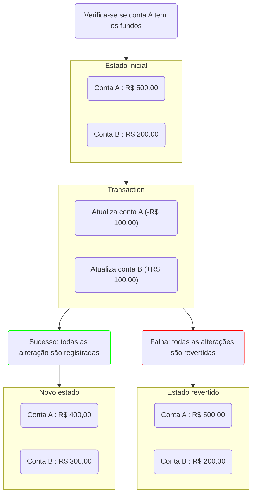

#planejamento_de_projetos/incidental_work 

> [!info] Trabalho incidental
> Algumas tarefas necessárias para o desenvolvimento do projeto devem ser destacadas da criação de Histórias, já que elas não entregam valor nem para o usuário final nem para os stakeholders.

Para o trabalho incidental a equipe do projeto deve separar uma quantidade de tempo específico durante uma iteração. Essa quantidade de tempo pode variar de 20-40% do tempo disponível de acordo com a necessidade da equipe.

O trabalho incidental não tem necessidade de ser formalmente catalogado, porém é necessário que algumas dessas tarefas sejam definidas, quando apresentam uma complexidade maior ou não podem ser executadas no presente momento, como a atualização da versão de um software, ou uma reescrita maior de uma parte do sistema.

As tarefas referentes ao trabalho incidental devem ser trabalhadas nesse tempo separado para esse tipo de trabalho.

> [!tip] Trabalho incidental vs Histórias
> O trabalho incidental não deve ser tratado em nenhum momento com a mesma prioridade que uma História. 
> 
> Durante a execução de uma História é um momento bom para efetuar trabalhos incidentais relacionados, desde que isso não impacte consideravelmente em sua complexidade.
> 
> Dependendo da quantidade de trabalho incidental acumulado sobre um determinado escopo, esse trabalho pode ser transformado em História de usuário, já que provavelmente esse impactará pelo menos algum grupo de usuários do sistema. (Por exemplo, uma reestruturação que impacte performance pode ser sentida pelos usuários).

# Exemplos de trabalho incidental:

- Reuniões no geral
- Refinamento de Histórias
- Melhorias de código que não impactem diretamente ao usuário final
- Atualização de bibliotecas
- Limpeza do projeto
- Melhoria de documentação que não foi feita bem durante o desenvolvimento das funcionalidades.

> [!warning] Não deve ser feito um segundo backlog para trabalho incidental.
> Esse tipo de organização é perda de tempo, já que qualquer História sempre terá uma prioridade maior que o trabalho incidental por entregar valor direto.

# Execução de trabalho incidental pela equipe

O ideal é que esse tempo de trabalho seja definido em períodos, como por exemplo, a sexta feira será o dia definido para execução de trabalho incidental. Dessa forma evitamos qualquer tipo de micro gerenciamento (que não é uma prática eficiente).

Essa divisão do trabalho incidental pode ser feita de duas formas:

- Atribuímos a uma pessoa apenas durante uma iteração que fique por conta de trabalho incidental
- Podemos distribuir para toda a equipe essa quantidade

Ambas as propostas tem seus prós e contras e devem ser avaliadas pela equipe.

# Refinamento de Trabalho incidental

É importante que o trabalho incidental não fique acumulado. 

Esse tipo de trabalho deve ser revisado uma vez durante cada iteração para verificar se faz sentido. Caso contrário esse cadastro deve ser descartado.

# Template de criação de trabalho incidental

Caso o trabalho incidental não possa ser feito em um determinado momento, ele deve ser persistido para ser implementado em algum momento futuro.

É necessário então definir algumas coisas durante a criação dessa tarefa.

- Tags, tipo de trabalho a ser desempenhado
- Responsável pelo trabalho se tiver alguém
- Responder: "Por que esse trabalho é importante?"
- Descrição do trabalho necessário

# Referências

- [[Managing Iterative Delivery]]

# ACID

ACID é uma conjunto de características que suportam as transações atômicas muito utilizadas em bases de dados. Elas garantem que a base de dados irá manter uma imagem consistente do mundo dos dados.

- *Atomicity*
	- Garante que uma conjunto de alterações seja registrado como uma unidade.
- *Consistency*
	- Qualquer leitura a uma base de dados irá retornar a última versão do item recuperado.
- *Isolation*
	- Define que se duas atualizações estão correndo concorrentemente para a mesma coisa, o estado final da base de dados será executado em ordem sequencial
- *Durability*
	- Indica que os dados registrados nunca serão perdidos

Características:
- ➕ Simplifica bastante o desenvolvimento de aplicações
- ➖ A fim de garantir consistência verificações são definidas impactando na performance do sistema

Exemplo: Conta de banco
Um usuário que enviar R$ 100,00 da conta A para a conta B.

Em um sistema ACID a operação para isso ser possível é feita da seguinte maneira:

