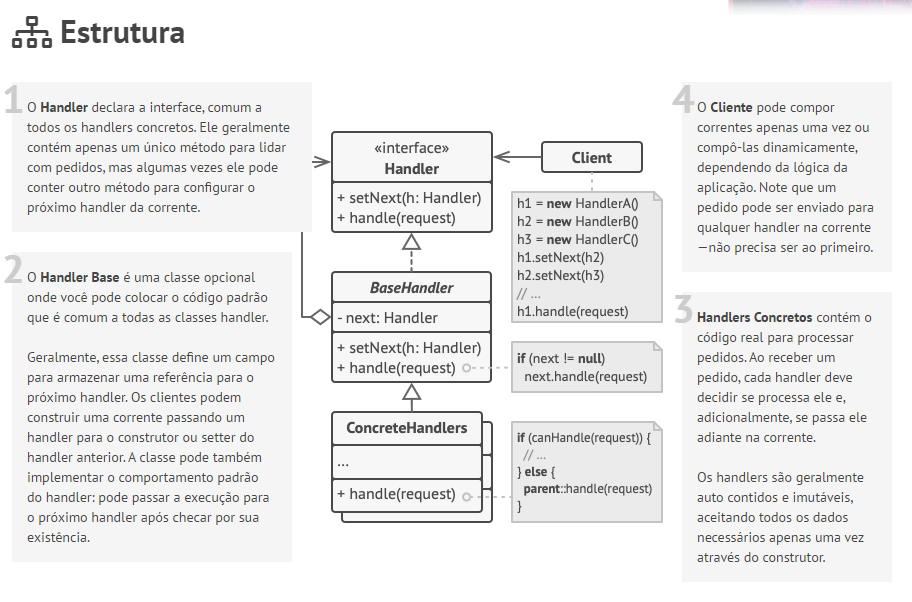

---
tags:
  - programação/padrões
---
# Chain of Responsibility

> [!info]
> Chain of Responsibility Pattern é uma especificação estrutural que garante a passagem de requisições em uma cadeia de validações. Cada **Handler** (etapa da cadeia) é responsável por processar a requisição de acordo com o parâmetros de entrada de cada etapa.



# Exemplo de um roteador de requisições

```javascript
class Route {
    constructor(route) { this.route = route }
    setNext(handler) { this.next = handler; return this; }
    handle(request) {
        if (request.route === this.route) next.handle(request)
    }
}

class AuthTokenValidator {
    constructor(tokenValidator) { this.tokenValidator = tokenValidator }
    setNext(handler) { this.next = handler; return this; }
    handle(request) {
        if (!this.tokenValidator.isValid(request)) 
	        throw new Error("Should have a valid token")
        next.handle(request)
    }
}

class AuthRoleValidator {
    constructor(IAMRepository, role) {
        this.IAMRepository = IAMRepository
        this.role = role
    }
    setNext(handler) { this.next = handler; return this; }
    handle(request) {
        if (!this.IAMRepository.hasRoleByAuth(request.authToken, role))
            throw new Error("Unauthorized")
        next.handle(request)
    }
}

const adminRoute = new Route("/admin")
    .setNext(new AuthTokenValidator(new TokenValidator())
        .setNext(new AuthRoleValidator(new IAMRepository(), "admin"))
    )
    
const landingPage = new Route("landing-page");

const userRoute = new Route("/")
    .setNext(new AuthTokenValidator(new TokenValidator())
        .setNext(new AuthRoleValidator(new IAMRepository(), "user"))
    );

adminRoute.handle(request);
landingPage.handle(request);
userRoute.handle(request);
```


# Referências

