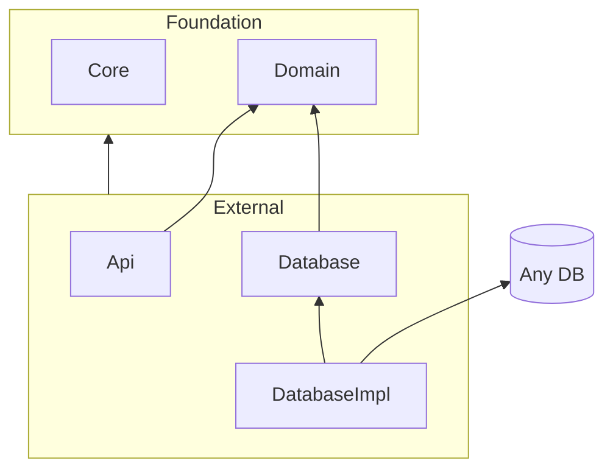
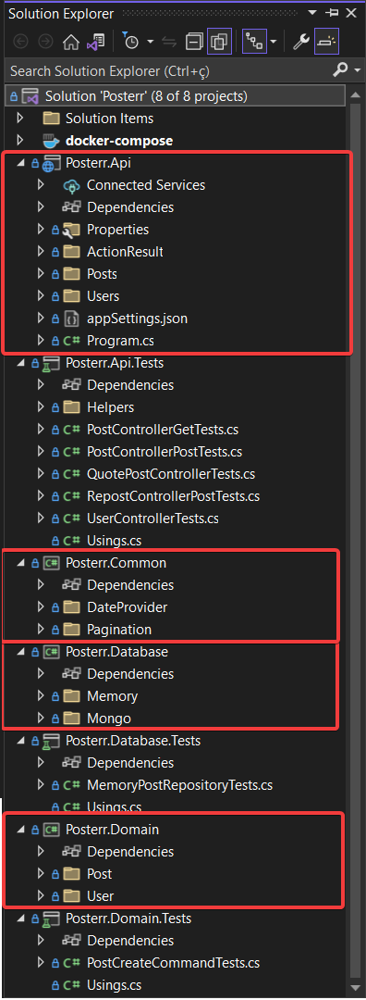

# Domain Driven Backend

Um backend desenvolvido utilizando separação por domínio aumenta a flexibilidade em relação a implementação.

Basicamente um projeto de backend pode ser dividido em 4 responsabilidades:

- **Core:** define funcionalidades comuns que pode ser utilizado em vários projetos
- **Domain:** define regras as regras de negócio
  - Criação das entidades
  - Validações
  - Modelo das entidades
- **API:** define o que é aberto para consumo externo
- **Database:** implementa a persistência dos dados

O projeto `Domain` define as formas de interação entre o sistema

- Commands
  - e.g Comandos para gerenciamento das entidades
- Entities
  - Definição do modelo das entidades
- Validators
  - Regras de negócio das entidades
- Repositories
  - Interfaces do formato de persistência das entidades

O diagrama abaixo apresenta a relação entre as responsabilidades. A sessão de Foundation é responsável por código que será utilizado em todos os projetos. A sessão de External é responsável pela implementações das integrações. Dessa forma é possível controlar várias versões externas do domínio enquanto o domínio se mantém intacto.

A comunicação entre os componentes dentro da sessão External é sempre feita por meio do domínio.

Aqui tem um exemplo de projeto em `dotnet core` que segue esse formato.

