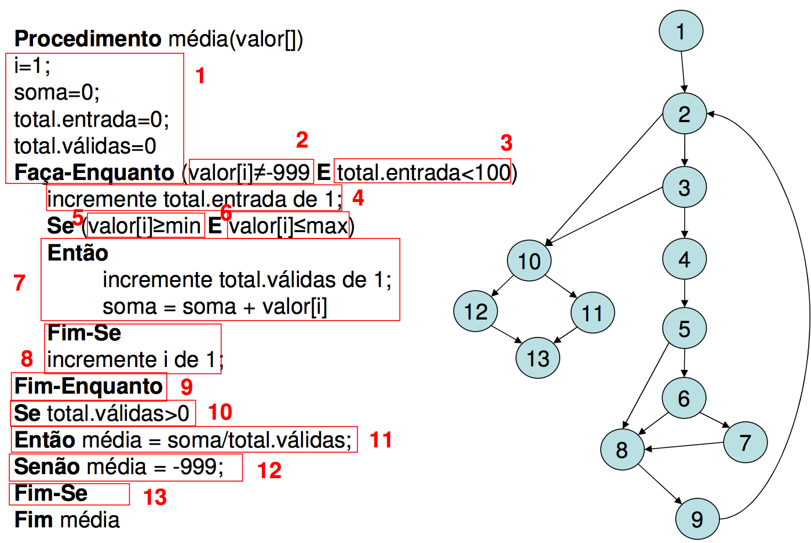

# Table of contents

- [Table of contents](#table-of-contents)
- [Semântica de código](#semântica-de-código)
  - [Ferramentas de refatoração](#ferramentas-de-refatoração)
  - [Etapas da refatoração](#etapas-da-refatoração)
  - [Uma função faz uma única coisa](#uma-função-faz-uma-única-coisa)
  - [Evitar condicionais com múltiplas instruções](#evitar-condicionais-com-múltiplas-instruções)
  - [Side effects (evitar utilizando múltiplos retornos)](#side-effects-evitar-utilizando-múltiplos-retornos)
  - [Evitar switch/cases](#evitar-switchcases)
  - [Nomenclatura variáveis](#nomenclatura-variáveis)
  - [Nomenclatura de métodos](#nomenclatura-de-métodos)
  - [Evitar Comentários](#evitar-comentários)
  - [Tratamento de exceções](#tratamento-de-exceções)
  - [Hierarquia de projetos](#hierarquia-de-projetos)
    - [Front-end](#front-end)
  - [Ferramentas de auxilio na construção de código](#ferramentas-de-auxilio-na-construção-de-código)
    - [Gerais](#gerais)
    - [Javascript](#javascript)
    - [Vue](#vue)
- [Exemplos](#exemplos)
- [Bibliografia](#bibliografia)

# Semântica de código

> Definição: Semântica é o estudo do significado. 

> Minha definição: Quando vc olha para o código e não te vem um que porra é essa na cabeça, a pessoa consegue entender o que foi implementado e quais as decisões que foram tomadas.

Existem arquiteturas que favorecem a semântica de um projeto. Eric Evans autor do livro Domain Driven Design descreve em seu livro ferramentas e procedimentos que auxiliam na criação de uma aplicação ou conjunto de serviços que possuem um linguagem de comum entendimento entre todas as entidades responsáveis pelo projeto.

## Ferramentas de refatoração

Todas as IDEs e Editores de Texto atuais apresentam ferramentas de refatorações que automatizam tarefas.

- Renomear
  - VSCode: `F2`
- Extrair código
  - VSCode: `CTRL + .` 

## Etapas da refatoração

Podemos seguir algumas etapas enquanto estamos refatorando um código legado.

- Criar teste com o resultado final do que está sendo refatorado
  - Pode não ser tão simples dependendo no sistema, porém é muito importante que façamos isso para garantir que o comportamento do código não mude de acordo com a refatoração
- Passo 1: reduzir a desordem (Reduce Clutter)
  - Remover código desnecessário
  - Remover comentários que não são pertinentes
  - Extrair métodos simples
  - Reduzir expressões lógicas
- Passo 2: reduzir a complexidade ciclomática
  - Extrair métodos para código dentro de loops
  - Extrair métodos para código dentro de ifs
- Passo 3: criar métodos
  - Identificar parte do código e extrair para métodos que descrevem bem seu comportamento

## Uma função faz uma única coisa

Seguindo o princípio de responsabilidade única cada função deve resolver um único problema.

Vantagens:

- Aumento da legibilidade de código
- Diminuição de replicação de código
- Possibilidade de utilizar Testes Unitários

## Evitar condicionais com múltiplas instruções

> Complexidade ciclomática é uma métrica do campo da engenharia de software, desenvolvida por Thomas J. McCabe em 1976, e serve para mensurar a complexidade de um determinado módulo (uma classe, um método, uma função etc), a partir da contagem do número de caminhos independentes que ele pode executar até o seu fim.

Aumento da complexidade do código:
- estruturas aninhadas
- múltiplos condicionais



## Side effects (evitar utilizando múltiplos retornos)

Side effects são alterações no código que podem levar a um comportamento não esperado. O famoso mexi numa coisa e quebrou outra.

Side effects são sintomas que um determinado treixo de código está sobrecarregado de responsabilidades e deve ser refatorado.

Alguns fatores que podem ocasionar side effects
- Alta complexidade aciclomática no código
- Variáveis que são alteradas durante a execução de várias linhas de código

```js
let obj = {a: 0};

doSomething(obj)

obj.a += 1
console.log(obj)

// Não sabemos o que será retornado, já que o obj pode ter sido alterado durante doSomething
```

Esse tipo de side effect pode ser ainda pior quando utilizamos funções assíncronas sem aguardar os devidos resultados.

```js

let books = []
let isBooksEmpty = true

doSomethingAsync()
  .then((res) => books.append(res.data))

doAnotherthingAsync()
  .then((res) => isBooksEmpty = !books.length)

console.log(isBooksEmpty)
// O que será printado no console?
```

## Evitar switch/cases

Estruturas switch/cases permitem muitos caminhos dentro do código. Esse tipo de estrutura aumenta muito a complexidade ciclomática e reduz muito a flexibilidade do código.

Esse tipo de estrutura pode ser facilmente substituida por sistemas de inscrição ou padrões de estrutura como Strategy Pattern.

## Nomenclatura variáveis

O nome de uma variável deve ser proporcional ao escopo que ela está inserida.

> Maior o escopo mais descrito o nome
> Menos o escopo mais encurtado o nome

O nome da variável também deve se referir ao contexto em que se encontra. Dessa forma mantemos uma consistência entre o que está escrito.

Exemplos

- Componente for uma página de conteúdo
  - variável que chama `title`
  - dessa forma eu sei que title se refere ao conteúdo
- Lista de páginas de conteúdo
  - variável `title` já não descreve bem sobre qual conteúdo se refere
  - dessa forma seria importante descrever melhor o title
  - por exemplo: `listTitle` e `contentTitle`

Evitar nomes genéricos já que eles não carregam nenhum valor simbólico ao negócio que a aplicação estão se propondo a resolver.

Nomes devem ser sempre carregar algum significado.
  
- Exemplos
  - data -> user
    - nesse caso o uso do data é sempre redundante, já que tudo pode ser considerado como data
  - info -> book_info
    - referente a informações do livro
  - handler -> url_handler
    - comando para tratar a url
  - wrapper -> buttons_wrapper
    - componente que envolve os demais componentes de botões
  - holder -> image_holder
    - componente que uma imagem será inserida ou encontrada

## Nomenclatura de métodos

Métodos devem ser nomentados de acordo com a ação que será executada. 

Métodos devem ser sempre isolados, não deve ser necessário o conhecimento da forma que um método foi implementado para sua utilização

Métodos que realizam algum tipo de ação devem começar com um **verbo de ação**.

```js

// bad
function filter(books, true){}  // falta de clareza na forma que esse filtro

// good
function filterByAuthor(books){}
```

Métodos que retorna um boolean devem ser escritos como uma **pergunta**.

```js
// bad
function userStatus(user){}  // não define o tipo de retorno

// good
function isActive(user){}
```

Um método não deve apresentar múltiplos parâmetros.

```js
// bad
// como faço para adicionar um parâmetro? 
// Vai quebrar em todas as partes do projeto que já utilizam esse código
function addUser(active, name, type, role, createdAt){} 
addUser(true, null, null, "admin", null) // não demonstra que tipo de usuário será criado

// good
function add(user){}
user = {isActive: true, role: "admin"}
add(user)
```

Um método não deve receber apenas um parâmetros booleano. Nesse caso o idela é criar dois métodos.

```js
// bad
function addUser(isTeacher){
  if(isTeacher){
    user.type = "teacher"
  }
  else {
    user.type = "admin"
  }
} 
addUser(true) // utilização não me diz nada

// good
function addAdmin(user){ user.type = "admin" }
function addTeacher(user){ user.type = "teacher" }
```

## Evitar Comentários

Comentários devem ser evitados no código. 

O próprio código deve ser auto explicativo, utilizando nomenclaturas e estruturas claras que demonstrem a intenção do que está sendo implementado. 

Porém comentários são uma ferramenta extremamente útil para descrever funções e classes para terceiros. Ou seja, se vc estiver criando uma biblioteca ou framework é de suma importancia que a camada mais externa do código seja documentada por meio de comentários, já que o desenvolvedor que utilizará o código não precisa saber sobre a implementação para utilizar seus recursos.

## Tratamento de exceções

Deve sempre lançar exceções quando o código não apresenta o comportamento de sucesso.

No exemplo abaixo vemos um simples método de validação. Perceba que no primeiro código o formato de retorno muda dependendo das verificações, esse tipo de prática é considerada um problema já que pode ocasionar bugs para chamadas a esse método.

```js

// bad code
function validate(obj){
  if(!obj.hasOwnProperty("name"))
    return { code: 1 , error: "Object has no property name"}

  return obj
}

// good code
function validate(obj){
  if(!obj.hasOwnProperty("name"))
    throw "Object has no property name"

  return obj
}
```

## Hierarquia de projetos

### Front-end

Estrutura padrão de front-end baseada em categorização por função. Vários framework criam o projeto se baseando nesse tipo de arquitetura do código. 

```
📦src
 ┣ 📂 assets
 ┃ ┣ 🖼️ user_profile_image_placeholder.png 
 ┃ ┣ 🖼️ logo.png
 ┃ ┗ 🖼️ book_cover_placeholder.png
 ┣ 📂 components
 ┃ ┣ 📜 AuthorDisplay
 ┃ ┣ 📜 UserDisplay
 ┃ ┣ 📜 BookDisplay
 ┃ ┗ 📜 DateDisplay
 ┣ 📂 services
 ┃ ┣ 📜 UserService
 ┃ ┣ 📜 BookService
 ┃ ┗ 📜 AuthorService
 ┣ 📂 router
 ┃ ┣ 📜 UserRouter
 ┃ ┗ 📜 BookRouter
 ┣ 📂 store
 ┃ ┗ 📜 UserStore
 ┣ 📂 views
 ┃ ┣ 📜 UserView
 ┃ ┗ 📜 BookView
 ┣ 📂 tests
 ┃ ┣ 📂 components
 ┃ ┣ 📂 services
 ┃ ┣ 📂 router
 ┃ ┣ 📂 store
 ┃ ┗ 📂 views
 ┗ 📜 main.js
```

Problemas com esse tipo de abordagem:
- Alto acoplamento entre os diversos componentes
- Baixa coesão, já que scripts que resolvem problemas diferentes estão associados
- Péssima visibilidade da intensão do projeto

Uma forma de suprir esse problemas é implementar uma arquitetura de código orientada ao significado de cada componente do sistema. Como **Kent Beck** falou uma vez a definição de coesão é:

> Pull the things that are unrelated further apart, and put the things that are related closer together.

Dessa forma a arquitetura do exemplo de Front-end poderia ser implementada da seguinte forma.

```
📦src
 ┣ 📂 user
 ┃ ┣ 📂 tests
 ┃ ┣ 🖼️ user_profile_image_placeholder.png 
 ┃ ┣ 📜 UserService
 ┃ ┣ 📜 UserDisplay
 ┃ ┣ 📜 UserRouter
 ┃ ┣ 📜 UserView
 ┃ ┗ 📜 UserService
 ┣ 📂 book
 ┃ ┣ 📂 tests
 ┃ ┣ 🖼️ book_cover_placeholder.png
 ┃ ┣ 📜 BookService
 ┃ ┣ 📜 BookDisplay
 ┃ ┣ 📜 BookView
 ┃ ┗ 📜 BookRouter
 ┣ 📂 author
 ┃ ┣ 📂 tests
 ┃ ┣ 📜 AuthorDisplay
 ┃ ┗ 📜 AuthorService
 ┣ 📂 common
 ┃ ┣ 📂 tests
 ┃ ┣ 🖼️ logo.png
 ┃ ┗ 📜 DateDisplay
 ┗ 📜 main.js
```

Nesse formato de abordagem precisamos sempre nos atentar a garantir que quando um componente do sitema começa a apresentar múltiplas funcionalidades, este deve ser promovido a um módulo próprio.

## Ferramentas de auxilio na construção de código

Existem diversas ferramentas que nos auxiliam na construção de um código limpo. Como já citado geralmente é comum ver ferramentas de refatoração implementadas nas principais IDEs e editores de texto.

Existem também ferramentas que o foco é em analisar o código produzido, essa ferramentas são chamadas de Linters.

### Gerais

- [Sonar Lint](https://www.sonarlint.org/vscode/)
  - O Sonar é uma ferramenta com uma opção gratuita de análise de código e pode ajudar muito em evitar bugs e em melhorar o repositório de código de forma geral, auxiliando a detecção de **bad smells** no código (problemas que podem ocasionar bugs ou problemas na redigibilidade e manutenabilidade de um software).

### Javascript

- [ESLint](https://eslint.org/)

### Vue

- [Vetur](https://marketplace.visualstudio.com/items?itemName=octref.vetur)
  - Apresenta uma solução completa de auto formatação, linter, sintax-highlignting

# Exemplos

Os exemplos foram divididos em 3 arquivos
- *_bad: arquivo com o código escrito da pior forma possível
- *_clean: arquivo com o código limpo
- *_notes: arquivo com o código ruim com comentários de possíveis melhorias

- No folder **ex_1** apresenta um exemplo de código com os seguintes problemas
  - Uma função faz uma única coisa
  - Nomenclatura variáveis
  - Nomenclatura de métodos
  - Side effects
- No folder **ex_2** apresenta um exemplo de código com os seguintes problemas
  - Evitar condicionais com múltiplas instruções
  - Condicionais invertidas
  - Alta complexidade ciclomática
  - Side effects

# Bibliografia

- [Clean Code - Uncle Bob / Lesson 1 - YouTube](https://www.youtube.com/watch?v=7EmboKQH8lM&list=PLmmYSbUCWJ4x1GO839azG_BBw8rkh-**zOj**)
- [Clean Code - Uncle Bob / Lesson 2 - YouTube](https://www.youtube.com/watch?v=2a_ytyt9sf8&list=PLmmYSbUCWJ4x1GO839azG_BBw8rkh-zOj&index=3)
- [Canal de YouTube do Uncle Bob - Cleancoders](https://www.youtube.com/c/Cleancoders)
- [Clean Code Book](https://www.amazon.com.br/C%C3%B3digo-limpo-Robert-C-Martin/dp/8576082675/ref=asc_df_8576082675/?tag=googleshopp00-20&linkCode=df0&hvadid=379792215563&hvpos=&hvnetw=g&hvrand=3608285070292495319&hvpone=&hvptwo=&hvqmt=&hvdev=c&hvdvcmdl=&hvlocint=&hvlocphy=20094&hvtargid=pla-398225630878&psc=1)
- [Complexidade ciclomática, análise estática e refatoração](https://www.treinaweb.com.br/blog/complexidade-ciclomatica-analise-estatica-e-refatoracao)