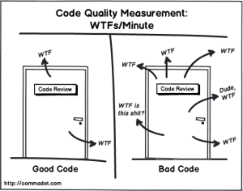
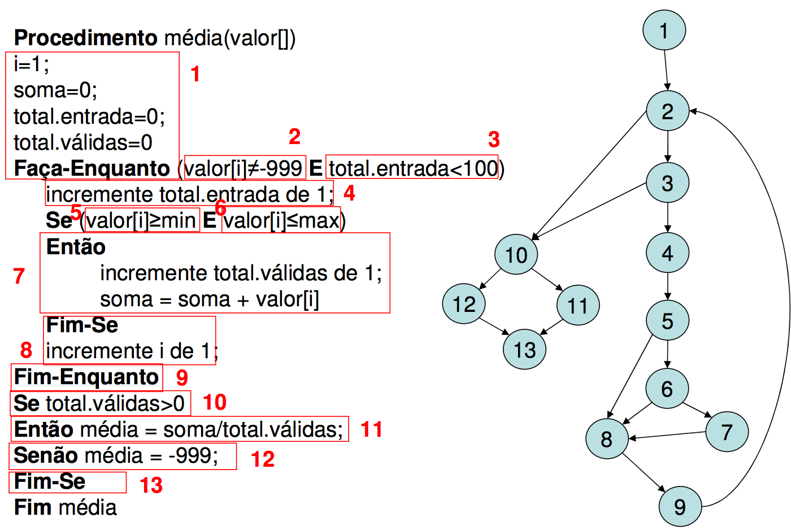

# Semântica de código

> Definição: Semântica é o estudo do significado. 

<div style="text-align:center">
  
</div>

---

# Formatação de código

> Código é escrito para pessoas não para a máquina.

---

# Uma função faz uma única coisa

Seguindo o princípio de responsabilidade única cada função deve resolver um único problema.

- Aumento da legibilidade de código
- Diminuição de replicação de código
- Possibilidade de utilizar Testes Unitários

---

# Evitar condicionais com múltiplas instruções



---

# Side effects (evitar utilizando múltiplos retornos)

> Side effects são alterações no código que podem levar a um comportamento não esperado. O famoso mexi numa coisa e quebrou outra.

```js

let books = []
let isBooksEmpty = true

doSomethingAsync()
  .then((res) => books.append(res.data))

doAnotherthingAsync()
  .then((res) => isBooksEmpty = !books.length)

console.log(isBooksEmpty)
// O que será printado no console?
```

---

# Evitar switch/cases

> Estruturas switch/cases permitem muitos caminhos dentro do código. Esse tipo de estrutura aumenta muito a complexidade ciclomática e reduz muito a flexibilidade do código.

---

# Nomenclatura variáveis

O nome de uma variável deve ser proporcional ao escopo que ela está inserida.

> Maior o escopo mais descrito o nome
> Menos o escopo mais encurtado o nome

- Evitar nomes genéricos já que eles não carregam nenhum valor simbólico ao negócio que a aplicação estão se propondo a resolver.

- Exemplos
  - data -> user
  - info -> book_info
  - handler -> url_handler
  - wrapper -> buttons_wrapper
  - holder -> image_holder

---

# Nomenclatura de métodos

Métodos devem ser nomeados de acordo com a ação que será executada. 

Métodos devem ser sempre isolados, não deve ser necessário o conhecimento da forma que um método foi implementado para sua utilização

---

# Nomenclatura de métodos

Métodos que realizam algum tipo de ação devem começar com um **verbo de ação**.

```js

// bad
function filter(books, true){}  // falta de clareza na forma que esse filtro

// good
function filterByAuthor(books){}
```

---

# Nomenclatura de métodos


Métodos que retorna um boolean devem ser escritos como uma **pergunta**.

```js
// bad
function userStatus(user){}  // não define o tipo de retorno

// good
function isActive(user){}
```

---

# Nomenclatura de métodos

Um método não deve apresentar múltiplos parâmetros.

```js
// bad
// como faço para adicionar um parâmetro? 
// Vai quebrar em todas as partes do projeto que já utilizam esse código
function addUser(active, name, type, role, createdAt){} 
addUser(true, null, null, "admin", null) // não demonstra que tipo de usuário será criado

// good
function add(user){}
user = {isActive: true, role: "admin"}
add(user)
```


---


# Evitar Comentários

O próprio código deve ser auto explicativo, utilizando nomenclaturas e estruturas claras que demonstrem a intenção do que está sendo implementado. 

```js

// bad
function someMethod(value){
  return value / 1000; // convert ratio
}

// good
function someMethod(value){
  const convertRatio = 1000;
  return value / convertRatio;
}

```

**Porém** comentários são uma ferramenta extremamente útil para descrever funções e classes para terceiros.

---

# Tratamento de exceções

O código deve sempre lançar exceções quando o código não apresenta o comportamento de sucesso.

```js

// bad code
function validate(obj){
  if(!obj.hasOwnProperty("name"))
    return { code: 1 , error: "Object has no property name"}

  return obj
}

// good code
function validate(obj){
  if(!obj.hasOwnProperty("name"))
    throw "Object has no property name"

  return obj
}
```

---

# Hierarquia de projetos

Modelo padrão muito utilizado

```
📦src
 ┣ 📂 assets
 ┃ ┣ 🖼️ user_profile_image_placeholder.png 
 ┃ ┣ 🖼️ logo.png
 ┃ ┗ 🖼️ book_cover_placeholder.png
 ┣ 📂 components
 ┃ ┣ 📜 AuthorDisplay
 ┃ ┣ 📜 UserDisplay
 ┃ ┣ 📜 BookDisplay
 ┃ ┗ 📜 DateDisplay
 ┣ 📂 services
 ┃ ┣ 📜 UserService
 ┃ ┣ 📜 BookService
 ┃ ┗ 📜 AuthorService
 ┣ 📂 router
 ┃ ┣ 📜 UserRouter
 ┃ ┗ 📜 BookRouter
 ┣ 📂 store
 ┃ ┗ 📜 UserStore
 ┣ 📂 views
 ┃ ┣ 📜 UserView
 ┃ ┗ 📜 BookView
 ┣ 📂 tests
 ┃ ┣ 📂 components
 ┃ ┣ 📂 services
 ┃ ┣ 📂 router
 ┃ ┣ 📂 store
 ┃ ┗ 📂 views
 ┗ 📜 main.js
```

---

> Pull the things that are unrelated further apart, and put the things that are related closer together.

```
📦src
 ┣ 📂 user
 ┃ ┣ 📂 tests
 ┃ ┣ 🖼️ user_profile_image_placeholder.png 
 ┃ ┣ 📜 UserService
 ┃ ┣ 📜 UserDisplay
 ┃ ┣ 📜 UserRouter
 ┃ ┣ 📜 UserView
 ┃ ┗ 📜 UserService
 ┣ 📂 book
 ┃ ┣ 📂 tests
 ┃ ┣ 🖼️ book_cover_placeholder.png
 ┃ ┣ 📜 BookService
 ┃ ┣ 📜 BookDisplay
 ┃ ┣ 📜 BookView
 ┃ ┗ 📜 BookRouter
 ┣ 📂 author
 ┃ ┣ 📂 tests
 ┃ ┣ 📜 AuthorDisplay
 ┃ ┗ 📜 AuthorService
 ┣ 📂 common
 ┃ ┣ 📂 tests
 ┃ ┣ 🖼️ logo.png
 ┃ ┗ 📜 DateDisplay
 ┗ 📜 main.js
```

---

# Ferramentas de refatoração (VSCode)

- Renomear: `F2`
- Extrair código: `CTRL + .` > `Extract code to method`

<div style="text-align:right">
  <br />
  <br />
  
</div>

---

# Ferramentas de auxilio na construção de código

- [Sonar Lint](https://www.sonarlint.org/vscode/)
- [ESLint](https://eslint.org/)
- [Vetur](https://marketplace.visualstudio.com/items?itemName=octref.vetur)

---

# Exemplos
