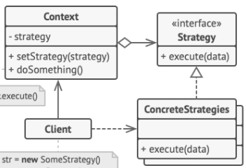
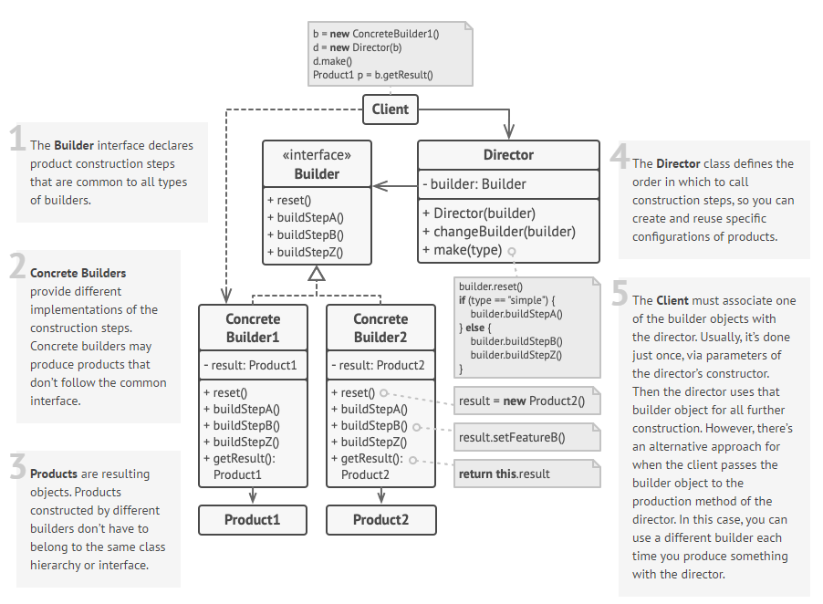
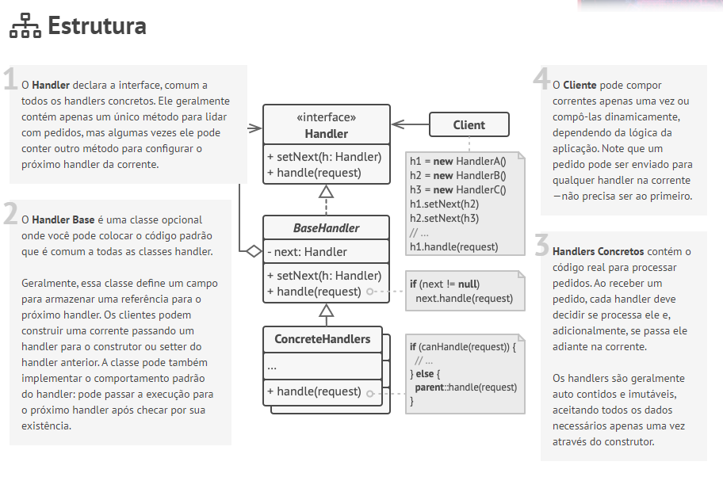

# Design Patterns

> Design Patterns são soluções já consolidadas para problemas comuns em software design, especificamente design de código.

---

# Design Patterns

- São esqueletos de ideias que já foram utilizadas diversas vezes em outros projetos.
- Confundidos com algoritmos prontos que adicionamos a nosso código.
- Ferramentas incríveis que todo desenvolvedor deve revisitar de tempos em tempos na sua carreiras.

---

# Diagrama UML

> UML é uma estrutura padrão para desenvolvimento de software, bastante utilizada na diagramação de estruturas do código, bancos de dados e fluxo de código.

---

# Diagrama UML

---

# Classificação dos Design Patterns

- Creational Patterns
  - Provê mecanismos de criação de objetos que aumentam a flexibilidade e o reuso de código existem.
- Structural Patterns
  - Provê mecanismos para montar classes e objetos em grandes estruturas, enquanto ainda mantem flexibilidade e eficiência.
- Behavioral Patterns
  - Define uma comunicação efetiva e atribui responsabilidades entre os objetos e classes.

---

# Builder

> Builder Pattern é destinado a resolver a construção de objetos complexos

---

# Facade Pattern

Facade Pattern provê uma interface simplificada para uma biblioteca, framework ou qualquer outro tipo de conjunto de classes complexo.

---

# Chain of Responsability Pattern

Chain of Responsability Pattern é uma especificaçaõ estrutural que garante a passagem de requisições em uma cadeia de validações.

---

# Quando não aplicar Design Patterns

- Cópia de código de outras linguagens
- Resulta em um código desnecessariamente mais complexo
- Exemplos
  - Observer Pattern em C#
  - Prototype em Javascript
  - Strategy em linguagens com recurso de Lambda Functions
