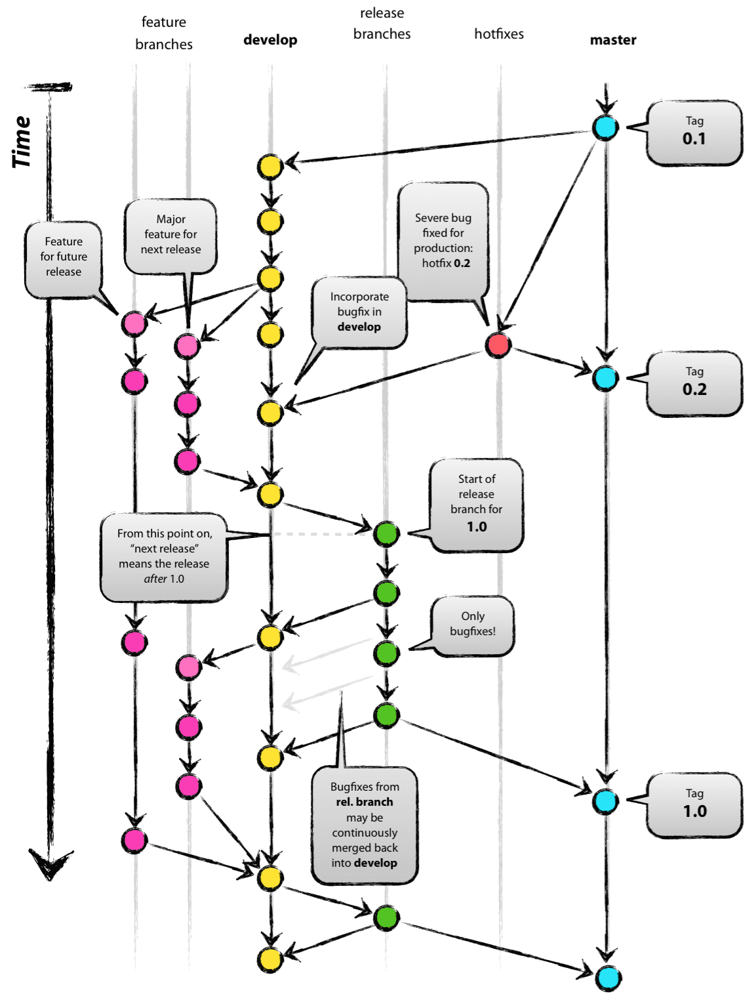

Git Flow é um método de trabalho para organizar o desenvolvimento de várias frentes dentro do projeto, de forma a essas frentes não interferirem umas as outras.

O método Git flow é divido em 6 tipos de branches

- **master(main)**
- **develop**
- **feature branches**
- **bugfix branches**
- **hotfix branches**
- **release branches**

### master (main)

- **nomenclatura:** master ou main 

É responsável por manter a versão mais estável do projeto, geralmente é a versão do jogo que está disponível para outras pessoas utilizarem.

Cada commit nessa branch deve ser adicionado uma **tag** para indicar a versão do projeto que estamos utilizando. Dessa forma fica simples de identificarmos problemas que estão acontecendo direto com os usuários finais.

### develop

- **nomenclatura:** develop

É responsável por manter todo o código desenvolvido até o momento no projeto, é uma versão menos estável do que a master, porém já deve conter código finalizado e não em desenvolvimento.

### feature branches

- **nomenclatura:** `feature/<número da task>-<nome da feature>`
  - número da task: é referente ao card que a feature foi requisitada, nesse card estão mais informações sobre a feature
  - nome da feature: nome resumido do que a feature entrega para o projeto

- **resumo do fluxo**
  - Abertura da branch pela develop
  - Desenvolvimento
  - Testes
  - Atualização da branch feature pela develop
  - Resolução de conflitos (se existir)
  - Envio do pull request para code review
  - Adequação da branch baseado no feedback
  - Merge na branch de develop

As branches de features são branches abertas da develop onde serão desenvolvidos todos os recursos necessários para a implementação de um feature no projeto.

Uma feature no projeto é um conjunto de tarefas com escopo fechado que devem agregar valor ao projeto.

Quando o desenvolvimento de uma feature é finalizado e todos os testes foram executados, o desenvolvedor responsável deve fazer um pull request para a branch de develop.

### bugfix branches
- **nomenclatura:** `bugfix/<número da task>-<nome da bugfix>`
  - número da task: é referente ao card da bugfix, nesse card estão mais informações
  - nome da bugfix: nome resumido do que a bugfix entrega para o projeto

- **resumo do fluxo**
  - Abertura da branch pela develop
  - Desenvolvimento
  - Testes
  - Atualização da branch feature pela develop
  - Resolução de conflitos (se existir)
  - Envio do pull request para code review
  - Adequação da branch baseado no feedback
  - Merge na branch develop

As branches de bug fixes são abertas para resolver bugs encontrados na versão atual da branch develop.

### hotfix branches

- **nomenclatura:** `hotfix/<número da task>-<nome da hotfix>`
  - número da task: é referente ao card da hotfix, nesse card estão mais informações sobre a hotfix
  - nome da hotfix: nome resumido do que a hotfix entrega para o projeto

- **resumo do fluxo**
  - Abertura da branch pela master
  - Desenvolvimento
  - Testes
  - Atualização da branch feature pela master
  - Resolução de conflitos (se existir)
  - Envio do pull request para code review
  - Adequação da branch baseado no feedback
  - Merge na branch master e criação da tag
  - Merge na branch develop

As braches de hot fixes são abertas para resolver bugs encontrados na versão atual da branch master, ou seja, bugs que estão no projeto utilizado pelos usuários finais.

### release branches
- **nomenclatura:** `release/<número da task>-<nome da release>`
  - número da task: é referente ao card que a release, nesse card estão mais informações sobre a release, como a release notes
  - nome da release: nome resumido do que a release entrega para o projeto, como talvez as principal funcionalidade

- **resumo do fluxo**
  - Abertura da branch pela develop
  - Testes
  - Correção de bugs
  - Atualização da branch feature pela master
  - Resolução de conflitos (se existir)
  - Envio do pull request para code review
  - Adequação da branch baseado no feedback
  - Merge na branch master e criação da tag
  - Merge na branch develop

As branches de release são abertas para publicar a versão do projeto que está em desenvolvimento para uma versão estável na branch master.

Nessas branches estamos mais interessados em testar a integração de tudo que foi desenvolvido por todas as frentes.

## Tags

As tags são versões do código que são atribuidas um nome fixo dentro do versionamento. As tags são importantes que dessa forma podemos distribuir o nosso projeto para várias pessoas e recolher seus feedbacks tendo como referência a versão do projeto que as pessoas tiveram contato. Por esse motivo é de suma importância que o projeto tenha descrito qual a versão está sendo executada.

### Versionamento por número

> [major].[minor].[change]

- **Major:** determina as versões globais do projeto
  - `< 0`: projeto ainda não concluíu o MVP (Minimum viable product)
  - `= 1`: projeto já concluíu o MVP
  - `> 1`: grandes alterações no projeto que impactam no estado atual do projeto, por exemplo, implementação de um novo sistema que irá alterar o fluxo do jogo, adição de um novo modo no jogo.

- **Minor:** determina as adições de funcionalides menores no projeto. Cada nova grande funcionalidade aumentar esse número em 1.

- **Change:** mudanças pequenas no projeto, geralmente correções de bugs e melhorias em cima das versões. Cada nova mudança deve aumentar esse número em 1.