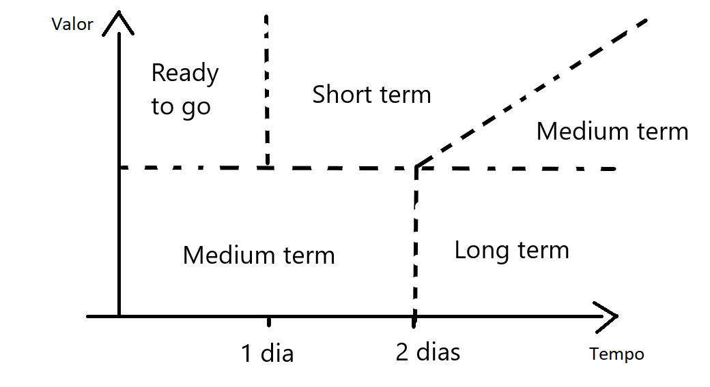

# Unity project guidelines

> Esse documento visa tem pro objetivo definir um conjunto de práticas no desenvolvimento de games utilizando Unity e na forma de organizar o fluxo de trabalho para garantir o sucesso no projeto.

## Sumário

- Repositório de código (versionamento)
  - Gitignore
- Hierarquia do projeto
  - Nomenclatura
- Code guides
- Hierarquia da Cena
- Organização do trabalho **[andamento]**
  - Quadro de tarefas **[andamento]**
  - Tarefas **[andamento]**
    - Descrição de uma tarefa **[andamento]**
    - Critérios de aceitação **[andamento]**
    - Definição de pronto **[andamento]**
  - Backlog **[andamento]**
    - Priorização de backlog **[andamento]**
- Releases **[andamento]**
  - Release notes **[andamento]**

# Repositório de código (versionamento)

## Gitignore

O arquivo de `.gitignore` garante que apenas os arquivos importantes ao projeto sejam persistidos no repositório, além disso evita conflitos em arquivos gerados, que podem ser ignorados no versionamento.

> Referência: [link](https://github.com/github/gitignore/blob/master/Unity.gitignore)

# Hierarquia do projeto

A fim de facilitar a busca de elementos relacionados e de melhorar a visibilidade de cada asset desenvolvido, faz-se necessário utilizar uma hierarquia mais independente focada no que cada elemento significa dentro do projeto e não na sua função. Dessa forma centraliza-se todos os dados referêntes ao elemento do projeto em um único lugar.

O projeto na Unity deve seguir a seguinte hierarquia

```
📦project
 ┣ 📂Assets
 ┃ ┣ 📂Audios
 ┃ ┣ 📂Decorations
 ┃ ┣ 📂Fonts
 ┃ ┣ 📂GameAssets
 ┃ ┃ ┣ 📂Managers
 ┃ ┃ ┣ 📂Elementos do projeto
 ┃ ┃ ┗ 📂etc
 ┃ ┣ 📂Particles
 ┃ ┣ 📂Shaders
 ┃ ┣ 📂Plugins
 ┃ ┣ 📂Resources
 ┃ ┣ 📂Scenes
 ┃ ┃ ┣ 📂Demo
 ┃ ┃ ┣ 📂GameBuild
 ┃ ┃ ┗ 📂Prototype
 ┃ ┗ 📂UI
 ┣ 📂Docs
 ┣ 📂Packages
 ┃ ┗ 📜manifest.json
 ┣ 📜.gitignore
 ┗ 📜read.me
```

- Assets: pasta raiz do projeto dentro da Unity, apresenta tudo o que tem respeito global no projeto
  - GameAssets: representa todos os elementos que irão constituir uma cena, focado em elementos que apresentam alguma lógica de programação e são mais dinâmicos
  - Decorations: representa os elementos decorativos globais, geralmente são elementos estáticos e que são reaproveitados em várias cenas
  - Particles: representa elementos de partículos globais, que são utilizados por vários elementos do projeto
  - Shaders: representa os shaders globais, que são utilizados por vários elementos do projeto
  - Scenes: representa as cenas criadas dentro da Unity
    - Demo: cenas de demonstração de uma ou mais funcionalidades dentro do sistema, geralmente utilizadas para testar essas funcionalidades
    - GameBuild: cenas que estão no jogo
    - Prototype: cenas que estão sendo desenvolvidas ou responsáveis por testar várias mecânicas do jogo, podem evoluir para se tornar uma GameBuild

Elementos do projeto são quaisquer elementos que serão inclusos no projeto, por exemplo: inimigos, personagem principal, inventário de ítens entre outros. Esses elementos devem ser hierarquizados de forma indenpendente de forma a todos os recursos envolvidos estejam centralizados, dessa forma melhoramos a visibilidade do projeto.

Pegando como exemplo a hierarquia de inimigos, como um **elemento do projeto**, a hierarquia pode ser apresentada da seguinte forma:

```
📂Elemento do projeto (inimigos)
┣ 📂Animations
┣ 📂Audios
┣ 📂Materials
┣ 📂Models
┣ 📂Prefabs
┣ 📂Scripts
┣ 📂ScritableObjects (As configurações de cada inimigo)
┣ 📂Shaders
┣ 📂Sprites
┣ 📂Textures
```

Dessa forma, temos todas as informações referentes a inimigos centralizadas e de fácil acesso. Por outro lado os recursos globais (utilizados por vários elementos) estam contidos nas pastas globais.

Em caso de necessidade, se um **elemento do projeto**, se tornar muito grande, é possível dividir esse elemento em outros separando a hierarquia, por exemplo: se dentro do projeto existem vários tipo de inimigos e eles são muito diferentes entre si, pode-se quebrar numa hierarquia de uma pasta Inimigos geral, e pastas de inimigos para cada tipo de inimigos, dessa forma cada contexto terá seus próprios recursos e forma independente.

## Nomenclatura

Nomenclatura de elementos dentro do projeto.

Assets dentro do projeto devem seguir **snake_case**.

Padrão de nomenclatura para assets:

| Asset type         | Name                     |
|--------------------|--------------------------|
| Animations         | `[animation_name]_anim`  |
| Audios             | `[audio_name]_sfx`       |
| Materials          | `[material_name]_mat`    |
| Prefabs            | `[prefab_name]_pf`       |
| Shaders            | `[shader_name]_shader`   |
| Scriptable objects | `[object_name]_so`       |
| Sprite             | `[script_name]_sprite`   |
| Texture            | `[texture_name]_texture` |


# Code guides

Code guides são padrões adotados no código para garantir agilidade no desenvolvimento. Dessa forma todos os desenvolvedores de um projeto compartilham um mesmo vocabulário facilitando a comunicação e o entendimento do projeto.

## Princípios

## Formatação

Quantidade de caracters por linha: 99;

## Sonar lint

O Sonar é uma ferramenta com uma opção gratuita de análise de código e pode ajudar muito em evitar bugs e em melhorar o repositório de código de forma geral, auxiliando a detecção de **bad smells** no código (problemas que podem ocasionar bugs ou problemas na redigibilidade e manutenabilidade de um software).

Para o desenvolvimento de código para a Unity o Sonar é ncessário alguns ajustes, já que o fluxo padrão do C# não é integralmente funcional no ambiente da Unity.

O arquivo `resources/.editorconfig` apresenta vários ajustes para utilizar com o Visual Studio Community.

## Modo de utilização no Visual Studio Community

- Copiar o arquivo `resources/.editorconfig` para a pasta raiz do projeto
- Abrir o Visual Stuido Community

# Organização do trabalho

Nessa seção serão as práticas relacionadas a organização das tarefas e das demandas do dia a dia e como organizá-las.

## Quadro de tarefas

O quadro de tarefas representa todas as tarefas disponíveis para implementação.

O quadro de tarefas é dividido em 7 seções:

- TODO
  - Tarefas abertas para desenvolvimento
- DOING
  - Tarefas sendo desenvolvidas pelo time
- PAUSED
  - Tarefas com algum bloqueio ou pausadas por priorização de outra
- CODE REVIEW
  - Tarefas que finalizaram desenvolvimento, e estão aguardando a revisão do time
- QA (Quality Assurence)
  - Tarefas esperando para serem integradas e testadas de uma forma mais integrada no sistema
- DONE
  - Tarefas finalizadas

## Tarefas

Existem um infinidade de tarefas para serem desenvolvidas em um projeto de games, nem todas vão seguir todo o fluxo do quadro de tarefas.

Tipos de tarefas:

- Tarefas de programação
  - Implementação de sistemas
  - Criação de ferramentas para auxilio no desenvolvimento
  - Criação de backend 
- Tarefas visuais
  - Criação de modelos
  - Criação de shaders
  - Animação de personagens
- Tarefas organizacionais
  - Reuniões de planejamento
  - Reunião de retrospectiva
  - Refinamento de tarefas

### Descrição de uma tarefa

Desenvolvido durante o processo de refinamento da tarefas ou funcionalidades.

### Critérios de aceitação

## Backlog

O backlog de tarefas é o conjunto de tarefas categorizadas que serão futuramente implementadas

O backlog pode ser dividido de acordo com a razão custo/benefício de cada funcionalidade no sistema.

Pode ser dividido na seguinte forma:

- NEW
  - Novas ideias que surgiram em reuniões de brainstorm ou durante o desenvolvimento
- REFINED
  - As ideias que já passaram por um refinamento e já podem ser priorizadas de acordo com a razão de custo benefício.
- READY TO GO
  - Features que já estão prontas para implementação imediata
- SHORT TERM
  - Features elegíveis para entrar nas próximas sprints de desenvolvimento
- MEDIUM TERM
  - Features elegíveis para entrar em sprints futuras 
- LONG TERM
  - Features sem previsão para serem implementadas 
- CADUCOU
  - Features que não tem mais sentido a implementação no projeto, utilizado mais como um histórico de ideias que foram levantas. 

## Priorização de backlog

A priorização do backlog deve organizar as tarefas de forma a maximizar o valor entregue pelas funcionalidades no projeto e relação ao custo de produção, ou seja, tempo de desenvolvimento, custo com assets e ferramentas.



# Releases

## Release notes