A organização de um projeto de software é um fator crucial e está diretamente relacionado ao sucesso do projeto. A chance de um projeto fracassar ou desperdiçar tempo é grande sem um processo formal de organização.

Em suma um projeto é uma coleção de ações que estão logicamente relacionadas a fim de gerar um resultado específico no projeto. Porém chegar na definição de quais são essas ações necessárias é preciso ponderar sobre distintos impactos tangentes ao projeto, como por exemplo usuários do sistema, stakeholders, desenvolvedores, designers, analistas de negócios. Todas essas entidades devem ser levadas em consideração na hora de organizar as ações necessárias a fim de garantir a eficiência do processo de desenvolvimento de software.

Ao mesmo tempo a organização deve recorrer a um processo simples e deve ser de conhecimento claro a todos os integrantes do projeto.

Esse sistema de organização se baseia nas seguintes entidades que serão elaboradas nos próximos capítulos.

 ---
> 
> [🌟 Valor](🌟%20Valores.md)
> [🎯 Metas](entities/goals.md)
> [🏆 Épicos](🏆%20Épicos.md)
> [🎽 Sprints](entities/sprints.md)
> [🃏 Histórias](🃏%20Histórias.md)
> 
> ---

```mermaid
flowchart LR

valores["🌟 Valor"]
metas["🎯 Meta"]
epicos["🏆 Épicos"]
sprints["🎽 Sprint"]
tarefas["🃏 Histórias"]

valores -- Pode se utilizar --> metas
valores -- Possui um ou vários --> epicos

metas -- Possui um ou vários --> epicos
epicos -- Possui um ou várias --> tarefas

tarefas -. São organizadas .-> sprints
```

