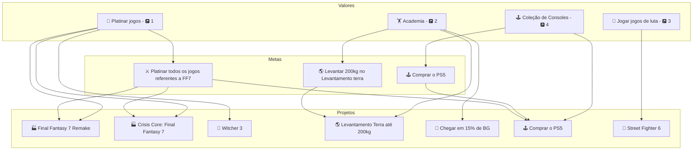
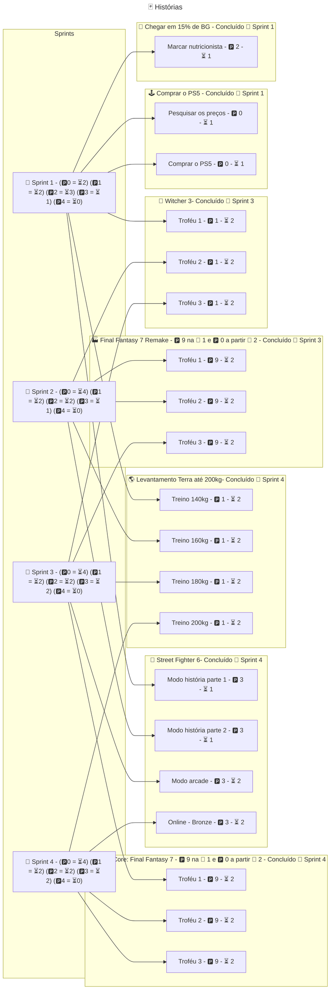

# 🎽 Sprint (Iteração)

A 🎽 Sprint é uma iteração de execuções de 🃏 Histórias que foram priorizadas com o objetivo de avançar na conclusão de 🎯 Metas e 🏆 Projetos ativos que por sua vez encurtam a distância para alcançar um 🌟 Valor.

### Propriedades de uma Sprint

> ---
> 🚧 Em construção
> 
> ---

### Durante a execução de uma 🎽 Sprint

> ---
> 🚧 Em construção
> 
> ---

### Priorização e planejamento de uma sprint

A prioridade das 🃏 Histórias deve levar em consideração os seguintes fatores

- Prioridade do 🌟 Valor, constitue a base da prioridade, já que o principal objetivo de organizar Sprints é definir metas a curto prazo para alcançar um 🌟 Valor.
- Prioridade da 🎯 Meta, a prioridade da meta pode substituir a prioridade do 🌟 Valor
- Dependência, caso o projeto seja uma dependência de outro, ele deve ter uma prioridade maior.
- Dependente, caso o projeto seja dependente de outro, ele deve ter a menor prioridade até o projeto que é dependente seja concluído

# Exemplo de planejamento de uma 🎽 Sprint

Para o planejamento precisamos principalmente levar em consideração as prioridades dos vários 🌟 Valores, 🎯 Metas e 🏆 Projetos.

Digamos que tenho o seguinte cenário

- 🌟 Valores
    - 💎  Platinar jogos - 🅿️ 1
    - 🏋️ Academia - 🅿️ 2
    - 🤼 Jogar jogos de luta - 🅿️ 3
    - 🕹️ Coleção de Consoles - 🅿️ 4
- 🎯 Metas
    - ⚔️ Platinar todos os jogos referentes a FF7
        - ⏳ 3 meses
    - 🌎 Levantar 200kg no Levantamento terra
        - ⏳ 6 meses
- 🏆 Projetos
    - 🏭 Final Fantasy 7 Remake
    - 🏭 Crisis Core: Final Fantasy
    - 🐺 Witcher 3
    - 🌎 Levantamento Terra até 200kg
    - 🥑 Chegar em 15% de BG
    - 🥊 Street Fighter 6
    - 🕹️ Comprar o PS5

As sprints tem um tempo limitado para desempenhar as 🃏 Histórias. Essa quantidade de tempo deve ser determinada pela prioridade de cada 🃏 Histórias de maneira proporcional.

Como a sprint é organizada a partir desse exemplo:

