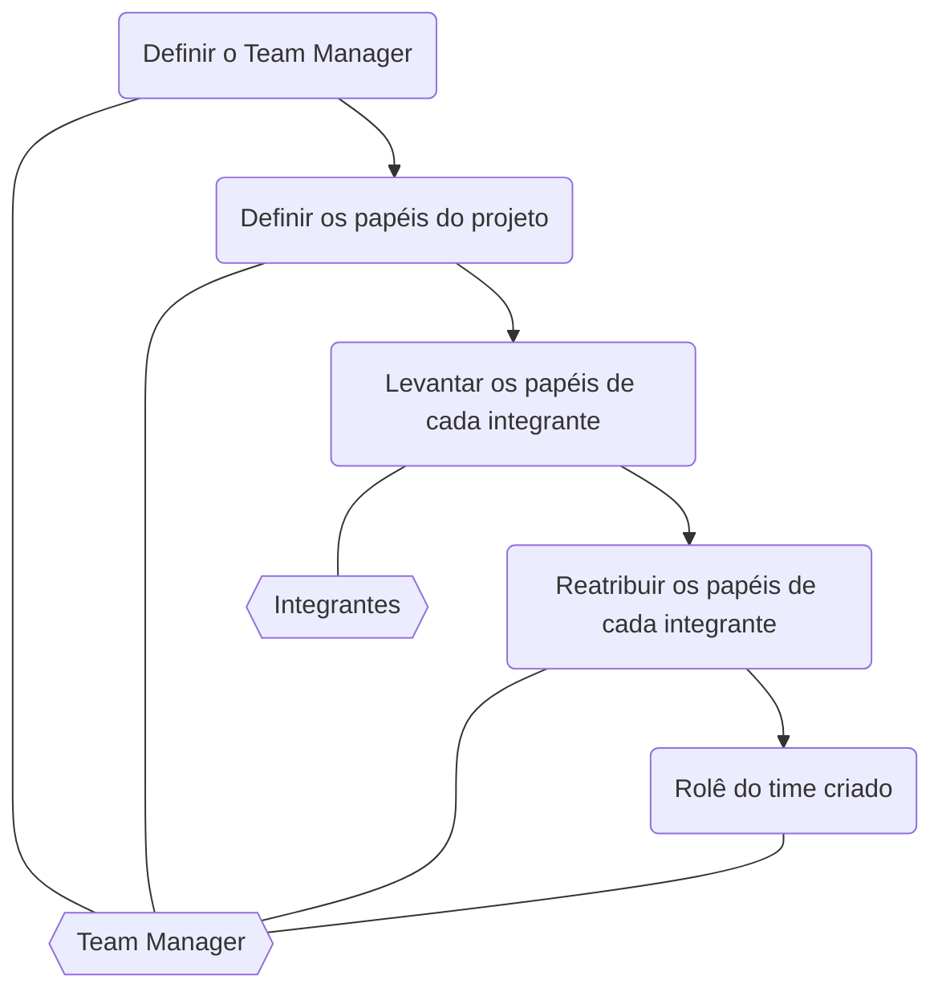
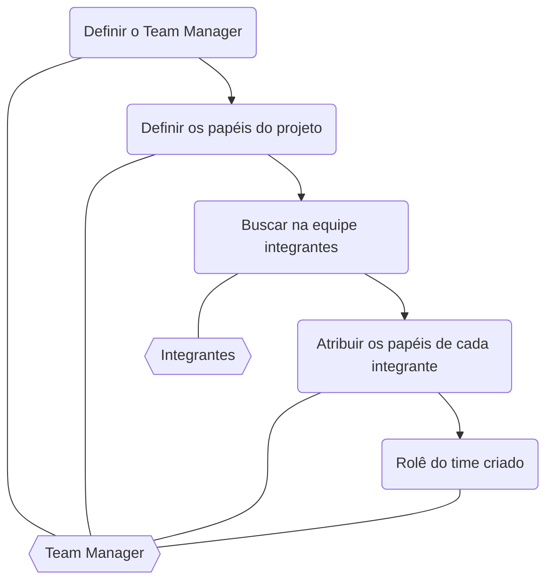

# Métricas para gerenciamento

# Documento de definição de papéis dentro do time

Problema atual:

- Configuração do time não é bem definida
- Todos os colaboradores fazem de tudo no projeto
- Falta de clareza quando necessário reportar um problema específico

Solução:

- Criar um documento com as definições dos papéis dentro da equipe.
  - Esse documento deve chamar **Rolê do time**
  - Esse documento deve definir todos os papéis dentro do time, desde o programador e design na ponta até a maior hierarquia dentro do time
  - Deve apresentar exemplos de atribuições para cada papel dentro da equipe
- Criar cultura da importancia dessas definições.
- Esse documento deve ser mantido e atualizado a cada alteração na equipe e no projeto.

> ⚠️ O **Manager** é responsável pela criação e manutenção da documentação de definições de papéis

Vantagens

- Visibilidade dos integrantes do time
- Visibilidade dos canais de comunicação
- Onboarding de novos membros facilitado

## Template do documento

> **Nome do documento:** Rolê do time

```md
<!-- Nome do arquivo: Rolê do time -->

# Integrantes do time

| Integrante | Papéis                              | Contato               |
| ---------- | ----------------------------------- | --------------------- |
| Fulano 1   | Frontend developer                  | email                 |
| Fulano 2   | Backend developer                   | email                 |
| Ciclano 1  | Backend developer, System Architect | email                 |
| Ciclano 2  | SM                                  | email                 |
| Beltrano 1 | QA                                  | email                 |
| Beltrano 2 | Manager                             | email, Whatapp número |

# Grupos de conversa do time

| Nome             | Plataform | Descrição                                            |
| ---------------- | --------- | ---------------------------------------------------- |
| Grupo Tal        | Whatsapp  | Grupo de conversa sobre tecnologia dentro do projeto |
| Grupo Tal Gestão | Whatsapp  | Grupo de gestão dentro do projeto                    |

# Papéis

<!-- TODO: descrever cada um dos papeís dentro do projeto -->

# Links relacionados

Referencia para o documento de `objetivo do projeto`;

```

### Exemplos de papéis dentro do time

Seguem alguns exemplos de papéis dentre de um time. Cada projeto pode ter necessidade especiais e essas descrições podem ser alteradas.

- Team Manager
  - Define as pessoas integrantes do time
  - Documentação pertinente a equipe (inclui o Rolê do time)
  - Intermediar comunicação entre time e cliente em relação a escopo do projeto
  - Manutenção dos rituais pertinentes ao projeto
- Project Manager
  - Intermediar comunicação entre time e cliente no levantamento de requisitos inicial do projeto
- Design/UX
  - Desenvolver layout
  - Alterar layout de acordo com requisitos do PO/Stackholders
- Frontend developer
  - Desenvolver e manter projeto do Frontend com qualidade
  - Estimativas de desenvolvimento
  - Sugestão de tecnologias
  - Revisão de código
  - Desenvolvimento e manutenção de documentação técnica
- Backend developer
  - Desenvolver e manter projeto do Backend com qualidade
  - Estimativas de desenvolvimento
  - Sugestão de tecnologias
  - Revisão de código
  - Desenvolvimento e manutenção de documentação técnica
- System Architect
  - Documentação do levantamento de requisitos viabilidade técnica
  - Análise de viabilidade do projeto (estimativas iniciais)
  - Análise de infraestrutura
  - Prototipação de novos recursos
  - Definição de tecnologia
  - Desenvolvimento e manutenção de documentação técnica
- QA - Quality Assurence
  - Documentação do levantamento de requisitos pertinente viabilidade de testes
  - Testes do sistema
  - Criação de planos de testes
- SM - Scrum Master (caso metodologia scrum)
  - Intermediação entre equipe e manager/PO/Stackholder em relação a dúvidas
- PO - Product Owner
  - Documentação do levantamento de requisitos pertinente viabilidade de negócio
  - Define linguagem ubíqua junto ao System Architect
  - Definições das histórias de usuário
  - Alterações de requisitos de acordo com necessidades dos Stackholders
  - Desenvolver as apresentações de Review do projeto
  - Intermediação de dúvidas de negócio com os Stackholders
- Stackholder
  - Definições de regras de negócio junto ao PO

> 🐕‍🦺 E todos são responsáveis por desenvolver um projeto que se orgulhem

## Avaliação da definição de papéis para projetos legados



## Avaliação da definição de papéis para projetos novos

