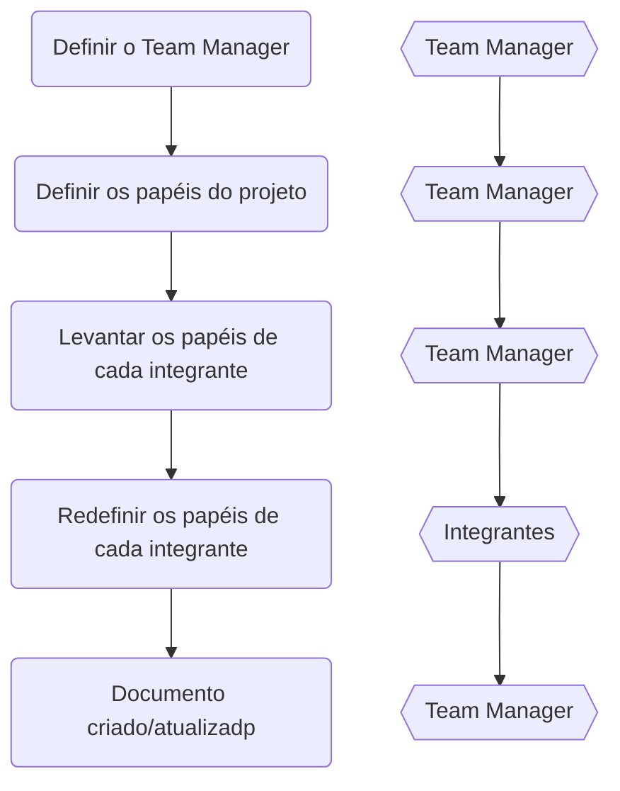
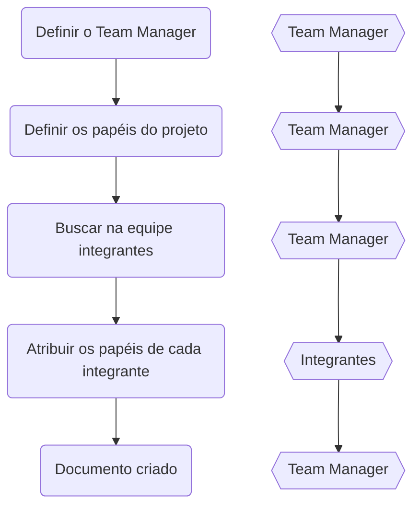

# Papéis e definições

### PO - Product Owner

O product owner é um papel criado pela metodologia do Scrum. Seu principal objetivo é gerenciar e otimizar o backlog do produto a fim de maximizar a entrega de valor.

> 💡 O principal papel do product owner deve ser garantir o sucesso do projeto e pode ser atribuido a uma pessoa especialista no negócio ou industria que o produto irá ser aplicado.

Principais responsabilidades dentro do time:

- Principal ponto de contato com o cliente
  - Garantir que estaja claro as expectativas do cliente
  - Garantir a priorização com o cliente
- Definir e priorizar os requisitos de usuário (Documentação dos requisitos)
  - Garantir que as histórias de usuários e requisitos estajam claras
  - Garantir que as histórias de usuário cumpram os requisitos do cliente
- Comunicar e explicar ao time de desenvolvimento as funcionalidades do produto
- Avaliar o trabalho do time de desenvolvimento
  - Prover constante feedback
- Definir o MVP

O Product Owner deve trabalhar em conjunto com o time de desenvolvimento a fim de levantar soluções robustas e viáveis. Ele pode fazer isso por meio de prototipação.

Também o product Owner deve trabalho em conjunto com o time de qualidade a fim de garantir que as expectativas do cliente estão sendo alcançadas.

### Developer

O desenvolvedor é o responsável por trabalhar nas necessidades do produto.

> 💡 O principal papel do desenvolver é garantir que as funcionalidades sejam implementadas de uma forma otimizada e que satisfaçam o requisitos do produto.

Principais responsabilidades dentro do time:

- Desenvolvimento do produto
  - Garantir que a funcionalidade implementada satisfaça o requisito do produto
- Levantamento de otimizações
- Refinamento dos requisitos de produto em requisitos técnicos

### QA - Quality Assurence

## Documento de definição de papéis dentro do time

> **Nome do documento:** Papéis do time

```md
<!-- Nome do arquivo: Papéis do time -->

# Integrantes do time

| Integrante | Papéis                              | Contato               |
| ---------- | ----------------------------------- | --------------------- |
| Fulano 1   | Frontend developer                  | email                 |
| Fulano 2   | Backend developer                   | email                 |
| Ciclano 1  | Backend developer, System Architect | email                 |
| Ciclano 2  | SM                                  | email                 |
| Beltrano 1 | QA                                  | email                 |
| Beltrano 2 | Manager                             | email, Whatapp número |

# Grupos de conversa do time

| Nome             | Plataform | Descrição                                            |
| ---------------- | --------- | ---------------------------------------------------- |
| Grupo Tal        | Whatsapp  | Grupo de conversa sobre tecnologia dentro do projeto |
| Grupo Tal Gestão | Whatsapp  | Grupo de gestão dentro do projeto                    |

# Links relacionados

Referencia para o documento de `objetivo do projeto`;

```

### Exemplos de papéis dentro do time

Seguem alguns exemplos de papéis dentre de um time. Cada projeto pode ter necessidade especiais e essas descrições podem ser alteradas.

- Team Manager
  - Define as pessoas integrantes do time
  - Documentação pertinente a equipe (inclui o Rolê do time)
  - Intermediar comunicação entre time e cliente em relação a escopo do projeto
  - Manutenção dos rituais pertinentes ao projeto
- Project Manager
  - Intermediar comunicação entre time e cliente no levantamento de requisitos inicial do projeto
- Design/UX
  - Desenvolver layout
  - Alterar layout de acordo com requisitos do PO/Stackholders
- Frontend developer
  - Desenvolver e manter projeto do Frontend com qualidade
  - Estimativas de desenvolvimento
  - Sugestão de tecnologias
  - Revisão de código
  - Desenvolvimento e manutenção de documentação técnica
- Backend developer
  - Desenvolver e manter projeto do Backend com qualidade
  - Estimativas de desenvolvimento
  - Sugestão de tecnologias
  - Revisão de código
  - Desenvolvimento e manutenção de documentação técnica
- System Architect
  - Documentação do levantamento de requisitos viabilidade técnica
  - Análise de viabilidade do projeto (estimativas iniciais)
  - Análise de infraestrutura
  - Prototipação de novos recursos
  - Definição de tecnologia
  - Desenvolvimento e manutenção de documentação técnica
- QA - Quality Assurence
  - Documentação do levantamento de requisitos pertinente viabilidade de testes
  - Testes do sistema
  - Criação de planos de testes
- SM - Scrum Master (caso metodologia scrum)
  - Intermediação entre equipe e manager/PO/Stackholder em relação a dúvidas
- PO - Product Owner
  - Documentação do levantamento de requisitos pertinente viabilidade de negócio
  - Define linguagem ubíqua junto ao System Architect
  - Definições das histórias de usuário
  - Alterações de requisitos de acordo com necessidades dos Stackholders
  - Desenvolver as apresentações de Review do projeto
  - Intermediação de dúvidas de negócio com os Stackholders
- Stackholder
  - Definições de regras de negócio junto ao PO

> 🐕‍🦺 E todos são responsáveis por desenvolver um projeto que se orgulhem

### Fluxo de levantamento de papéis para projetos legados



### Fluxo de levantamento de papéis para projetos novos

