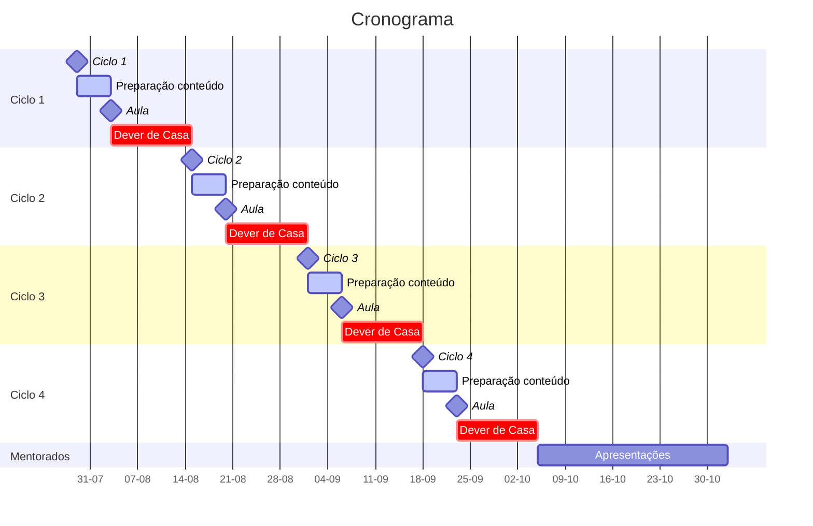

# Edital do DOJO

O Dojo tem como objetivo fomentar o compartilhamento de conhecimento entre a equipe da GH. O conhecimento é compartilhado com foco a exposição de conceitos pertinentes ao desenvolvimento de software aos integrantes mais novos da equipe pelos integrantes mais experiêntes, possibilitando um nivelamento das experiências e maior integração entre os integrantes do time.

Ao final do período de execução os mentorados terão sido expostos aos principais conceitos de desenvolvimento de software empregados pelo mercado e poderão empregar esses conceitos em futuros projetos, possibilitando o desenvolvimento de software com qualidade, escalabilidade e performance.

Paralelo a isso teremos profissionais capacitados para criar seus próprios grupos de treinamento e DOJOs e assim espalhar a cutura do compartilhamento de conhecimento dentro da GH.

## Composição do grupo

- Mentor
  - Responsável por expor os conceitos definidos e suporte do aprendizado
- Máximo de 4 mentorados
  - Responsáveis por implementar o conteúdo proposto e fomentar com dúvidas as discussões
- Co-mentor (Opcional)
  - Responsável em ajudar os mentorados a definir e organizar o trabalho desenvolvido

## Período de execução

- Ciclo de 3 meses
  - Aproximadamento 12 semanas

- 8 semanas de conteúdos expostos pelo Mentor
  - Exposição de conteúdos pertinentes ao desenvolvimento de software
  - Discussão dos conteúdos 

- 4 semanas de conteúdos expostos pelo Mentorados
  - Conteúdo de interesse dos mentorados pertinem aos conteúdos expostos
  - Preparação dos mentorados para futuros grupos de DOJO 

## Formato

- Uma aula expositiva sobre um tópico relacionado a desenvolvimento de software
- Toda semana deverá ter algum **🏠 Dever de casa** para ser discutido no próximo encontro
- Um fórum de discussão sobre o tema exposto
- Implementação dos feedbacks discutidos no fórum

Será feito um acompanhamento do **🏠 Dever de casa** no terceiro dia apartir do dia da reunião da semana. Essa reunião deve ser breve entre todos os integrantes.

Os **Deveres de Casa** serão desenvolvidos com foco em aplicar a prática proposta na semana e as práticas anteriores.

## Observações

- A empresa precisa apresentar oportunidades do emprego das práticas propostas no treinamento
- Será necessário a participação integral do grupo
  - Devemos manter a taxa de presença o mais alta possível
  - Casos extremos podem ser flexibilizados

## Cronograma

Esse cronograma deve ser preenchido com todos os conteúdos cada conteúdo proposto.

## Conteúdos

O Mentor, junto com Co-mentor caso exista, deve levatar 4 conteúdos principais que serão expostos para os mentorados durante o DOJO.

Esses conteúdos devem ser planejados **antes do início do DOJO**.

Cada conteúdo deve ser descrito da seguinte maneira:

- Em poucas palavaras sobre o que se trata o conteúdo.
- Justificativa de porque expor o conteúdo.
- 🏠 Dever de casa aplicado.
- Formato de avaliação proposto.

> **🌈 GUIDELINE** Os conteúdos expostos no DOJO devem ser complementares e incrementais. Cada semana um conteúdo novo deve se relacionar com o conteúdo anterior.

## Apresentações dos mentorados

Cada mentorado deve criar uma apresentção de **até 30 minutos** relacionada a algum tópico abordado no DOJO.

> **🌈 GUIDELINE** As apresentações devem ser espaçadas de 1 semana para possibilitar tempo hábil para a confecção das mesmas.

Cada mentorado deverá apresentação o tópico abordado e a justificativa no primeiro momento.

As apresentações deverão conter:

- Apresentação formatada
  - Qual o tópico abordado?
  - Justificativa do tópico abordado. (Por que esse tópico deve ser abordado?)
- Documentação auxiliar referente ao conteúdo apresentado
- Exemplos de utilização

Após a apresentação temos mais **15-30 minutos** de levantamento de dúvidas e discussões.

## Avaliações

Ao que se diz respeito ao mentor:

- Qualidade na criação dos conteúdos
- Qualidade da apresentação dos conteúdos
  - Clareza nos conceitos
  - Exemplos em código
- Assiduidade das datas estipuladas
- Compromentimento com o acompanhamento dos mentorados

Ao que se diz respeito aos mentorados:

- Assiduidade nos encontros
- Avaliação relacionada aos **🏠 Deveres de Casa**
- Participação nas discussões dos encontros

## Recompesas

- Certificado de conclusão reconhecido pela empresa
- Remuneração extra para Mentor
- Possibilidade da publicação do conteúdo na plataforma GH Academy
  - Mentor pode receber extra por isso