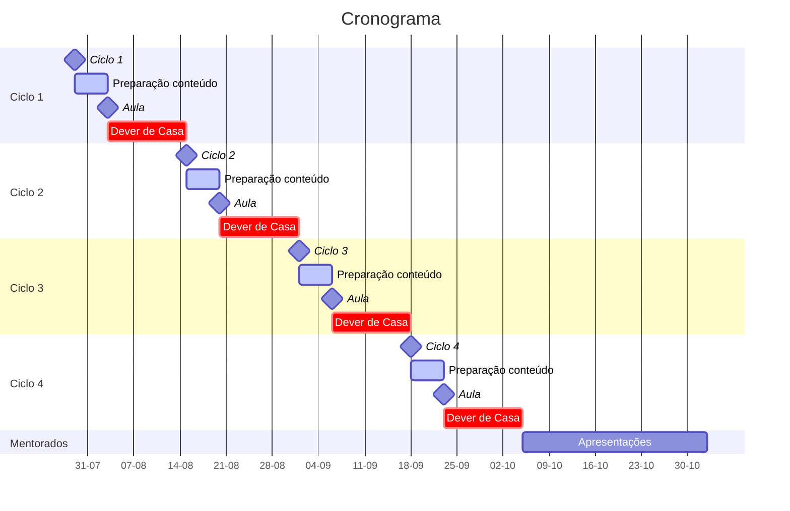

# Handbook do DOJO

> **Objetivo do documento**
> Apresentar o formato de um treinamento no estilo "DOJO" e como submeter propostas de DOJOs para a aprovação.

### O que é o DOJO? Onde vive? O que come?

O Dojo tem como objetivo fomentar o compartilhamento de conhecimento entre a equipe da GH. O conhecimento é compartilhado com foco a exposição de conceitos pertinentes ao desenvolvimento de software aos integrantes mais novos da equipe pelos integrantes mais experientes, possibilitando um nivelamento das experiências e maior integração entre os integrantes do time.

Ao final do período de execução os mentorados terão sido expostos aos principais conceitos de desenvolvimento de software empregados pelo mercado e poderão empregar esses conceitos em futuros projetos, possibilitando o desenvolvimento de software com qualidade, escalabilidade e performance.

Paralelo a isso teremos profissionais capacitados para criar seus próprios grupos de treinamento e DOJOs e assim espalhar a cultura do compartilhamento de conhecimento dentro da GH.

# Quem pode participar?

## Para Mentor:

Qualquer colaborador da empresa pode se candidatar a ser um mentor de um DOJO. Para isso, ele precisa submeter uma proposta de DOJO para a banca avaliadora seguindo os critérios apresentados neste documento. 

O Mentor é responsável antes da execução do DOJO de:

- Criar o documento de proposta do DOJO
- Submeter o documento de proposta

Após a validação do DOJO o Mentor deve:

- Criar o formulário de cadastro de mentorados
- Submeter o formulário em todos os canais de comunicação da empresa
- Selecionar os mentorados

O Mentor é responsável durante a execução do DOJO de:

- Criar um canal de comunicação geral dos participantes do DOJO
- Desenvolver a aula expositiva do conteúdo relacionado
- Ajudar os mentorados na organização de tempo relativa ao trabalho e DOJO
- Acompanhar os mentorados semanalmente na execução do **🏠 Dever de casa**
- Avaliar o desempenho dos Mentorados

O Mentor é responsável após a execução do DOJO de:

- Aplicar o Quiz de aderência do DOJO
- Gerar o relatório de avaliação dos Mentorados
- Gerar o relatório de horas que deve ser submetido a Gestão
- Submeter todo conteúdo desenvolvido

## Para Mentorado:

A seleção de mentorados será feita por todos **os canais de comunicação da empresa**. O colaborador interessado deve entrar em contato com as pessoas responsáveis.

> **🌈 GUIDELINE** Cada mentorado deverá participar apenas de um DOJO por vez.

O Mentorado é responsável durante a execução do DOJO de:

- Participar das aulas expositivas
- Participar do canal de discussão geral do DOJO
- Desenvolver e apresentar o **🏠 Dever de casa**
- Procurar o Mentor em caso de dúvidas

# Formato do DOJO

As sessões abaixo descrevem o formato de um treinamento no estilo "DOJO". A proposta de DOJO deve estar de acordo com os critérios descritos.

## Composição do grupo

- Mentor
  - Responsável por expor os conceitos definidos e suporte do aprendizado
- Máximo de 4 mentorados
  - Responsáveis por implementar o conteúdo proposto e fomentar com dúvidas as discussões
- Co-mentor (Opcional)
  - Responsável em ajudar os mentorados a definir e organizar o trabalho desenvolvido

## Período de execução

O período de execução de um DOJO tem como base os seguintes critérios:

- Ciclo de 3 meses
  - Aproximadamente 12 semanas

- 8 semanas de conteúdos expostos pelo Mentor
  - Exposição de conteúdos pertinentes ao desenvolvimento de software
  - Discussão dos conteúdos 

- 4 semanas de conteúdos expostos pelo Mentorados
  - Conteúdo de interesse dos mentorados pertinente aos conteúdos expostos
  - Preparação dos mentorados para futuros grupos de DOJO 

## Formato de um ciclo de DOJO

Um ciclo do DOJO se caracteriza por:

- Uma aula expositiva sobre um tópico relacionado a desenvolvimento de software
- Toda semana deverá ter algum **🏠 Dever de casa** para ser discutido no próximo encontro
- Um fórum de discussão sobre o tema exposto
- Implementação dos feedbacks discutidos no fórum

Será feito um acompanhamento do **🏠 Dever de casa** no terceiro dia a partir do dia da reunião da semana. Essa reunião deve ser breve entre todos os integrantes.

Os **Deveres de Casa** serão desenvolvidos com foco em aplicar a prática proposta na semana e as práticas anteriores.

## Lançamento de Horas

O lançamento de horas será feito por meio do **Jira**.

Cada ciclo do DOJO será cadastrado como uma tarefa.

Cada participante do DOJO (Mentor ou Mentorado) deve preencher as horas trabalhadas nas tarefas referentes ao ciclo atual.

## Comprometimento da gestão

A empresa precisa apresentar oportunidades do emprego das práticas propostas no DOJO. Assim cada projeto deve apresentar um ambiente propício para a implementação das práticas propostas.

A empresa também se disponibiliza a ceder as horas necessárias para o comprometimento da execução das tarefas do DOJO. Compromissos do DOJO serão reservados e devem ser respeitados pelos projetos dos participantes, havendo sempre entendimento entre todas as partes.

Compromissos do DOJO podem ser:

- Aula do conteúdo
- Apresentação do mentorado
- Reunião de acompanhamento
- Desenvolvimento do **🏠 Dever de casa**

## Conteúdos

O Mentor, junto com Co-mentor caso exista, deve levantar 4 conteúdos principais que serão expostos para os mentorados durante o DOJO.

Esses conteúdos devem ser planejados **antes do início do DOJO** e submetidos na proposta.

Cada conteúdo deve ser descrito da seguinte maneira:

- Em poucas palavras sobre o que se trata o conteúdo.
- Justificativa de porque expor o conteúdo.
- 🏠 Dever de casa aplicado.
- Formato de avaliação proposto.

> **🌈 GUIDELINE** Os conteúdos expostos no DOJO devem ser complementares e incrementais. Cada semana um conteúdo novo deve se relacionar com o conteúdo anterior.

## Apresentações dos mentorados

Cada mentorado deve criar uma apresentação de **até 30 minutos** relacionada a algum tópico abordado no DOJO.

> **🌈 GUIDELINE** As apresentações devem ser espaçadas de 1 semana para possibilitar tempo hábil para a confecção das mesmas.

Cada mentorado deverá apresentar, junto ao Mentor, o tópico abordado e a justificativa no primeiro momento.

As apresentações deverão conter:

- Apresentação formatada
  - Qual o tópico abordado?
  - Justificativa do tópico abordado. (Por que esse tópico deve ser abordado?)
- Documentação auxiliar referente ao conteúdo apresentado
- Exemplos de utilização

Após a apresentação será reservado um tempo de **15-30 minutos** de levantamento de dúvidas e discussões dos outros participantes.

## Quiz de aderência do DOJO

O quiz de aderência de treinamento do DOJO serve como um **índice de acompanhamento do impacto** do DOJO no desenvolvimento cotidiano.

> **🌈 GUIDELINE** O quiz pode ser aplicado mensalmente durante a execução do DOJO a fim de acompanhar a evolução dos conteúdos do DOJO nos projetos de cada mentorado.

- Você ficou satisfeito(a) com o treinamento?
  - Classificação 1 - 5

- O quão familiarizado com o conteúdo você estava previamente?
  - Classificação 1 - 5

- O quão fácil foi entender a linguagem ou termos utilizados?
  - Classificação 1 - 5
  - Onde poderia melhorar?

- Você teve oportunidade de aplicar algum do conteúdos?
  - Classificação 1 - 5
  - O que você mais aplicou?
  - O que falta para conseguir aplicar o conteúdo?

## Avaliações

Ao que se diz respeito ao mentor:

- Qualidade na criação dos conteúdos
- Qualidade da apresentação dos conteúdos
  - Clareza nos conceitos
  - Exemplos em código (se possível)
- Assiduidade das datas estipuladas
- Comprometimento com o acompanhamento dos mentorados

Ao que se diz respeito aos mentorados:

- Assiduidade nos compromissos do DOJO
- Avaliação relacionada aos **🏠 Deveres de Casa**
- Participação nas discussões

### Avaliações referentes ao **🏠 Dever de Casa**

As avaliações referentes ao **🏠 Dever de Casa** deve ser desenvolvida no período da criação do documento de [Proposta do DOJO](#proposta-do-dojo).

As avaliações devem ser mensuráveis e bem descritas em relação ao que se espera de cada mentorado no cumprimento das tarefas.

Após cada apresentação de **🏠 Dever de Casa** o Mentor deve efetuar essas avaliações e passar-las com seus mentorados a fim de prover conselhos construtivos que agreguem valor e ajudem o mentorado a desenvolver na carreira. **Não será permitido** nenhum tipo de comportamento que constrinja, ofenda ou diminua o esforço dos mentorados

## Recompensas

- Certificado de conclusão reconhecido pela empresa
- Remuneração extra para Mentor
- Possibilidade da publicação do conteúdo na plataforma GH Academy
  - Nesse caso todas as aulas devem ser gravadas
  - Mentor receberá 30% do valor arrecadado

# Proposta do DOJO

A proposta do DOJO é o documento de formalização das práticas e conceitos que deve ser entregue a banca avaliadora para avaliação da viabilidade do DOJO.

Neste documento o Mentor descreve o funcionamento, junto com todos os conceitos e medidas que serão elaboradas durante a execução do DOJO.

**É imprescindível** que esse documento seja desenvolvido antes da submissão à banca avaliadora.

## Documento de Proposta de DOJO

- Contexto dos conteúdos abordados
  - Quais serão os conteúdos abordados?
  - Onde podem ser aplicados?
- Justificativa dos conteúdos
  - Porque é importante?
  - O que traz de valor?
- Composição do grupo
- Cronograma de execução
- Estimativa de tempo
  - Descrição da estimativa de tempo para cada ciclo
  - Descrição da estimativa de tempo geral
- Recursos necessários
  - Recursos que a empresa precisa providenciar para a execução do DOJO
  - Exemplos: livros, licenças de softwares...
- Descrição de cada conteúdo abordado
  - Tópicos que serão ensinados
  - **🏠 Dever de casa** proposto
  - Avaliação do **🏠 Dever de casa**
- Quiz de aderência ao DOJO apresentado no final do período

A proposta de DOJO deve ser entregue como uma **arquivo PDF** formatado seguindo qualquer um dos Templates abaixo.

### Modelo Google Docs

### Modelo em Markdown

Abaixo segue o template do documento de Proposta de DOJO em Markdown.

Todas as `<tags>` devem ser substituídas com as devidas informações

```markdown
# DOJO - <Nome do DOJO>

<Contexto dos conteúdos>

<Justificativa dos conteúdos>

## Composição do grupo

- **Mentor:** <Nome do Mentor>
- **3 mentorados**
  - <Nomes dos mentorados> caso já escolhidos
  - <Forma de seleção dos mentorados>

## Cronograma

Esse cronograma deve ser preenchido com todos os conteúdos cada conteúdo proposto.

<Imagem de referencia do cronograma>

## Estimativa de horas

<Tempo de duração de cada ciclo>

| Tarefa               | Estimativa em horas |
| -------------------- | ------------------- |
| Ciclo 1              | X horas             |
| Ciclo 2              | X horas             |
| Ciclo 3              | X horas             |
| Ciclo 4              | X horas             |
| Aulas dos mentorados | X horas             |
| Total                | X horas             |

## Recursos necessários (Opcional)

<Descrição de quais recursos são necessários para a execução do DOJO>

# Conteúdos

## Primeiro conteúdo

<Descrição dos tópicos abordados>

### 🏠 Dever de casa

<Descrição do trabalho>

### Avaliação

<Descrição da forma de avaliação>

## Segundo conteúdo

<Descrição dos tópicos abordados>

### 🏠 Dever de casa

<Descrição do trabalho>

### Avaliação

<Descrição da forma de avaliação>

## Terceiro conteúdo

<Descrição dos tópicos abordados>

### 🏠 Dever de casa

<Descrição do trabalho>

### Avaliação

<Descrição da forma de avaliação>

## Quarto conteúdo

<Descrição dos tópicos abordados>

### 🏠 Dever de casa

<Descrição do trabalho>

### Avaliação

<Descrição da forma de avaliação>

# Quiz de aderência de treinamento

<Perguntas que serão levantadas nos relatórios>

<Para cada pergunta, qual informação pode ser extraída>
```

#### Exemplo de cronograma utilizando Mermaid JS

Para a criação do gráfico de Gantt apresentado foi utilizado a biblioteca [Mermaid JS](https://mermaid-js.github.io/). O `markdown` referente ao gráfico segue abaixo:



```
gantt
    title Cronograma
    dateFormat  DD-MM-YYYY
    axisFormat %d-%m
    todayMarker off

    section Ciclo 1
    Ciclo 1         :milestone, m1, 29-07-2022, 0d
    Preparação conteúdo :active, 5d
    Aula         :milestone, 0d
    Dever de Casa         :crit, 12d
    section Ciclo 2
    Ciclo 2         :milestone, 0d
    Preparação conteúdo :active, 5d
    Aula         :milestone, 0d
    Dever de Casa         :crit, 12d
    section Ciclo 3
    Ciclo 3         :milestone, 0d
    Preparação conteúdo :active, 5d
    Aula         :milestone, 0d
    Dever de Casa         :crit, 12d
    section Ciclo 4
    Ciclo 4         :milestone, 0d
    Preparação conteúdo :active, 5d
    Aula         :milestone, 0d
    Dever de Casa         :crit, 12d
    section Mentorados
    Apresentações :4w
```