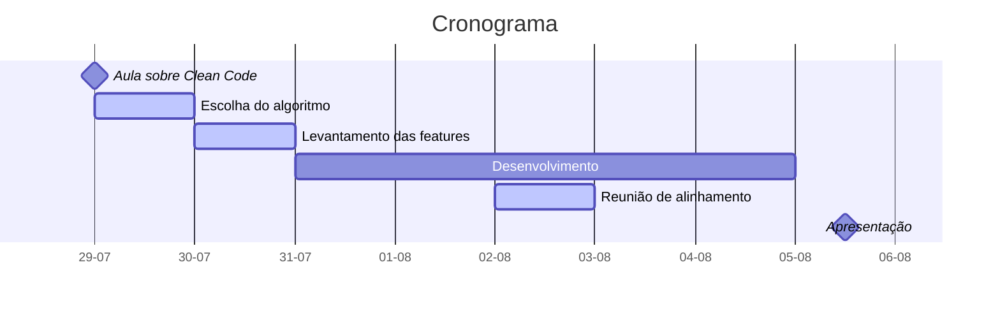

# Dever de casa - Clean Code

Cada mentorado deverá implementar um pequeno sistema ou altoritmo utilizando as práticas apresentadas na aula de Clean code.

O projeto deve ser desenvolvido em uma liguagem de programação acordada com o **Mentor**.

A apresentação irá consistir em:

- Explicação do sistema ou algoritmo implementado
- Apresentação das features implementadas
- Levantamento de pelo menos 3 refatorações efetuadas durante o processo de desenvolvimento
- Explicação dos benefícios das refatorações efetuadas

## Algoritmos e sistemas recomendados:

- Jogo de console
- Sistema de calculadora
- REST API para gerenciamento de uma loja
- Página de formulário de contato

## Cronograma

- As tarefas em Azul devem ser realizadas juntas ou com supervisão do **Mentor**.

## Avaliação

<!-- TODO: definir 3 notas para cada um dos tópicos avaliados -->

- Quantidade features implementadas
- Clean code
  - Formatação do código
  - Hierarquia do projeto
  - Nomenclatura de variáveis
  - Nomenclatura de métodos
  - Tratamento de estruturas de múltiplas condições
  - Tratamento de exceções

**BONUS:** testes automatizados.
