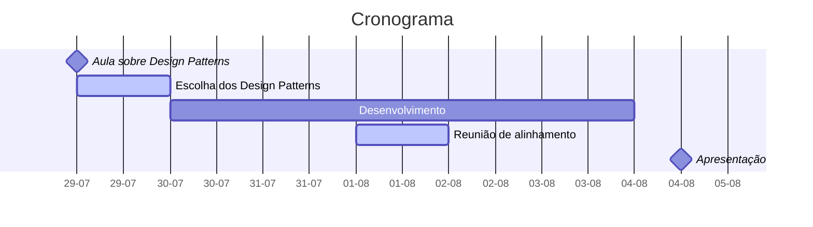

# Dever de casa - Desgin Patterns

Cada mentorado deverá implementar um Design Pattern em um projeto separado, tentando replicar um problema real.

O projeto deve ser desenvolvido em uma liguagem de programação acordada com o Mentor.

A apresentação irá consistir em:

- Explicação do Design Pattern escolhido
- Explicação da implementação
- Diagrama de classes
- Os testes para garantir a funcionalidade da solução

## Design Patterns recomendados:

- Factory Method
- Builder
- Adapter
- Composite
- Decorator
- Facade
- Chain of Responsibility

Os mentorados devem escolher um dos Design Patterns disponíveis. Apenas um Design Pattern deve ser apresentado por um mentorado.

## Cronograma

- As tarefas em Azul devem ser realizadas juntas ou com supervisão do **Mentor**.

## Avaliação

<!-- TODO: definir 3 notas para cada um dos tópicos avaliados -->

- Apresentção
  - Capacidade de transmitir a ideia do Design Pattern
  - Sinergia do problema resolvido com o mundo real do desenvolvimento
  - Formatação da apresentação

- Clean code
  - Formatação do código
  - Hierarquia do projeto
  - Nomenclatura de variáveis

- Testes
  - Qualidade da bateria de testes
  - Cobertura de testes