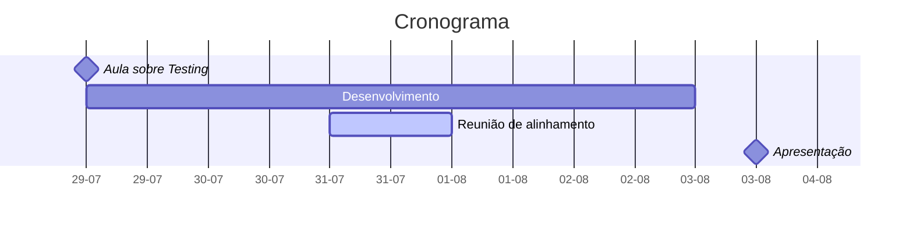

# Dever de Casa - Automated Tests

A fim de exercitar o que foi apresentado, o mentorado deve implementar testes automatizados em um projeto de escolha.

O projeto escolhido pode ser o apresentado no **Dever de Casa de Clean Code.**

- Implementar testes unitários para 50% - 100% de cobertura de linhas do código.
- Apresentar exemplos de testes implementados
  - Qual tipo de teste foi implementado?
  - Qual tecnologia foi utilizada para o desenvolvimento dos testes?
  - Quais foram as principais dificuldades?
- **(Opcional)** Mentorados podem implementar outros testes automatizados
  - Testes de performance
  - Testes de segurança
  - Testes de qualidade de código

## Cronograma

## Avaliação

<!-- TODO: definir 3 notas para cada um dos tópicos avaliados -->

- Clean code
  - Formatação do código
  - Hierarquia do projeto
  - Nomenclatura de variáveis
  - Nomenclatura de métodos
  - Tratamento de estruturas de múltiplas condições
  - Tratamento de exceções

- Cobertura de linhas do código
- Qualidade da bateria de testes
  - Testes para múltiplos fluxos de código
  - Testes para tratamento de erros
