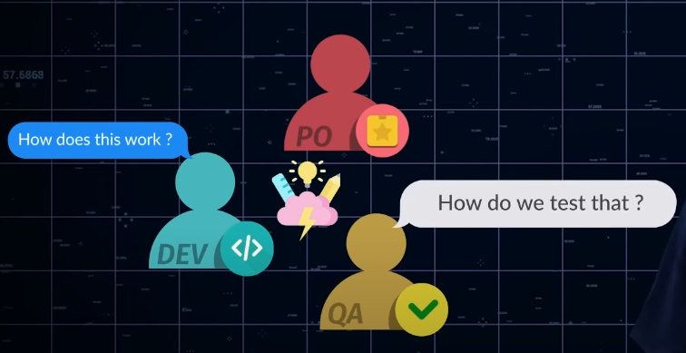
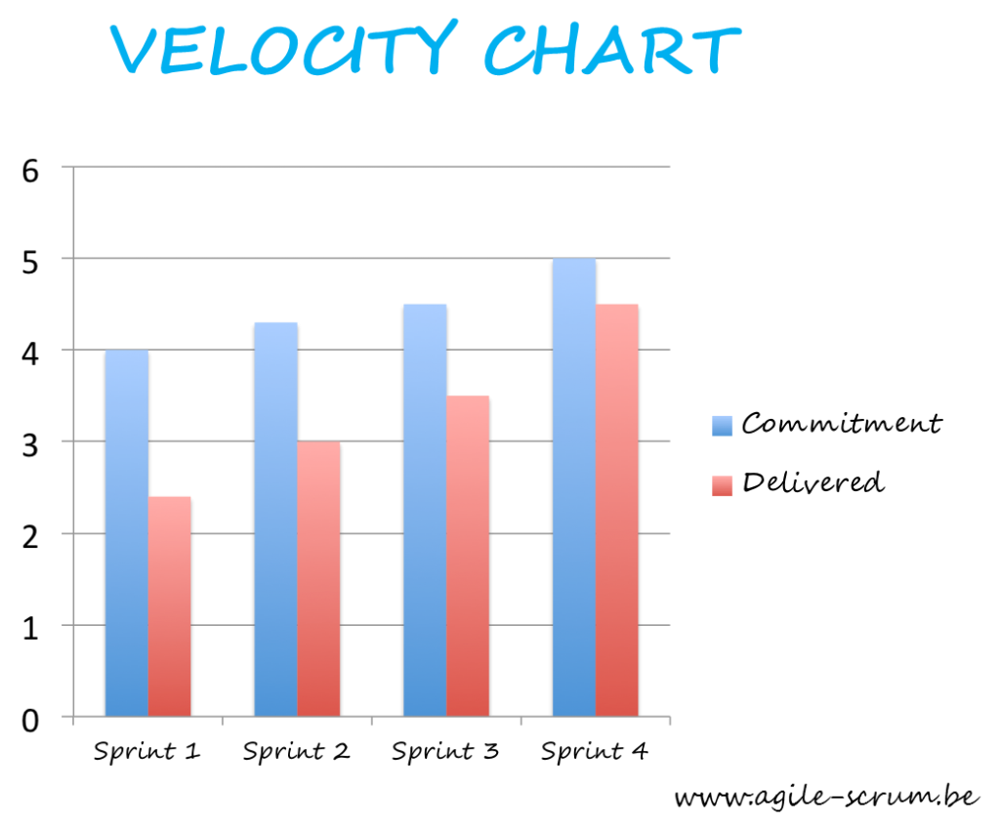

# Project Design

---

# Abordagem evolutiva para desenvolvimento de software

- Desenvolvimento incremental
- Desenvolvimento iterativo
- Separação de resposabilidades
- Modularização
- Coesão

---

# Papéis do time de desenvolvimento

---

# Levantamento de requisitos

- O que queremos resolver?
- Definição de prioridade
- Prototipação

---

# MVP (Minimum viable product)

- O que significa ser um mínimo produto viável?

- Qual a finalidade?

---

# Organização do projeto (sistema de gestão)

- Método de fluxo trabalho
- Documentação
- Linguagem do projeto
- Acompanhamento do projeto

---

# Métricas

- Como sabemos que estamos resolvendo o problema?
- Definição de Unit of Work (Unidade de trabalho)

---

# Métricas - Velocity

---

# Arquitetura de um projeto

Qualidade de um software com a abordagem evolutiva:

- Flexibilidade
  - Deve ser possível ativar e desativar funcionalidades
  - Adição de novas funcionalidades 
- Reaproveitamento de código
- Qualidade do software
- Automatização

---

# 🏠 Dever de casa

### Projeto - Troll Form

> 🎉 Um formulário que trola o usuário para enviar os dados. 

Esse formulário será como um jogo onde o player deve ter que conseguir enviar o formulário depois de passar por todas as trollagens planejadas pelas formulário.

O formulário terá várias trolagens que o usuário tem que previnir para conseguir enviar os dados.

Tópicos abordados:

- Novas trolagens não podem impactar em trolagens já existentes.
- O usuário depois de passar pelas trolagens conseguirá enviar os dados.

---

> Prazo de conclusão do projeto: 8 semanas
> Ciclos de desenvolvimento: sugestão 1 semana
> Quantidade de horas semanais desempenhadas: 4 horas individuais

Os papéis serão definidos a cada ciclo de forma a todos desempenharem pelo menos uma vez um papel.

- Líder técnico (Tech leader)
- Desenvolvedor
- Product Owner (PO)
  - Nesse caso também como especialista do negócio e gerente do projeto
- Quality Assurence (QA)

---

# Próximos passos

- Definir o papel de cada integrante do projeto

- Levantamento de métricas, métodos e processos.

- Reunião de organização do projeto
  - Definição de métricas
  - Definição de método de trabalho
  - Criação do sistema de gestão
  
- Reunião de levantamento de requisitos e definição de MVP

---

# Avaliação

As avaliações são dadas como um processo de auditoria de consultoria.

Será avaliado de acordo com cada papel desempenhado no projeto.

Legenda:
- C: completo
- P: parcial
- X: não entregue

---

Product Owner

> ⚠️ Na reunião de organização do projeto serão discutidas as métricas. 
> É de responsabilidade do Product Owner e gestor garantir que as métricas estão sendo alcançadas.

| Quesito                                   | Estado |
| ----------------------------------------- | ------ |
| Documentação do projeto                   |        |
| Gerenciamento (acertividade das métricas) |        |
| Prototipação                              |        |
| Priorização de features                   |        |
| Viabilidade técnica das features          |        |

---

Líder técnico

> ⚠️ Na reunião de organização do projeto serão discutidas as práticas de desenvolvimento aplicadas. 
> É de responsabilidade do Líder técnico e gestor garantir que as métricas estão sendo alcançadas.

| Quesito                        | Estado |
| ------------------------------ | ------ |
| Formato de trabalho            |        |
| Features entregues             |        |
| Desenvolvimento da equipe      |        |
| Qualidade do software entregue |        |

---

Desenvolvedor

| Quesito               | Estado |
| --------------------- | ------ |
| Features entregues    |        |
| Qualidade do software |        |

---

Qualidade

| Quesito                                  | Estado |
| ---------------------------------------- | ------ |
| Qualidade do processo de desenvolvimento |        |
| Qualidade do produto                     |        |
