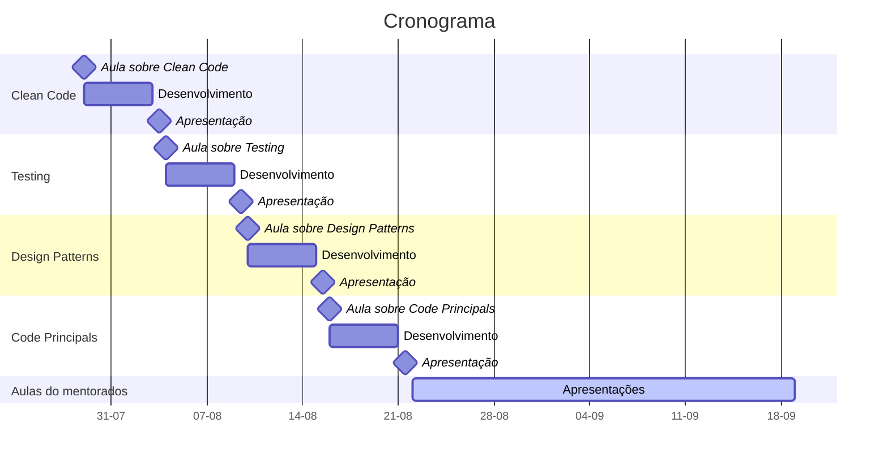

# DOJO

O Dojo tem como objetivo fomentar o compartilhamento de conhecimento entre a equipe da GH. O conhecimento é compartilhado com foco a exposição de conceitos pertinentes ao desenvolvimento de software aos integrantes mais novos da equipe pelos integrantes mais experiêntes, possibilitando um nivelamento das experiências e maior integração entre os integrantes do time.

Ao final do período de execução os mentorados terão sido expostos aos principais conceitos de desenvolvimento de software empregados pelo mercado e poderão empregar esses conceitos em futuros projetos, possibilitando o desenvolvimento de software com qualidade, escalabilidade e performance.

Paralelo a isso teremos profissionais capacitados para criar seus próprios grupos de treinamento e DOJOs e assim espalhar a cutura do compartilhamento de conhecimento dentro da GH.

## Composição do grupo

- Mentor
  - Responsável por expor os conceitos definidos e suporte do aprendizado
- Máximo de 4 mentorados
  - Responsáveis por implementar o conteúdo proposto e fomentar com dúvidas as discussões
- Consultor de agilidade
  - Responsável em ajudar os mentorados a definir e organizar o trabalho desenvolvido

## Período de execução

- Ciclo de 3 meses
  - Aproximadamento 12 semanas

- 8 semanas de conteúdos expostos pelo Mentor
  - Exposição de conteúdos pertinentes ao desenvolvimento de software
  - Discussão dos conteúdos 

- 4 semanas de conteúdos expostos pelo Mentorados
  - Conteúdo de interesse dos mentorados
  - Preparação dos mentorados para futuros grupos de DOJO 

## Formato

- Uma aula expositiva sobre um tópico relacionado a desenvolvimento de software
- Toda semana deverá ter algum **dever de casa** para ser discutido no próximo encontro
- Um fórum de discussão sobre o tema exposto
- Implementação dos feedbacks discutidos no fórum

Será feito um acompanhamento do **Dever de casa** no terceiro dia apartir do dia da reunião da semana. Essa reunião deve ser breve entre todos os integrantes.

Os **Deveres de Casa** serão desenvolvidos pela ideia do próprio mentorado, com foco em aplicar a prática proposta na semana e as práticas anteriores.

## Observações

- A empresa precisa apresentar oportunidades do emprego das práticas propostas no treinamento
- Será necessário a participação integral do grupo
  - Devemos manter a taxa de presença o mais alta possível
  - Casos extremos podem ser flexibilizados

## Cronograma

## Conteúdos

### Clean code

Apresentação de conceitos relacionados a desenvolvimento de software com foco na qualidade do código gerado.

Um código com qualidade mantem a produtividade da equipe sempre no seu máximo e diminui o despedício de recursos (tanto tempo quanto dinheiro) durante o desenvolvimento de software.

Tópicos abordados:

- Qualidade de software
- Ferramentas de refatoração
- Formatação de código
- Semântica do código
- Exemplos em código

### Testing

Introdução ao desenvolvimento de software orientado a tests.

Um projeto que apresenta testes automatizados garante a funcionalidade do sistema e aumenta a produtividade de uma equipe. Também ajuda a integrar novos desenvolvedores ao projeto e aumenta a confiabilidade dos clientes em relação ao projeto.

Tópicos abordados:

- Introdução a testes automatizados
- Tipos de testes automatizados
- Fases de um teste
- Sintaxe da implementação de testes
- Dicas de semântica e documentação
- Exemplos em código

### Design Patterns

Introdução a Design Patterns no desenvolvimento de software.

Design Patterns são soluções já consolidadas para problemas comuns em software design, especificamente design de código. Desenvolvedores que conhecem Design Patterns tem maior autonomia para solucionar problemas e aumentam capacidade do projeto em prever problemas durante o processo de desenvolvimento.

A utilização de Design Patterns no desenvolvimento de software aumenta a flexibilidade do sistema e o foco do desenvolvimento no problema real do cliente em relação a como fazer a implementação.

Tópicos abordados:

- Introdução a Design Patterns
- Quando aplicar Design Patterns
- Quando não aplicar Design Patterns
- Diagrama de classes
- Tipos de Design Patterns
- Exemplos em código

### Code Principles

Introdução a princípios de código.

Utilizar princípios de código ajuda a guiar o desenvolvimento de uma sistema, o que aumenta a agilidade no desenvolvimento e evoluação.

Tópicos abordados:

- Princípio do ETC (Easier to Change)
- Clean Code
- DRY
- Conceitos relacionados a qualidade de código
  - Modularidade
  - Coesão
- Exemplos em código