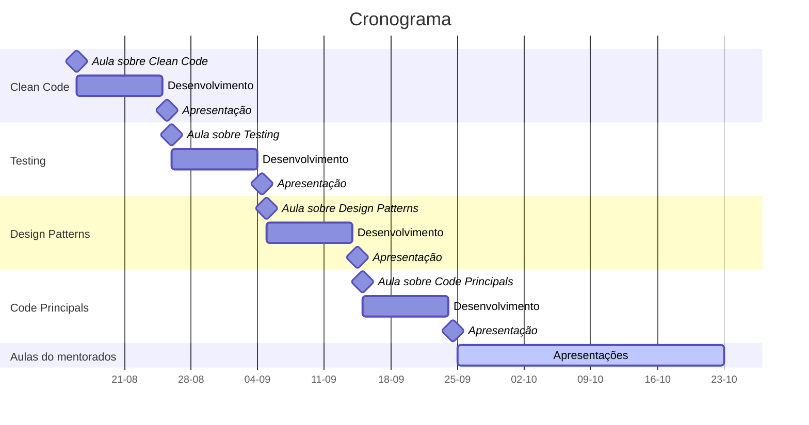
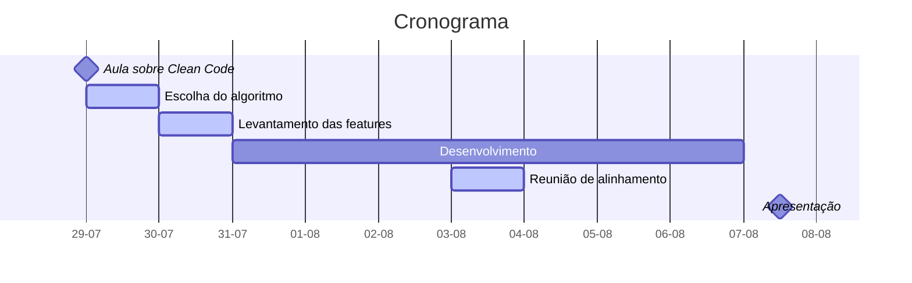
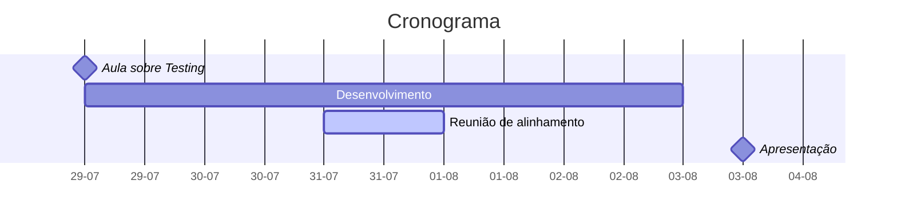
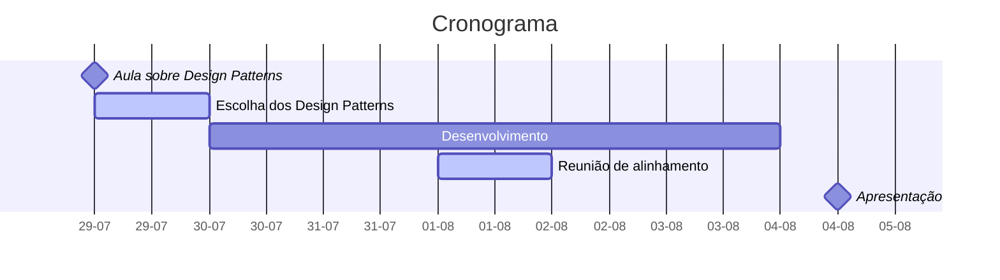

# DOJO - Biluca Master Class

O Dojo tem como objetivo fomentar o compartilhamento de conhecimento entre a equipe da GH. O conhecimento é compartilhado com foco a exposição de conceitos pertinentes ao desenvolvimento de software aos integrantes mais novos da equipe pelos integrantes mais experientes, possibilitando um nivelamento das experiências e maior integração entre os integrantes do time.

Ao final do período de execução os mentorados terão sido expostos aos principais conceitos de desenvolvimento de software empregados pelo mercado e poderão empregar esses conceitos em futuros projetos, possibilitando o desenvolvimento de software com qualidade, escalabilidade e performance.

Paralelo a isso teremos profissionais capacitados para criar seus próprios grupos de treinamento e DOJOs e assim espalhar a cultura do compartilhamento de conhecimento dentro da GH.

- [DOJO - Biluca Master Class](#dojo---biluca-master-class)
  - [Composição do grupo](#composição-do-grupo)
  - [Cronograma](#cronograma)
  - [Estimativa de horas](#estimativa-de-horas)
- [Conteúdos](#conteúdos)
  - [Clean code](#clean-code)
    - [🏠 Dever de casa - Clean Code](#-dever-de-casa---clean-code)
      - [Algoritmos e sistemas recomendados](#algoritmos-e-sistemas-recomendados)
    - [Cronograma](#cronograma-1)
    - [Avaliação](#avaliação)
  - [Testing](#testing)
    - [🏠 Dever de Casa - Automated Tests](#-dever-de-casa---automated-tests)
    - [Cronograma](#cronograma-2)
    - [Avaliação](#avaliação-1)
  - [Design Patterns](#design-patterns)
    - [🏠 Dever de casa - Design Patterns](#-dever-de-casa---design-patterns)
      - [Design Patterns recomendados](#design-patterns-recomendados)
    - [Cronograma](#cronograma-3)
    - [Avaliação](#avaliação-2)
  - [Code Principles](#code-principles)
- [Quiz de aderência de treinamento](#quiz-de-aderência-de-treinamento)

## Composição do grupo

- **Mentor:** Bruno Bernardes da Costa
- **3 mentorados**
  - A ser definido pelo formulário de seleção de mentorados

## Cronograma

```mermaid
gantt
    title Cronograma
    dateFormat  DD-MM-YYYY
    axisFormat %d-%m
    todayMarker off

    section Clean Code
    Aula sobre Clean Code         :milestone, m1, 16-08-2022, 0d
    Desenvolvimento               :dev1, after m1, 9d
    Apresentação                  :milestone, m2, after dev1, 1d

    section Testing
    Aula sobre Testing            :milestone, m3, after m2, 0d
    Desenvolvimento               :dev2, after m3, 9d
    Apresentação                  :milestone, m4, after dev2, 1d

    section Design Patterns
    Aula sobre Design Patterns    :milestone, m5, after m4, 0d
    Desenvolvimento               :dev3, after m5, 9d
    Apresentação                  :milestone, m6, after dev3, 1d

    section Code Principals
    Aula sobre Code Principals    :milestone, m7, after m6, 0d
    Desenvolvimento               :dev4, after m7, 9d
    Apresentação                  :milestone, m8, after dev4, 1d

    section Aulas do mentorados
    Apresentações            :active, m9, after m8, 4w
```

## Estimativa de horas

Cada ciclo do DOJO será executado durante duas semanas. I ciclo de Aulas dos mentorados será executado em 4 semanas.

| Tarefa                  | Estimativa em horas |
| ----------------------- | ------------------- |
| Ciclo - Clean Code      | 8h                  |
| Ciclo - Testing         | 8h                  |
| Ciclo - Design Patterns | 8h                  |
| Ciclo - Code Principals | 8h                  |
| Aulas dos mentorados    | 15h                 |
| Total                   | 47h                 |

# Conteúdos

## Clean code

Apresentação de conceitos relacionados a desenvolvimento de software com foco na qualidade do código gerado.

Um código com qualidade mantém a produtividade da equipe sempre no seu máximo e diminui o desperdício de recursos (tanto tempo quanto dinheiro) durante o desenvolvimento de software.

Tópicos abordados:

- Qualidade de software
- Ferramentas de refatoração
- Formatação de código
- Semântica do código
- Exemplos em código

### 🏠 Dever de casa - Clean Code

Cada mentorado deverá implementar um pequeno sistema ou algoritmo utilizando as práticas apresentadas na aula de Clean code.

O projeto deve ser desenvolvido em uma linguagem de programação acordada com o **Mentor**.

A apresentação irá consistir em:

- Explicação do sistema ou algoritmo implementado
- Apresentação das features implementadas
- Levantamento de pelo menos 3 refatorações efetuadas durante o processo de desenvolvimento
- Explicação dos benefícios das refatorações efetuadas

#### Algoritmos e sistemas recomendados

- Jogo de console
- Sistema de calculadora
- REST API para gerenciamento de uma loja
- Página de formulário de contato

### Cronograma

```mermaid
gantt
    title Cronograma
    dateFormat  DD-MM-YYYY
    axisFormat %d-%m
    todayMarker off

    Aula sobre Clean Code         :milestone, m1, 29-07-2022, 0d
    Escolha do algoritmo          :active, a1, after m1, 1d
    Levantamento das features     :active, a2, after a1, 1d
    Desenvolvimento               :a3, after a2, 7d
    Reunião de alinhamento        :active, 03-08-2022, 1d
    Apresentação                  :milestone, after a3, 1d
```

- As tarefas em Azul devem ser realizadas juntas ou com supervisão do **Mentor**.

### Avaliação

<!-- TODO: definir 3 notas para cada um dos tópicos avaliados -->

- Quantidade features implementadas
- Clean code
  - Formatação do código
  - Hierarquia do projeto
  - Nomenclatura de variáveis
  - Nomenclatura de métodos
  - Tratamento de estruturas de múltiplas condições
  - Tratamento de exceções

**BONUS:** testes automatizados.

## Testing

Introdução ao desenvolvimento de software orientado a testes.

Um projeto que apresenta testes automatizados garante a funcionalidade do sistema e aumenta a produtividade de uma equipe. Também ajuda a integrar novos desenvolvedores ao projeto e aumenta a confiabilidade dos clientes em relação ao projeto.

Tópicos abordados:

- Introdução a testes automatizados
- Tipos de testes automatizados
- Fases de um teste
- Sintaxe da implementação de testes
- Dicas de semântica e documentação
- Exemplos em código

### 🏠 Dever de Casa - Automated Tests

A fim de exercitar o que foi apresentado, o mentorado deve implementar testes automatizados em um projeto de escolha.

O projeto escolhido pode ser o apresentado no **Dever de Casa de Clean Code.**

- Implementar testes unitários para 50% - 100% de cobertura de linhas do código.
- Apresentar exemplos de testes implementados
  - Qual tipo de teste foi implementado?
  - Qual tecnologia foi utilizada para o desenvolvimento dos testes?
  - Quais foram as principais dificuldades?
- **(Opcional)** Mentorados podem implementar outros testes automatizados
  - Testes de performance
  - Testes de segurança
  - Testes de qualidade de código

### Cronograma

```mermaid
gantt
    title Cronograma
    dateFormat  DD-MM-YYYY
    axisFormat %d-%m
    todayMarker off

    Aula sobre Testing         :milestone, m1, 29-07-2022, 0d
    Desenvolvimento               :a3, after m1, 5d
    Reunião de alinhamento        :active, 31-07-2022, 1d
    Apresentação                  :milestone, after a3, 1d
```

### Avaliação

<!-- TODO: definir 3 notas para cada um dos tópicos avaliados -->

- Clean code
  - Formatação do código
  - Hierarquia do projeto
  - Nomenclatura de variáveis
  - Nomenclatura de métodos
  - Tratamento de estruturas de múltiplas condições
  - Tratamento de exceções

- Cobertura de linhas do código
- Qualidade da bateria de testes
  - Testes para múltiplos fluxos de código
  - Testes para tratamento de erros

## Design Patterns

Introdução a Design Patterns no desenvolvimento de software.

Design Patterns são soluções já consolidadas para problemas comuns em software design, especificamente design de código. Desenvolvedores que conhecem Design Patterns tem maior autonomia para solucionar problemas e aumentam capacidade do projeto em prever problemas durante o processo de desenvolvimento.

A utilização de Design Patterns no desenvolvimento de software aumenta a flexibilidade do sistema e o foco do desenvolvimento no problema real do cliente em relação a como fazer a implementação.

Tópicos abordados:

- Introdução a Design Patterns
- Quando aplicar Design Patterns
- Quando não aplicar Design Patterns
- Diagrama de classes
- Tipos de Design Patterns
- Exemplos em código

### 🏠 Dever de casa - Design Patterns

Cada mentorado deverá implementar um Design Pattern em um projeto separado, tentando replicar um problema real.

O projeto deve ser desenvolvido em uma linguagem de programação acordada com o Mentor.

A apresentação irá consistir em:

- Explicação do Design Pattern escolhido
- Explicação da implementação
- Diagrama de classes
- Os testes para garantir a funcionalidade da solução

#### Design Patterns recomendados

- Factory Method
- Builder
- Adapter
- Composite
- Decorator
- Facade
- Chain of Responsibility

Os mentorados devem escolher um dos Design Patterns disponíveis. Apenas um Design Pattern deve ser apresentado por um mentorado.

### Cronograma

```mermaid
gantt
    title Cronograma
    dateFormat  DD-MM-YYYY
    axisFormat %d-%m
    todayMarker off
    
    Aula sobre Design Patterns    :milestone, m1, 29-07-2022, 0d
    Escolha dos Design Patterns   :active, a1, after m1, 1d
    Desenvolvimento               :a2, after a1, 5d
    Reunião de alinhamento        :active, 01-08-2022, 1d
    Apresentação                  :milestone, after a2, 1d
```

- As tarefas em Azul devem ser realizadas juntas ou com supervisão do **Mentor**.

### Avaliação

<!-- TODO: definir 3 notas para cada um dos tópicos avaliados -->

- Apresentação
  - Capacidade de transmitir a ideia do Design Pattern
  - Sinergia do problema resolvido com o mundo real do desenvolvimento
  - Formatação da apresentação

- Clean code
  - Formatação do código
  - Hierarquia do projeto
  - Nomenclatura de variáveis

- Testes
  - Qualidade da bateria de testes
  - Cobertura de testes

## Code Principles

Introdução a princípios de código.

Utilizar princípios de código ajuda a guiar o desenvolvimento de uma sistema, o que aumenta a agilidade no desenvolvimento e evolução.

Tópicos abordados:

- Princípio do ETC (Easier to Change)
- Clean Code
- DRY
- Conceitos relacionados a qualidade de código
  - Modularidade
  - Coesão
- Exemplos em código

# Quiz de aderência de treinamento

- Você ficou satisfeito(a) com o treinamento?
  - Classificação 1 - 5

- O quão familiarizado com o conteúdo você estava previamente?
  - Classificação 1 - 5

- O quão fácil foi entender a linguagem ou termos utilizados?
  - Classificação 1 - 5
  - Onde poderia melhorar?

- Você teve oportunidade de aplicar algum do conteúdos?
  - Classificação 1 - 5
  - O que você mais aplicou?
  - O que falta para conseguir aplicar o conteúdo?

