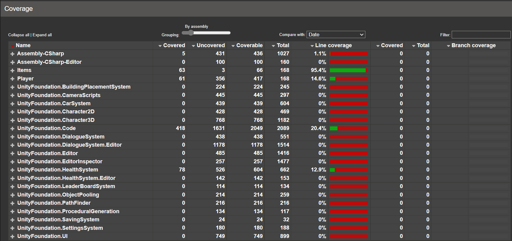

# Automated Tests

> Testes automatizados são qualquer tipo de verificação do comportamento de um sistema executados automaticamente.

---

# Por que utilizar testes automatizados?

- Documentação de código
- Safety Net
- Aumento de produtividade

---

## Documentação de código


---

## Safety Net


---

## Aumento de produtividade

<div class="columns">

<p>Times que empregam técnicas como TDD, Continuous integration and delivery gastam 44 porcento mais tempo em trabalho útil (novas funcionalidades) do que corrigindo bugs</p>
</div>

---

# Tipos

- Integration Tests
- Security Tests
- Performance Tests
- Acceptance Tests
- Quality Assurance Tests

---

# Fases

- Unit
- API (Application Programming Interface)
- UI (User interface)

---

# Testes: O que são? Como vivem? O que fazem?

- Arrange (Preparação), Act (Ação), and Assert (Verificação)

```js
test('should add two numbers and return sum value', () => {
  // arrange
  const calculator = new Calculator()

  // act
  const result = calculator.sum(1, 2)

  // assert
  expect(result).toBe(3);
})
```

---

# Tipos mais comuns de verificações

```js
expect(result).toBe(number)                       // Espera um valor igual
expect(result).not.toBe(number)                   // Espera um valor diferente
expect(result).toBeGreaterThan(number | bigint)   // Espera um valor maior
expect(result).toBeLessThan(number | bigint)      // Espera um valor menor
expect(method()).toThrow(error?)                  // Espera que method lance uma exceção
```

---

# Code Coverage

> Apresenta um visão gráfica da quantidade de código submetido a testes
  
- **Observação:** Não deve ser utilizada isoladamente como métrica de qualidade de código
- Utilizar Mutation e outros tipos de técnicas para garantir a qualidade

---

## Exemplo de um relatório de cobertura de código



---

## Exemplo de um arquivo específico no relatório de cobertura de código


--- 

# Exemplos

- **ex_1**: Testes unitários 101
- **ex_2**: GUI testes unitário utilizando Veu 3 + Vue-Jest

---

# Dever de casa

- Implementar testes unitários para 50% de cobertura de linhas do código.
- Apresentar exemplos de testes implementados
  - Qual tipo de teste foi implementado?
  - Qual tecnologia foi utilizada para o desenvolvimento dos testes?
  - Quais foram as principais dificuldades?
- **(Opcional)** Mentorados podem implementar outros testes automatizados
  - Testes de performance
  - Testes de segurança
  - Testes de qualidade de código

---

# Bibliografia

- [Documentação do Jest](https://jestjs.io/)
- [Clean Code Class 4](https://www.youtube.com/watch?v=58jGpV2Cg50&list=PLmmYSbUCWJ4x1GO839azG_BBw8rkh-zOj&index=5)
- [Accelerate: The Science of Lean Software and DevOps: Building and Scaling High Performing Technology Organizations](https://www.amazon.com/Accelerate-Software-Performing-Technology-Organizations/dp/1942788339)
